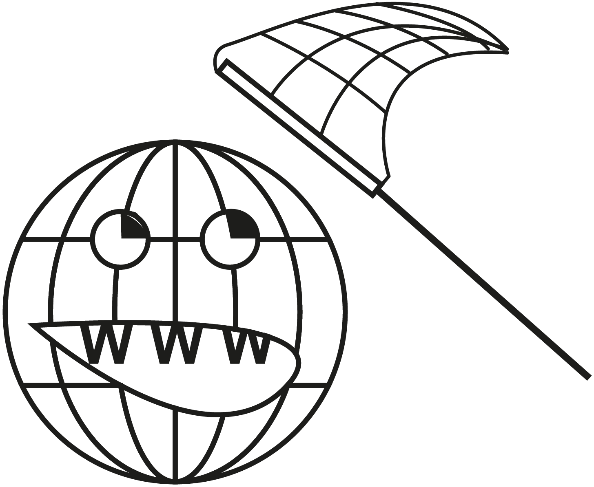

```{r setup, include=FALSE}

## Global options
knitr::opts_chunk$set(echo=TRUE,
        	            cache=FALSE,
                      prompt=FALSE,
                      comment=NA,
                      message=FALSE,
                      warning=FALSE,
                      class.source="bg-info",
                      class.output="bg-warning")


```


> Cet article peut être utilisé pour une initiation aux bases de la collecte automatique de données du Web avec R. Il s'agit d'un support associé à un site web plus complet et approfondie sur le webscraping avec R et Python : https://webscraping.gitpages.huma-num.fr/website/

# Introduction {-}

Le *web scraping*, ou extraction de données sur le web, est une technique qui consiste à extraire de manière automatisée des informations à partir de sites web. En d'autres termes, c'est comme si vous utilisiez un robot pour récupérer des données à partir de pages web, plutôt que de le faire manuellement.

En sciences humaines et sociales, le *web scraping* peut être utilisé pour collecter des données pertinentes sur des sites web, forums, blogs, des réseaux sociaux, ou autres sources en ligne. Cette méthode peut être particulièrement utile pour analyser des tendances, des opinions, des dynamiques... ou tout simplement pour constituer une base de données à partir de plusieurs sources web. L'utilisation de R pour le web scraping permet d'automatiser ces processus et d'analyser les données extraites de manière efficace.


```{r, echo=FALSE, out.width="30%",  fig.align = "center"}

```

Le *Web scraping* permet d'extraire des informations spécifiques d'une page web en analysant sa structure HTML et en extrayant uniquement les éléments pertinents. Cette pratique demande ainsi quelques connaissances techniques en matière de web, de langague de balisage HTML et de le CSS, qui permettent respectivement de structurer une page web et de définir l'apparence et la mise en forme des différents éléments du document.

Avant de se pencher sur la technique de collecte avec R, cet article aborde dans un premier temps les connaisances indispensable à la mise en place d'une collecte de données automatisée.

Le *Web scraping* regroupe différente technique plus ou moins complexe. Cet article, qui est une inititation à la pratique de la collecte automatique de données présente le cas d'utilisation le plus simple est abordable. Pour aller plus loin et se former à des techniques plus avancé, vous pouvez consulter ce support de formation plus détaillé : https://webscraping.gitpages.huma-num.fr/website/


# Présentation du cas pratique

Présentation du site web exemple utilisé

http://books.toscrape.com/


# Bases techniques

## HTML

## CSS

## Inspecteur de code


# Mis en pratique

Tout uniquement les vignettes

## Exporation manuelle

## Collecte vignette

## Données collectées

## Collecte page ressource

boucle dur URL pré collectées

récupération de toutes les metadonnées + section thématique

## Données collectées - explo

explo par section thématique


# Pour aller plus loin

## Rselenium

## Support complet


# Bibliographie {-}

<div id="refs"></div>

# Annexes {-}

## Info session  {-}

```{r session_info, echo=FALSE}
kableExtra::kable_styling(knitr::kable(rzine::sessionRzine()[[1]], row.names = F))
kableExtra::kable_styling(knitr::kable(rzine::sessionRzine()[[2]], row.names = F))
```

## Citation {-}

```{r Citation, echo=FALSE}
rref <- bibentry(
   bibtype = "misc",
   title = "Titre de la fiche",
   subtitle = "Sous-Titre de la fiche",
   author = c("Premier Auteur.e", "Second Auteur.e"),
   doi = "10.48645/xxxxxx",
   url = "https://rzine.fr/publication_rzine/xxxxxxx/",
   keywords ="FOS: Other social sciences",
   language = "fr",
   publisher = "FR2007 CIST",
   year = 2021,
   copyright = "Creative Commons Attribution Share Alike 4.0 International")

``` 

`r capture.output(print(rref))`

### BibTex : {-}

```{r generateBibTex, echo=FALSE}

writeLines(toBibtex(rref), "cite.bib")
toBibtex(rref)

``` 

<br/>

## Glossaire {- #endnotes}

```{js, echo=FALSE}

$(document).ready(function() {
  $('.footnotes ol').appendTo('#endnotes');
  $('.footnotes').remove();
});

```
