```{r setup, include=FALSE}

## Global options
knitr::opts_chunk$set(echo=TRUE,
        	            cache=TRUE,
                      prompt=FALSE,
                      comment=NA,
                      message=FALSE,
                      warning=FALSE,
                      class.source="bg-info",
                      class.output="bg-warning")


```


> Cet article peut être utilisé pour une initiation aux bases de la collecte automatique de données du *web* avec R. De nombreux aspects et méthodes de *web scraping* qui ne sont pas abordés dans ce document sont présentés sur ce [**site web associé**](https://webscraping.gitpages.huma-num.fr/website/), plus complet et approfondi sur le *web scraping* avec R et Python. 

# Introduction {-}

Le *web scraping*, ou extraction de données sur le *web*, est une technique qui consiste à extraire de manière automatisée des informations à partir de sites *web*. En d'autres termes, c'est comme si vous utilisiez un robot pour récupérer des données à partir de pages *web*, plutôt que de le faire manuellement.

En sciences humaines et sociales, le *web scraping* peut être utilisé pour collecter des données pertinentes sur des sites *web*, forums, blogs, des réseaux sociaux, ou autres sources en ligne. Cette méthode peut être particulièrement utile pour analyser des tendances, des opinions, des dynamiques, ou tout simplement pour constituer une base de données à partir de plusieurs sources internet. L'utilisation de R pour le *web scraping* permet d'automatiser ce processus et d'analyser les données extraites immédiatement de manière efficace.

Le *Web scraping* permet d'extraire des informations spécifiques d'une page *web* en analysant sa structure HTML et en extrayant uniquement les éléments pertinents. Cette pratique demande ainsi quelques connaissances techniques en matière de *web*, de langage de balisage HTML et de langage CSS, qui permettent respectivement de structurer une page *web* et de définir l'apparence et la mise en forme des différents éléments du document.

Au delà de présenter le *web scraping* avec R, cet article aborde dans un premier temps les connaisances indispensables à la mise en place d'une collecte de données automatisée.

Le *Web scraping* regroupe différentes techniques plus ou moins complexes. Cet article, qui est une inititation à la pratique de la collecte automatique de données présente le cas d'utilisation le plus simple. Pour aller plus loin et se former à des techniques plus avancées, vous pouvez consulter ce support de formation plus détaillé :


<center>
[**https://webscraping.gitpages.huma-num.fr/website/**](https://webscraping.gitpages.huma-num.fr/website/){target="_blank"}
</center>


\


# Bases techniques

L'extraction automatisée de données du *web* requiert des prérequis indispensables : certaines connaissances spécifiques liées à la structure d'une page *web* et une compréhension des principes techniques sous-jacents. Vous devez ainsi acquérir une connaissance du langage HTML (balises) et une familiarité avec le CSS (sélecteurs) pour identifier, cibler et extraire les éléments d'une page *web*.

## Le langage HTML

Le langage HTML (***H****yper***T***ext* ***M****arkup* ***L****anguage*) est un dérivé du XML (*e****X****tensible* ***M****arkup* ***L****anguage*). Le XML est un langage de balisage flexible qui permet de définir des règles spécifiques pour structurer et stocker des données. Il est utilisé dans une variété de domaines, notamment pour l'échange de données entre applications. Par exemple, voici un document XML simple représentant des informations sur un livre :

```
<Book>
  <Title>Le Seigneur des Anneaux</Title>
  <Author>J.R.R. Tolkien</Author>
  <Genre>Fantasy</Genre>
  <Year>1954</Year>
</Book>
```

Le langage HTML, sous-langage du XML, partage de nombreuses caractéristiques avec ce langage, mais il est spécifiquement conçu pour structurer et organiser le contenu des pages *web*. Le HTML utilise une série de balises (*tags*) pour définir la structure et le contenu d'une page *web*, ce qui permet aux navigateurs *web* de l'afficher correctement pour les utilisateurs.

\

### Les balises

Il n'y a pas de nombre fixe de balises HTML, car de nouvelles balises peuvent être introduites avec les versions futures du langage HTML. Cependant, il existe un ensemble de balises HTML standard définies dans les spécifications du W3C (*World Wide Web Consortium*^[Le *World Wide Web* Consortium, abrégé par le sigle W3C, est un organisme de standardisation à but non lucratif, fondé en octobre 1994 chargé de promouvoir la compatibilité des technologies du *World Wide Web* telles que HTML5, HTML, XHTML, XML, RDF, SPARQL, CSS, XSL, PNG, SVG, MathML et SOAP.]). Pour obtenir la liste la plus à jour des balises HTML, vous pouvez consulter la [documentation officielle du W3C](https://www.w3.org/){target="_blank"}.

Chaque balise est entourée des symboles **`<`** et **`>`** et peut contenir des attributs qui spécifient des propriétés supplémentaires pour l'élément. Si aucune balise n'est obligatoire dans une page HTML, il est de convention d'avoir la structure de base suivante :

```{html, eval = FALSE, class.source='bg-info'}     
<!DOCTYPE html>
<html>
<head>
    <title>Titre de la page</title>
</head>
<body>

    <!-- Contenu de la page -->
    
</body>
</html>     
```

- **`<!DOCTYPE html>`** : En début du document, indique au navigateur qu'il s'agit d'une page HTML5^[HTML5 (*HyperText Markup Language 5*) est la dernière révision majeure du HTML (format de données conçu pour représenter les pages *web*). Cette version a été finalisée le 28 octobre 2014. HTML5 spécifie deux syntaxes d'un modèle abstrait défini en termes de DOM : HTML5 et XHTML5.].
- **`<html>`** : Englobe tout le contenu de la page HTML. Définit le début et la fin du document HTML.
- **`<head>`** : Contient les métadonnées de la page, des liens vers des fichiers annexes (CSS, javascript…), etc.
- **`<title>`** : Définit le titre de la page qui apparaîtra dans la barre de titre du navigateur.
- **`<body>`** : Contient tout le contenu visible de la page, tel que le texte, les images, les liens, les tableaux, etc.


Dans la majorité des cas, on utilise une balise de fermeture pour indiquer la fin de l'élémént. Une balise de fermeture présente un **`/`** avant le nom de la balise :

```{html, eval = FALSE, class.source='bg-info'}    
<body>

    <!-- Contenu de la page -->
    
</body>    
```    


Le body peut contenir toute une variété de balises prédéfinies pour structurer et ajouter différents types de contenu dans la page *web*. Voici quelques balises indispensables à connaitre :

- **`<h1>`**, **`<h2>`**, …, **`<h6>`** : **titres** de différents niveaux,    
- **`<p>`** : **paragraphe**,    
- **`<a>`** : **lien hypertexte**,    
- **``** : **image**,    
- **`<ul>`**, **`<ol>`**, **`<li>`** : **listes** non ordonnées et ordonnées,    
- **`<table>`**, **`<tr>`**, **`<td>`** : **tableau** avec des lignes et des cellules,    
- **`<div>`** : **section** (type bloc),    
- **`<span>`** : **section** (type "inline").


Exemple d'utilisation de la balise **`p`** (paragraphe) :

```{html, eval = FALSE, class.source='bg-info'}    
<body>

<p>Ceci est un paragraphe en langage HTML</p>

</body>    
```

Dans cet exemple, les balises **`<p>`** et **`</p>`** permettent de créer un paragraphe dont le contenu textuel est "*Ceci est un paragraphe en langage HTML*".

Les différentes balises permettent ainsi de structurer, hierarchiser et organiser le contenu d'une page *web*. Elles peuvent s'emboiter indéfiniment :

```{html, eval = FALSE, class.source='bg-info'}    
<body>
  
<div>
  
<p>Un paragraphe en <a href="https://fr.wikipedia.org/wiki/HTML5">langage HTML</a></p>

</div>  
  
</body>    
```


Voici le rendu graphique du code HTML ci-dessus dans un navigateur *web* :

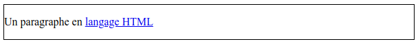

\

### Les attributs

Ces balises hiérarchisées et potentiellement regroupées, peuvent être renseignées d'attributs qui permettent de spécifier des informations supplémentaires et jouer sur leur mise en forme. Par exemple :

- **`id`** : identifiants,    
- **`class`** : classes,    
- **`href`** : liens,    
- etc.    

Ces attributs sont à spécifier dans les balises ouvrantes :

```{html, eval = FALSE, class.source='bg-info'}    
<body>

<div id="debut_doc">
    <h1 class="categorie">Tous les articles</h1>
</div>

<div id="Liste_ref">
    <h2 class="article">Titre article</h2>
    <p class="summary">Résumé article...</p>
    <a href="https://www.article.org">Intégralité article</a>
  
    <h2 class="article">Titre article bis</h2>
    <p class="summary">Résumé article bis...</p>
    <a href="https://www.article_bis.org">Intégralité article bis</a>
</div>

</body>    
```

L'organisation segmentée du contenu via les balises **`div`** ou **`span`** ainsi que les différents attributs spécifiés permettent la mise en forme et le paramétrage des éléments. Les attributs des balises peuvent être associés à une mise en forme (couleur, taille, position, etc.) à l'aide du langage CSS (cf. [partie suivante](#le-langage-css)). Mais **il s'agit également d'éléments cruciaux pour la collecte automatisée de données sur le** ***web***, car il permettent de cibler précisément des éléments. 

Dans l'exemple ci-dessus, il est ainsi possible de récupérer toutes les URLs (***U****niform* ***R****esource* ***L****ocator*) des articles, en ciblant le contenu de tous les attributs **`href`** des balises **`<a>`** situés dans les **`<div>`** ayant pour identifiant "**Liste_ref**".


\

## Le langage CSS

Le CSS, ou *Cascading Style Sheets* (feuilles de style en cascade), est un langage de programmation utilisé pour décrire l'apparence et la mise en forme des documents HTML et XML. Il permet de contrôler l'apparence visuelle des différents éléments de pages *web* (taille, position, couleur, police, marges, etc.) via les sélecteurs CSS.

Le CSS peut être incorporé de différentes manières :

**1. Directement dans les balises** à l'aide de l'attribut **`style`** :

<center><b>page.html</b></center>

```{html, eval = FALSE, class.source='bg-info'}    
<h1 style ="font-size:40px;color:#f03b35;text-align:center;">Titre principal</h1>    
```


**2. Dans le document HTML**, inclut dans une balise **`<style>`** adaptée à cet effet :

<center><b>page.html</b></center>

```{html, eval = FALSE, class.source='bg-info'}    
<style>

h1 {
color: #f03b35;
font-size: 40px;
text-align: center;
}
    
</style>

<body>
<h1>Titre principal</h1>
</body>    
```


**3. Dans une feuille de style externe** (fichier texte avec l'extension **`.css`**). Cette dernière méthode est à privilégier car la séparation du contenu et la mise en forme facilite la mise à jour des styles. Le lien vers la feuille de style CSS est à indiquer dans une balise `<link>` inclut dans la balise `<head>` qui contient les métadonnées du document :

:::: {style="display: flex;"}

::: {.column width="59%"}
<center><b>page.html</b></center>

```{html, eval = FALSE, class.source='bg-info'}    
<html>

<head>
<link rel="stylesheet" href="style.css">
</head>

<body>

<h1>Titre principal</h1>
<p>Un premier paragraphe introductif</p>

</body>

</html>    
```
:::

::: {.column width="2%"}
:::

::: {.column width="39%"}
<center><b>style.css</b></center>

```{css, eval = FALSE, class.source='bg-warning'}    
body {
background-color: lightblue;
}

h1 { 
color: #f03b35;
font-size: 40px;
text-align:center;
}

p { 
font-style: italic;
font-size: 20px;
}    
```
:::
::::

Dans les trois cas, le rendu graphique dans un navigateur *web* sera le suivant :

{fig-align="center"}

\

### Les sélecteurs CSS simples

<div class="alert alert-danger">**Bien qu'une connaissance approfondie du CSS ne soit pas nécessaire le *web scraping*, il est important de connaître les sélecteurs CSS.** **Leur utilisation est précieuse pour cibler des données de manière détaillée et ainsi optimiser la collecte.**</div>

Plusieurs sélecteurs CSS permettent de cibler et styliser les différentes balises HTML :

**1. Les sélecteurs d'éléments** permettent de cibler tous les éléments d'un même type.

:::: {style="display: flex;"}
::: {.column width="49%"}
<center><b>page.html</b></center>
```{html, eval = FALSE, class.source='bg-info'}    
<h2>Titre de niveau 2</h2>    
```
:::

::: {.column width="2%"}
:::

::: {.column width="49%"}
<center><b>style.css</b></center>
```{css, eval = FALSE, class.source='bg-warning'}    
h2 { font-size: 20px; }    
```
:::
::::

\

**2. Les sélecteurs d'identifiants** permettent de cibler un élément spécifique par son identifiant (**`id`**).

:::: {style="display: flex;"}
::: {.column width="49%"}
<center><b>page.html</b></center>
```{html, eval = FALSE, class.source='bg-info'}    
<div id="example">  </div>    
```
:::

::: {.column width="2%"}
:::

::: {.column width="49%"}
<center><b>style.css</b></center>
```{css, eval = FALSE, class.source='bg-warning'}    
#example { background-color: #f2f2f2; }    
```
:::
::::

\

**3. Les sélecteurs de classes** permettent de cibler les éléments ayant une classe spécifique (**`class`**).

:::: {style="display: flex;"}
::: {.column width="49%"}
<center><b>page.html</b></center>
```{html, eval = FALSE, class.source='bg-info'}    
<p class="summary">Ceci est un résumé</p>    
```
:::

::: {.column width="2%"}
:::

::: {.column width="49%"}
<center><b>style.css</b></center>
```{css, eval = FALSE, class.source='bg-warning'}    
.summary { font-family: Arial, sans-serif; }    
```
:::
::::

\

**4. Les sélecteurs d'attributs** permettent de cibler les éléments ayant un attribut spécifique. Exemple : l'attribut `href`, qui renseigne l'URL d'un lien cliquable.   

:::: {style="display: flex;"}
::: {.column width="49%"}
<center><b>page.html</b></center>
```{html, eval = FALSE, class.source='bg-info'}    
<a href="https://www.example.org">Lien</a>    
```
:::

::: {.column width="2%"}
:::

::: {.column width="49%"}
<center><b>style.css</b></center>
```{css, eval = FALSE, class.source='bg-warning'}    
a[href] { color: purple; }    
```
:::
::::

Il est possible de préciser sa cible en indiquant une valeur pour l'attribut.

```{css, eval = FALSE, class.source='bg-warning'}    
a[href="https://example.org"] { color: purple;}    
```


\

### Les sélecteurs complexes et combinateurs

Le CSS met également à disposition des sélecteurs complexes et combinateurs que l'on peut utiliser pour cibler des contenus de manière très précise. Quelques exemples :

**A. Les sélecteurs descendants** ciblent les éléments, descendants d'un autre élément.

:::: {style="display: flex;"}
::: {.column width="49%"}
<center><b>page.html</b></center>
```{html, eval = FALSE, class.source='bg-info'}    
<div id="liste_ref">

  
    <p class="summary">Ceci est un résumé</p>
    
  
</div>    
```
:::

::: {.column width="2%"}
:::

::: {.column width="49%"}
<center><b>style.css</b></center>
```{css, eval = FALSE, class.source='bg-warning'}    
#liste_ref p .summary { font-size: 12px; }    
```

<div class="alert alert-danger">Cible tous les paragraphes de la classe `summary`, positionnés dans l'élément ayant pour identifiant `liste_ref`.</div>
:::
::::


\

**B. Les sélecteurs de voisin direct** ciblent les nœuds qui suivent immédiatement un élément.

:::: {style="display: flex;"}
::: {.column width="49%"}

<center><b>page.html</b></center>

```{html, eval = FALSE, class.source='bg-info'}    
<div id="liste_ref">

    <h2>Titre article</h2>
    <p class="summary">Ceci est un résumé</p>
    
    <h2>Titre article</h2>
    <p class="summary">Ceci est un résumé</p>
        
</div>    
```
:::

::: {.column width="2%"}
:::

::: {.column width="49%"}

<center><b>style.css</b></center>

```{css, eval = FALSE, class.source='bg-warning'}    
#liste_ref + h2 { font-size: 14px; }    
```

\

<div class="alert alert-danger">Cible uniquement la première balise `h2` de l'élément ayant pour identifiant `liste_ref`.</div>
:::
::::

\

### Exemple pratique

Pour mieux comprendre l'utilisation et le fonctionnement du HTML et du CSS, **vous pouvez vous exercer à la pratique de ces deux langages à partir de cet exemple simple mis à disposition en téléchargement** :

\

<center>
[ **exo_HTML.zip**](https://gitlab.huma-num.fr/webscraping/rzine_webscraping/-/raw/master/exo_HTML.zip?ref_type=heads&inline=false)
</center>

<br>

Une fois téléchargé, décompressez le répertoire qui contient deux fichiers : *page.hmtl* et *style.CSS*.

1. Un fichier HTML peut être interprété (mis en page) par n'importe quel navigateur (Firefox, Google Chrome, Microsoft Edge, ect.). Ouvrez le fichier page.html avec un navigateur. Aucune connexion internet n'est nécessaire. 

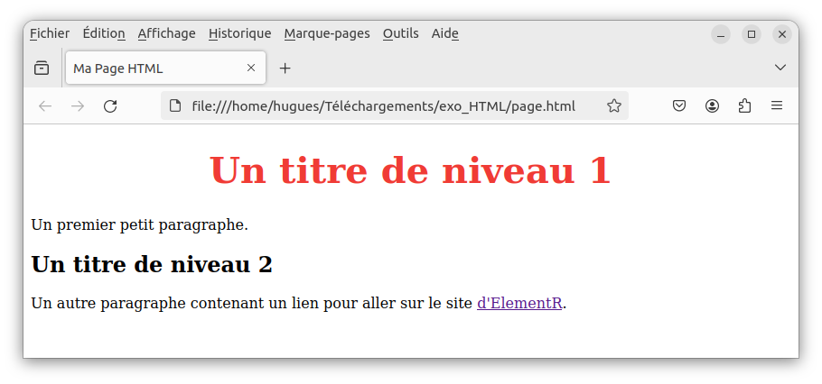

2. Ouvrez les deux fichiers (page.hmtl et style.CSS) avec un editeur de fichier texte (ex : bloc-note, Rstudio, Notepad++, ect.).


:::: {style="display: flex;"}
::: {.column width="69%"}

<center><b>page.html</b></center>

```{html, eval = FALSE, class.source='bg-info'}    
<!DOCTYPE html>
<html>
  <head>
    <title>Ma Page HTML</title>
      <meta charset="utf-8" />
      <link rel="stylesheet" href="style.css">
  </head>
  
  <body>
  <h1>Un titre de niveau 1</h1>
  <p>Un premier petit paragraphe.</p>
  <h2>Un titre de niveau 2</h2>
  <p>Un autre paragraphe contenant un lien pour aller sur le site 
  <a href="https://elementr.netlify.app/">ElementR</a>.
  </p>
        
  </body>
</html>    
```
:::

::: {.column width="2%"}

:::

::: {.column width="29%"}

<center><b>style.css</b></center>

```{css, eval = FALSE, class.source='bg-warning'}    
h1 { 
color: #f03b35;
font-size: 40px;
text-align:center;
}    
```
:::

:::

3. Ajoutez et/ou modifiez du contenu (balise) dans le code source du fichier page.html. Enregistrez le fichier et réaffichez (ou raffraichissez avec la touche `F5`) la page HTML dans le navigateur pour apprécier la nouvelle mise en page. 

4. Ajoutez et/ou modifiez du contenu dans le code source du fichier style.css. Enregistrez le fichier et réaffichez la page HTML (ou raffraichissez la avec la touche `F5`) dans le navigateur pour apprécier la nouvelle mise en page.

\

## Le code source d'une page 

La connaissance du HTML et du CSS vous permettra de comprendre et de naviguer dans le code source du page *web*. L'ensemble des navigateurs *web* modernes proposent des outils d'inspection du code source des pages internet. 

L'outil le plus universel, mais peu convivial, est l'affichage brut du code-source d'une page. C'est une extraction complète du code-source, c'est-à-dire du code que le navigateur web reçoit et met en forme.
On y accède via le raccourci `Ctrl-U` ou via clic-droit sur la page puis `(Afficher le) code source de la page`.

::::: {style="display: flex;"}
:::: {.column width="49%"}
::: {style="text-align: center;"}
Avec *Google Chrome* :
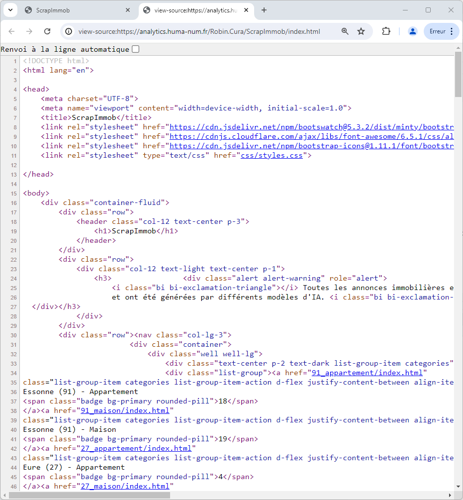{fig-align="center"}
::: 
:::: 
:::: {.column width="2%"}
::::
:::: {.column width="49%"}
::: {style="text-align: center;"}
Avec *Mozilla FireFox* :
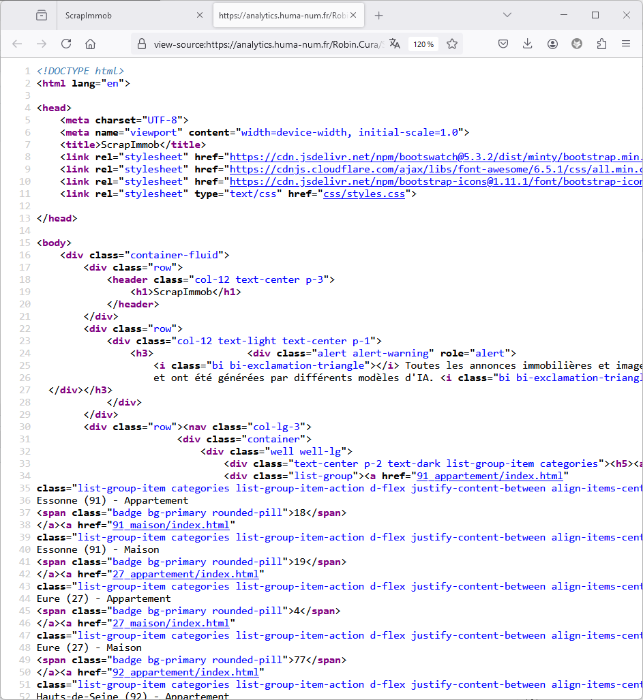
:::
::::
:::::


**L'inspecteur de code source est un autre moyen d'afficher le code source d'une page *web*, mais il est plus convivial et permet plus facilement de l'explorer (possibilités de filtrage, de recherche, de liens dynamiques etc.). Il permet l'identification des balises, des classes, des identifiants, des styles associés aux éléments et ainsi de procéder à une extraction ciblée de données**. En utilisant l'inspecteur de code source, vous accédez à toutes les informations nécessaires pour concevoir un script de collecte automatisée. 


Pour y accéder, cliquez-droit n'importe où sur la page *web* ouverte dans un navigateur, puis cliquez sur “Inspecter” :

:::: {style="display: flex;"}

::: {.column width="49%"}

::: {style="text-align: center;"}

Avec *Google Chrome* :


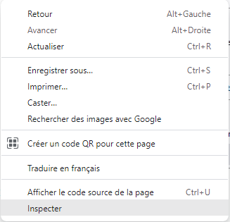{fig-align="center"}

::: 

::: 

::: {.column width="2%"}

:::

::: {.column width="49%"}

::: {style="text-align: center;"}

Avec *Mozilla FireFox* :

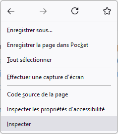

:::

::: 

::::


\

L'inspecteur s'ouvre et en utilisant l'outil de sélection (entouré en <font style="color:#FF0000;">**rouge**</font>), il donne la possibilité de naviguer dans le code source en survolant les différents éléments de la page, et vice versa.

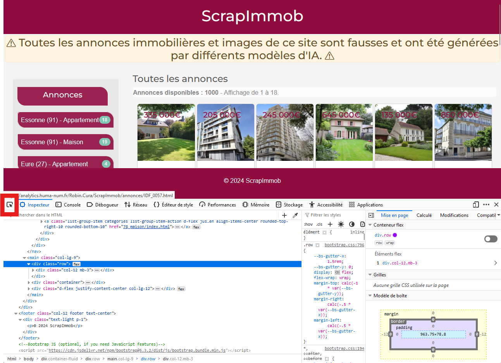

\

Vous pouvez déplier le code source pour l'explorer en profondeur. Cet article Rzine est une page HTML dans laquelle l'ensemble de la partie "*2. Bases techniques*" semblent contenu dans une `div` ayant pour identifiant `"bases-techniques"` :

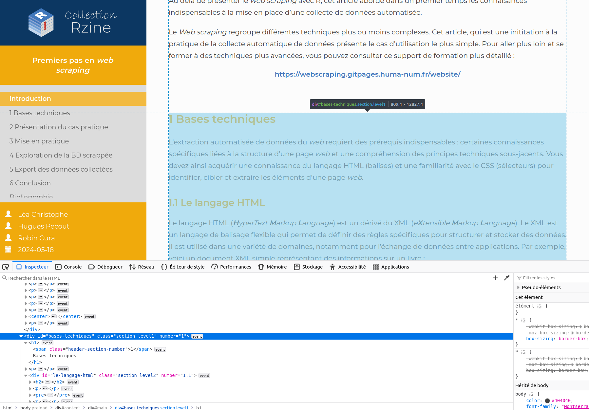

\

En réalisant un clic-droit sur un élément, vous pouvez récupérer plusieurs choses. Cliquez sur copier :

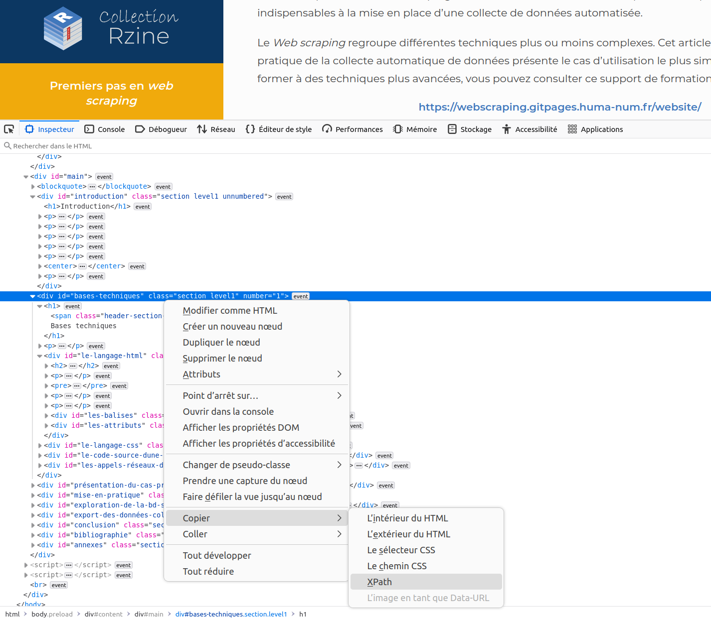


\

Il est ainsi possible de récupérer aisément : 

- **l'intérieur du HTML** : contenu de la balise sélectionnée. Par exemple, l'intérieur du HTML de `<div id="abc" class="foo"><strong>TEXTE</strong></div>` est  `<strong>TEXTE</strong>`)
- **l'exterieur du HTML** : ensemble de la balise sélectionnée. Par exemple, l'extérieur du HTML de `<div id="abc" class="foo"><strong>TEXTE</strong></div>` est  `<div id="abc" class="foo"><strong>TEXTE</strong></div>`)
- **Le sélecteur CSS** (ex : `#bases-techniques`)
- **Le chemin CSS** (ex : `html body.preload div#content div#main div#bases-techniques.section.level1`
- **Le Xpath** (ex : `//*[@id="bases-techniques"]`)

<div class="alert alert-info">
XPath est un acronyme qui signifie "*XML Path Language*". Il s'agit d'un langage de requête utilisé pour naviguer et interroger des documents XML ou HTML. XPath est ainsi utilisé pour sélectionner des éléments spécifiques d'une page *web*.</div>

Ces trois derniers éléments pourront vous être précieux pour automatiser votre collecte.
Par exemple, le sélecteur CSS `#bases-techniques h2` permet de cibler tous les titres de niveau 2 présents dans l'élément `div` ayant pour identifiant "*bases-techniques*".

\

## Les appels réseaux d'une page

Quand on souhaite réaliser une collecte d'éléments redondants (structurés de la même manière) sur une page *web* (ex : sites d'annonce, catalogues de médias, etc.), il peut être utile de chercher à comprendre le fonctionnement interne de la page.

Pour cela, il est possible d'observer ce qui se passe lorsqu'une page *web* est chargée, de façon à repérer des éléments structurés (données *json* par exemple) qui seraient chargées ou requêtées lors de l'interrogation de la page. Il s'agit donc d'observer les appels qu'une page émet lors de son chargement, pour récupérer des images, des polices, des bibliothèques de mise en page (CSS, javascript), etc.

On peut réaliser cette opération dans l'inspecteur de code, dans l'onglet "*Réseaux*" (ou *Network* dans Chrome) après avoir actualisé la page :

<video width="100%" controls>

<source src="figures/Screencast_Inspecteur_Network_crop.webm" type="video/webm">

</video>

\

Dans L'exemple ci-dessus, on constate que l'ouverture de la page de cet article déclenche :  

1. L'ouverture de la page à proprement parler (format  `html` dans la colonne `Type`).    
2. Le chargement de la bibliothèque de fonctions MathJax.js (`javascript`) qui permettent de mettre en forme des équations dans des pages HTML.  
3. La tentative de chargement de la "favicon" du site, c'est-à-dire de l'icône qui devrait s'afficher dans le titre de l'onglet. Comme cette icône n'existe pas, la page essaie de la charger depuis d'autres emplacements (3 derniers appels), sans succès. 


<div class="alert alert-info">
<b>La première étape du *web scraping* consiste ainsi à analyser le code source de la page et du site *web* ciblé, afin de trouver le chemin ou l'emplacement exacte des informations que l'on souhaite récupérer. Plus le code HTML d'un site est structuré et optimisé, plus la collecte automatisé sera facilitée.</b></div>


\

# Site *web* de démonstration

## Le site *web* [**ScrapImmob**](https://analytics.huma-num.fr/Robin.Cura/ScrapImmob/index.html)

Pour cette introduction au *web scraping* avec R, nous proposons une mise en pratique sur un site *web* de démonstration crée pour l'occasion : [**ScrapImmob**](https://analytics.huma-num.fr/Robin.Cura/ScrapImmob/index.html). **Ce site compile 1000 annonces fictives de ventes immobilères de maisons et d'appartements.**  

<center>

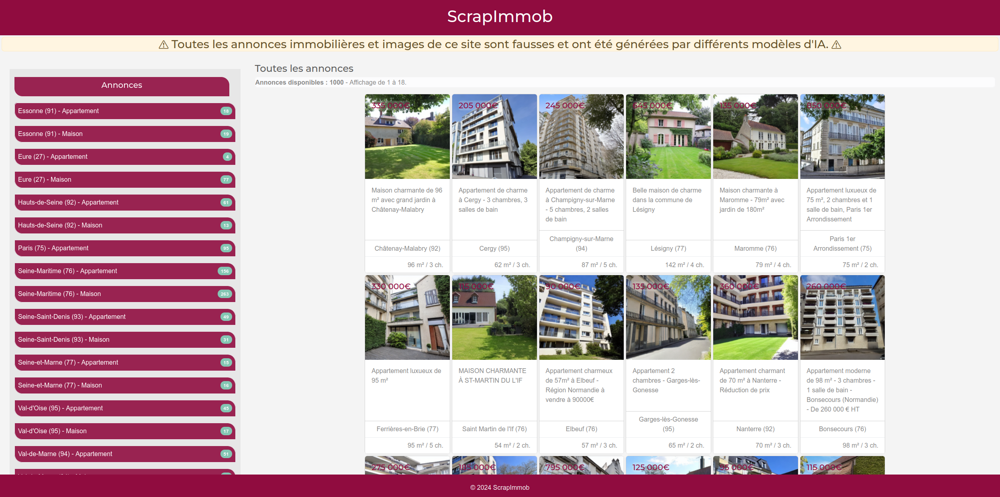

</center>

\

<div class="alert alert-danger"> <b>L'intégralité des biens présentés ainsi que les images associées ont été générés par différents modèles d'intelligence artificielle. Toutes les informations affichées sont donc complétement fictives. Toute ressemblance avec une annonce existante ou ayant existé serait purement fortuite et ne pourrait être que le fruit d'une pure coïncidence.</b> </div>


Comme n'importe quel site d'annonces immobilières, **ScapImmob recense des annonces de ventes de maisons ou d'appartements dans dix départements français : l'Essonne, l'Eure, les Hauts-de-Seine, Paris, la Seine-Maritime, la Seine-Saint-Denis, la Seine-et-Marne, le Val d'Oise, le Val de Marne et les Yvelines.** 

Une exploration rapide du site nous permet d'observer que chaque annonce contient les informations suivantes : 

- des photographies,    
- un titre,     
- une description,     
- des caractèristiques techniques (surfaces, prix, nombre de pièces, etc.),   
- Une localisation (commune et carte interactive). 

<center>

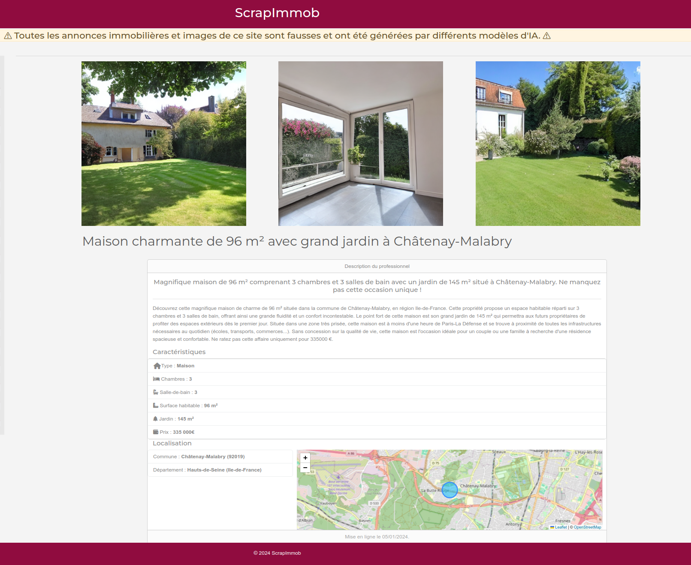

</center>

\

Pour automatiser la collecte de ces informations, nous devons inspecter le code source du site pour déterminer la localisation précise de ces différents éléments. Dans quelles balises se trouvent-il ? Quels sont les identifiants ou classes des différentes balises ? ect.

\

## Exploration du code source

Pour *scrapper*, il est important de comprendre comment le site *web* est construit pour être capacité de cibler les bons élements. Après avoir navigué sur [**ScrapImmob**](https://analytics.huma-num.fr/Robin.Cura/ScrapImmob/index.html) de manière classique, nous pouvons commencer à explorer son code source. Pour cela, nous allons utiliser l'inspecteur de code pour comprendre comment les éléments sont organisés dans la page et détécter les noms de balises, de classes, d'identifiants et les styles associés aux différents éléments.  

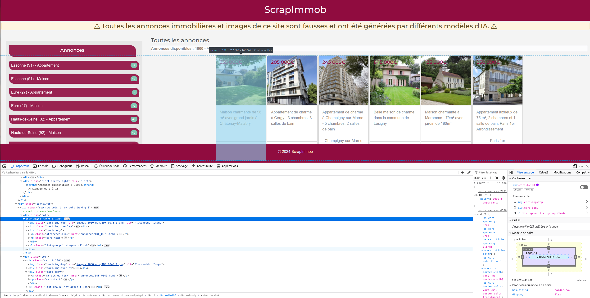

\

## Défintion des objectifs

Avant de se lancer dans une collecte automatisée, **il est primordiale de bien définir ses objectifs et de déterminer précisément quelles informations on souhaite récupérer**. L'exploration du code source nous permettra ensuite d'estimer le niveau de difficulté et de choisir une méthode optimisée.

<div class="alert alert-info">Pour cette introduction, **notre objectif est de récupérer une partie de la base de données (un département) des biens mis en vente sur [**ScrapImmob**](https://analytics.huma-num.fr/Robin.Cura/ScrapImmob/index.html), incluant l'ensemble des caractèristiques de description**. La récupération des coordonnées géographiques affichées dans la carte intéractive est également souhaitée.</div>

Pour répondre a cet objectif, le processus de collecte va se dérouler en plusieurs étapes :

1. **Comprendre la structure de la page centrale** (ou page d'acceuil).

2. **Comprendre le système d'URL du site** afin de pouvoir cibler la collecte sur une catégorie (département et type).

3. **Trouver où récupérer les URLs de chaque page d'annonce ciblée**, puis les collecter.

4. **Comprendre la structure des pages d'annonces** et localiser les informations à récupérer dans le code source.

5. **Collecter l'ensemble des caractèristiques de chaque bien**  à partir de la liste des URL récupérées.

6. **Collecter les coordonnées géographiques** affichées dans la carte interactive pour tous les biens ciblés. 

\

# Mise en pratique

## Les packages de scraping

Comme pour toutes les opérations et manipulations de données, plusieurs solutions existent pour le scraping avec le langage R. Si plusieurs fonctions R-base peuvent être utilisées, il existe surtout deux packages R de référence en matière de collecte automatisée :

- [**`rvest`**](https://rvest.tidyverse.org/) : développé par Hadley Wickham (Rstudio), ce package facilite le scraping en utilisant les sélecteurs CSS et XPath pour extraire les données formatées en HTML ou en XML. Ce package s'insprire de bibliothèques python déjà existantes : [Beautiful Soup](https://www.crummy.com/software/BeautifulSoup/) et [RoboBrowser](https://robobrowser.readthedocs.io/en/latest/readme.html). **`rvest`** fait partie de l'écosystème **`tidyverse`**, les fonctions peuvent s'utiliser avec le(s) pipe(s). Ce package est simple d'utilisation mais également limité en matière de fonctionnalité. Il ne permet que depuis peu, et de manière limitée, de simuler les actions d'un utilisateur (clic, scroll, ect.). On l'utilisera essentiellement pour l'extraction de données de sites *web* statiques.

- [**`Rselenium`**](https://cran.r-project.org/web/packages/RSelenium/index.html) : ce package est ce que l'on appelle un *binding* de langage ("liaison") qui permet d'utiliser les fonctionnalités de **`Selenium 2.0 WebDriver`**. Ce *framework* *web* permet d'automatiser les tests d'applications *web* en simulant des utilisateurs. **`Selenium 2.0 WebDriver`** peut aussi être utilisé pour la collecte automatisée de données sur des sites *web* dynamiques, nécessitant une interaction utilisateur (exécution de code javascript généré par clic, survol, scroll, ect.). Il s'agit concrètement d'un outil qui simule la navigation sur un site web plutôt que d'un outil comme `rvest` qui en extrait simplement le contenu.


Le site *web* [**ScrapImmob**](https://analytics.huma-num.fr/Robin.Cura/ScrapImmob/index.html) est un site *web* statique. Il n'existe pas de base de données, toutes les informations affichées sont présentes dans le code source de la page. Il n'est donc pas nécessaire de simuler le comportement d'un utilisateur pour accéder aux données ciblées. **Dans ce cas, il sera plus simple d'utiliser le package [**`rvest`**](https://rvest.tidyverse.org/)**.

\

### Installation de `rvest`

Le package [**`rvest`**](https://rvest.tidyverse.org/) permet de naviguer à travers la structure HTML des pages *web*, extraire du texte, des tableaux, des images et d'autres éléments, et les convertir en données structurées directement exploitables dans R. 

Commencez par installer le package, puis chargez la librairie.

```{r, message=FALSE, warning=FALSE, eval=FALSE}

install.packages("rvest")

library(rvest)

```


```{r, message=FALSE, warning=FALSE, echo = FALSE, eval=TRUE, cache=FALSE}

library(rvest)

```

\

### Fonctionnement de **`rvest`**

Commençons par explorer les principales fonctions du package [**`rvest`**](https://rvest.tidyverse.org/) à partir d'un extrait du code source du site *web* [**ScrapImmob**](https://analytics.huma-num.fr/Robin.Cura/ScrapImmob/index.html).
Pour cela, nous pouvons utiliser la fonction **`minimal_html()`** qui permet de créer un contenu HTML (XML) requêtable à partir d'un contenu HTML fourni dans une chaîne de caractère.

```{r, message=FALSE, warning=FALSE}

# Extrait de code source html du site ScrapImmob 
extrait_html <- "<div class='card-body'>
                      <a href='annonces/IDF_0078.html' class='stretched-link'></a>
                      <p class='card-text'>Maison charmante de 96 m² avec grand jardin à Châtenay-Malabry</p>
                  </div>"

# Interprétation du "texte" comme du code source html
basic_html <- minimal_html(extrait_html)


class(basic_html)

```

- Les fonctions **`read_element()`** ou **`read_elements()`** permettent respectivement la récupération du 1er ou de tous les éléments d'un document HTML, en précisant un sélecteur CSS ou un Xpath.

```{r, echo = TRUE, message=FALSE, warning=FALSE}

# Récupérer toutes les balises <p> du document :
basic_html |> html_elements("p")

```

- La fonction **`html_attr()`** permet l'extraction des valeurs d'attributs. 

```{r, echo=TRUE, message=FALSE, warning=FALSE}

# Récupérer le ou les URL(s) indiquée(s) dans l'attribut href
basic_html |> html_elements("a") |> html_attr("href")

```


- Les fonctions **`html_text()`** ou **`html_text2()`** permettent d'extraire uniquement le texte d'un élément.

```{r, echo=TRUE, message=FALSE, warning=FALSE}

# Récupérer le contenu textuel des balises <p>
basic_html |> html_elements("p") |> html_text2()

```

\

<div class="alert alert-danger">**Les fonctions du package `rvest` sont conçues pour être utilisées en *pipe*. Elles fonctionnent aussi bien avec le *pipe* natif du R-base (`|>`), qu'avec celui du package `magrittr` (`%>%`), utilisé dans le `tidyverse`**</div>


\

## Le système d'URL 

### Filtrage des biens & ciblage d'URL

:::: {style="display: flex;"}

::: {.column width="28%"}

::: {style="text-align: left;"}

 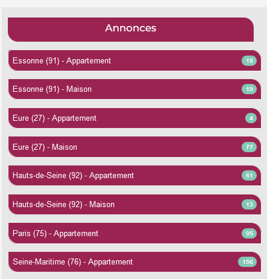
 
::: 

::: 

::: {.column width="2%"}

:::
  
::: {.column width="70%"}

Sur la page d’accueil du site [**ScrapImmob**](https://analytics.huma-num.fr/Robin.Cura/ScrapImmob/index.html), un ensemble de boutons situé à gauche permet de filtrer les biens par département et par type de biens. **Lorsque l'on clique sur l'un de ces boutons, les biens affichés sur la page sont filtrés en fonction du choix réalisé**. L'URL de la page est alors modifiée de la manière suivante :

URL principale :       
[https://analytics.huma-num.fr/Robin.Cura/**ScrapImmob/index.html**]{style="font-size: 90%;"}    

URL du filtre "Essonne (91) - Appartement" :  
[https://analytics.huma-num.fr/Robin.Cura/**ScrapImmob/91_appartement/index.html**]{style="font-size: 90%;"}     

URL du filtre "Val-d'Oise (95) - Maison" :          
[https://analytics.huma-num.fr/Robin.Cura/**ScrapImmob/95_maison/index.html**]{style="font-size: 90%;"}  

::: 

::::


Notre objectif étant de collecter uniquement des données sur les biens (maisons et appartements) de la Seine-Maritime, nous allons orienter notre collecte sur les deux URLs suivantes :

- https://analytics.huma-num.fr/Robin.Cura/ScrapImmob/**76_maison/index.html**   
- https://analytics.huma-num.fr/Robin.Cura/ScrapImmob/**76_appartement/index.html**

Nous commençons par récupérer le code source de ces deux pages avec la fonction `read_html()`. Cette fonction effectue une requête HTTP, puis en analyse le code HTML récupéré à l'aide du package `xml2`.

```{r, eval=params$force_scraping, message=FALSE, warning=FALSE, cache=FALSE, echo = FALSE}
url_appart <- "https://analytics.huma-num.fr/Robin.Cura/ScrapImmob/76_appartement/"
url_maison <- "https://analytics.huma-num.fr/Robin.Cura/ScrapImmob/76_maison/"

code_appart <- read_html(url_appart)
code_maison <- read_html(url_maison)
xml2::write_xml(code_appart, "offline_data/code_appart.html")
xml2::write_xml(code_appart, "offline_data/code_maison.html")
```

```{r, eval=TRUE, message=FALSE, warning=FALSE, cache=FALSE, echo = FALSE}
url_appart <- "https://analytics.huma-num.fr/Robin.Cura/ScrapImmob/76_appartement/"
url_maison <- "https://analytics.huma-num.fr/Robin.Cura/ScrapImmob/76_maison/"
code_appart <- read_html("offline_data/code_appart.html")
code_maison <- read_html("offline_data/code_maison.html")
```


```{r,  eval=FALSE, message=FALSE, warning=FALSE, cache=FALSE}
url_appart <- "https://analytics.huma-num.fr/Robin.Cura/ScrapImmob/76_appartement/"
url_maison <- "https://analytics.huma-num.fr/Robin.Cura/ScrapImmob/76_maison/"

code_appart <- read_html(url_appart)
code_maison <- read_html(url_maison)
```

```{r,  eval=TRUE, message=FALSE, warning=FALSE, cache=FALSE}
# Affichage de l'objet code_appart
code_appart
```

\

### Récupérer les URLs des pages d'annonces

A partir de ces deux URLs, nous allons pouvoir récupérer la liste des URLs de toutes les pages des annonces affichées sur ces pages. Cela nous permettra dans un second temps, de collecter l'ensemble des informations de description de chaque bien en vente. 

En explorant le code source, on remarque que les URLs de pages d'annonces complètes sont stockées dans des balises `<a>` de la classe `stretched-link` :

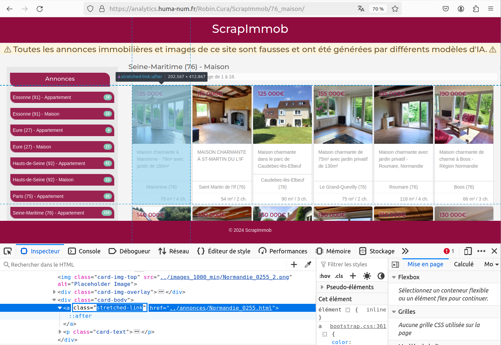

\

Ainsi, pour récupérer la liste de ces ensembles d'URLs, nous devons donc collecter les valeurs (URL en chaîne de caractère) de l'attribut `href` dans toutes les balises `<a>` de la classe `stretched-link` :

```{r, echo=TRUE, message=FALSE, warning=FALSE}

code_appart |> html_elements("a.stretched-link") |>  html_attr("href")

```

Nous pouvons faire la même chose pour les annonces de vente de maison en Seine-Maritime :

```{r, echo=TRUE, message=FALSE, warning=FALSE}

code_maison |> html_elements("a.stretched-link") |>  html_attr("href")

```

Cela permet de récupérer les URLs des annonces affichées sur la première page. Pour collecter l'ensemble des biens ciblés, nous devons comprendre comment fonctionne le système d'URL qui permet d'afficher toutes les annonces de bien en vente en Seine-Maritime.

\

### Récupérer toutes les URLs

Nous avons pu collecter les URLs des biens affichés sur la première page. Pour reproduire la collecte d'URLs sur l'ensemble des pages des appartements et des maisons de Seine-Maritime, il est nécessaire de connaitre le nombre total de pages à afficher pour voir tous les biens et de comprendre le système d'URLs.

\

:::: {style="display: flex;"}

::: {.column width="47%"}

<center>

<b>[**../76_appartement/index.html**](https://analytics.huma-num.fr/Robin.Cura/ScrapImmob/76_appartement/index.html)</b>

</center>

:::{style="margin-top:3%;"}

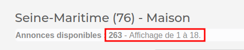

:::

Dans cette section, il y a 156 biens en vente, et chaque page en affiche jusqu'à 18. Il y a donc **9 pages** des biens listés (156 / 18 = 8.7).

::: 

::: {.column width="6%"}

:::
  
::: {.column width="47%"}

<center>

<b>[**../76_maison/index.html**](https://analytics.huma-num.fr/Robin.Cura/ScrapImmob/76_maison/index.html)</b>

</center>

:::{style="margin-top:3%;"}

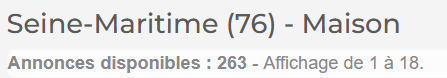

:::

Dans cette section, il y a 263 biens en vente, et chaque page en affiche jusqu'à 18. Il y a donc **15 pages** des biens listés (263 / 18 = 14.6).

::: 
::::


Lorsque l'on observe le comportement de l'URL à chaque chargement d'une nouvelle page, il est facile de comprendre le système d'URLs utilisé par [**ScrapImmob**](https://analytics.huma-num.fr/Robin.Cura/ScrapImmob/index.html) :

**Page 1** = https://analytics.huma-num.fr/Robin.Cura/ScrapImmob/76_appartement/**index.html**   
**Page 2** = https://analytics.huma-num.fr/Robin.Cura/ScrapImmob/76_appartement/**page_2.html**   
**Page 3** = https://analytics.huma-num.fr/Robin.Cura/ScrapImmob/76_appartement/**page_3.html**    
**Page 4** = https://analytics.huma-num.fr/Robin.Cura/ScrapImmob/76_appartement/**page_4.html**     
**Page 5** = https://analytics.huma-num.fr/Robin.Cura/ScrapImmob/76_appartement/**page_5.html**     
...     


Ainsi, il est aisé de reconstituer la liste des URLs des pages ciblées :

```{r, echo=TRUE, message=FALSE, warning=FALSE}

# Nombres de pages à scrapper
nbpage_appart <- 9
nbpage_maison <- 15

# Construction des URLs pour les biens de type "appartement" (76) 
list_url_appart <- paste0(url_appart, "page_", 1:nbpage_appart,".html")

# Construction des URLs pour les biens de type "maison" (76) 
list_url_maison <- paste0(url_maison, "page_", 1:nbpage_maison,".html")

# Concaténation des deux vecteurs d'URLs
list_url <- c(list_url_appart, list_url_maison)

# Modification URL première page : page_1.html = index.html
list_url<- gsub(x = list_url, pattern =  "page_1.html", replacement = "index.html")

# Affichage du vecteur de liens
head(list_url)

```

\

<div class="alert alert-danger"> <b>
Une autre solution aurait été de simuler le clic d'un utilisateur sur le bouton "page suivante". Cela aurait permis de  collecter des données sans avoir à lister les URLs des pages ciblées.</b></div>

\


### Scraper toutes les URLs

A partir de cette liste, nous pouvons collecter l'ensemble des URLs présentes sur ces pages, qui renvoient vers des pages d'annonces complètes. Pour cela, nous créons la boucle suivante : 


```{r scrap_link_cache, echo=FALSE, eval = params$force_scraping, message=FALSE, warning=FALSE}
# Création d'un vecteur vide
links <- character()

i<- 1
# Boucle de récupération des URLs de page d'annonce
for (i in 1:length(list_url)){

  # Récupération du code source de la page i
  page <- read_html(list_url[i])

  # Récupération du lien dans les balises de la classe "stretched-link"
  links_p <- page |> html_elements("a.stretched-link") |>  html_attr("href")

  links <- c(links, links_p)

 }

# Affichage des 6 premières URLs récupérées
head(links)
saveRDS(links, "offline_data/links.rds")
```

```{r scrap_link_offline, echo=FALSE, eval = TRUE, message=FALSE, warning=FALSE}
links <- readRDS('offline_data/links.rds')
```

```{r scrap_link, echo=TRUE, message=FALSE, warning=FALSE, eval = FALSE}

# Création d'un vecteur vide
links <- character()

i<- 1
# Boucle de récupération des URLs de page d'annonce
for (i in 1:length(list_url)){

  # Récupération du code source de la page i
  page <- read_html(list_url[i])

  # Récupération du lien dans les balises de la classe "stretched-link"
  links_p <- page |> html_elements("a.stretched-link") |>  html_attr("href")

  links <- c(links, links_p)

 }
```


```{r scrap_link_print, echo=TRUE, message=FALSE, warning=FALSE, eval = TRUE}
# Affichage des 6 premières URLs récupérées
head(links)
```


**Les URLs récupérées sont relatives**, c'est à dire qu'elles n'incluent que le nom d'une page spécifique. Le chemin courant n'est pas indiqué. Nous pouvons le rajouter avec la fonction `url_absolute()`.


```{r, echo=TRUE, message=FALSE, warning=FALSE, eval=TRUE}

links <- url_absolute(links, "https://analytics.huma-num.fr/Robin.Cura/ScrapImmob/a/b")

# Affichage des 6 premières URLs absolues
head(links)

``` 

\


## Collecte principale

### Scraping d'une page d'annonce

Notre liste de page *web* à scraper est prête. Nous pouvons maintenant explorer les pages de chaque annonce pour comprendre comment sont structurées les données en HTML pour afin de les extraire automatiquement. Après une exploration avec l'inspecteur de code, nous observons que les éléments ciblés sont stockés dans les balises suivantes :

- **Titre court** : balise `<h6>` de classe `display-6`
- **Titre long** : balise `<h5>` de classe `card-title`
- **Description** : balise `<p>` de classe `card-text`
- **Photos (3)** : balise `` de classe `img-fluid`

Les autres informations sont stockées dans une balise `<ul>` (ou `<div>`) de classe `list-group` :

- **Type de bien** : balise `<li>` de classe `list-group-item` - élément 1    
- **Nombre de chambre** : balise `<li>` de classe `list-group-item` - élément 2   
- **Nb de salle de bain** : balise `<li>` de classe `list-group-item` - élément 3   
- **Surface habitable** : balise `<li>` de classe `list-group-item` - élément 4   
- **Surface jardin** : balise `<li>` de classe `list-group-item` - **Cet élément est facultatif**     
- **Prix** : balise `<li>` de classe `list-group-item` - élément 5 ou 6   
- **Commune** : balise `<li>` de classe `list-group-item` - élément 6 ou 7
-  **Département** : balise `<li>` de classe `list-group-item` - élément 7 ou 8

**Les informations que l'on souhaite récupérer dans les balises `<li>` sont affichées en gras**. Cette caractèristique s'avère très précieuse pour otpimiser la collecte. 

\

Dans un premier temps, nous essayons d'extraire ces informations pour une seule page d'annonce :

```{r, echo= FALSE, message=FALSE, warning=FALSE, eval =TRUE}

library(rvest)

``` 


```{r, echo=FALSE, message=FALSE, warning=FALSE, eval =params$force_scraping}
# Lecture du code source de la page 1
code_annonce_1 <- read_html(links[1])
xml2::write_xml(code_annonce_1, "offline_data/code_annonce_1.html")
``` 

```{r, echo=FALSE, message=FALSE, warning=FALSE, eval = TRUE}
# Lecture du code source de la page 1
code_annonce_1 <- read_html("offline_data/code_annonce_1.html")
``` 

```{r, echo=TRUE, message=FALSE, warning=FALSE, eval =FALSE}

# Lecture du code source de la page 1
code_annonce_1 <- read_html(links[1])

``` 

A partir de l'exploration du code source, nous pouvons essayer d'extraire chaque élément séparément.


```{r, echo=TRUE, message=FALSE, warning=FALSE}

# Titre court
code_annonce_1 |> html_element("h6.display-6") |> html_text2()

# Titre long
code_annonce_1 |> html_element("h5.card-title") |> html_text2()

# Description
code_annonce_1 |> html_element("p.card-text") |> html_text2()

# Photos (liens relatifs)
code_annonce_1 |> html_elements("img.img-fluid") |>  html_attr("src")

# Photos 1
code_annonce_1 |> html_element("a.col-sm-3:nth-child(1) > img") |>  html_attr("src")

# Photos 2
code_annonce_1 |> html_element("a.col-sm-3:nth-child(2) > img") |>  html_attr("src")

# Photos 3
code_annonce_1 |> html_element("a.col-sm-3:nth-child(3) > img") |>  html_attr("src")


# Type, Nb de chambre, de salle de bain, surfaces, prix, commune et département
code_annonce_1 |> html_elements("li.list-group-item > strong") |> html_text2()

```
 

\

<div class="alert alert-info">**La récupération des coordonnées du marqueur affiché dans la carte interactive est légèrement plus complexe. Leur collecte automatisée est expliquée dans la [partie 3.5](#collecte-de-coordonnées).**</div>

\

### Construction d'un tableau de collecte

Nous pouvons démarrer la collecte automatisée des informations sur l'ensemble des page ciblées. Nous commençons par créer un tableau de données vide, qui nous permettra de stocker l'ensemble des données colléctées.


```{r, echo=TRUE, message=FALSE, warning=FALSE, cache=FALSE}

scrapimmob <- data.frame(URL = as.character(links),
                         T_court = as.character(0),
                         T_long = as.character(0),
                         Description = as.character(0),
                         Photo_1 = as.character(0),
                         Photo_2 = as.character(0),
                         Photo_3 =  as.character(0),
                         Type = as.character(0),
                         nb_ch = as.character(0),
                         nb_sdb = as.character(0),
                         surf_hab = as.character(0),
                         surf_jar = as.character(0),
                         prix = as.character(0),
                         com = as.character(0),
                         dep =  as.character(0))

```


Le `data.frame` *scrapimmob* prêt à stocker les données collectées :


```{r, echo=FALSE, warning=FALSE, eval=TRUE}

library(DT)
datatable(
    scrapimmob, 
    rownames = FALSE,  
    extensions = 'Buttons', options = list(
    dom = 'Bfrtip', pageLength = 5,
    buttons = list(list(extend = 'colvis', columns = c(1:14))), 
    columnDefs = list(list(
    targets = c(1,2,3),
    visible = TRUE, 
    render = JS(
    "function(data, type, row, meta) {",
    "  if (type === 'display') {",
    "    return data.length < 15 ? data : ",
    "      '<span title=\"' + data + '\">' + data.substr(0, 15) + '...</span>';",
    "  }",
    "  return data;",
    "}"
  )
))))

```

\

### Scraping de toutes les pages  {.tabset}

#### Pas-à-pas

Nous pouvons désormais construire une boucle qui collecte toutes ses données et complète le tableau précédemment créée.


```{r scraping_cached, echo=FALSE, message=FALSE, warning=FALSE, eval = params$force_scraping}

for (i in 1:nrow(scrapimmob)){   

code_annonce <- read_html(scrapimmob$URL[i])

# Titre court
scrapimmob$T_court[i] <- code_annonce |> html_element("h6.display-6") |> html_text2()

# Titre long
scrapimmob$T_long[i] <- code_annonce |> html_element("h5.card-title") |> html_text2()

# Description
scrapimmob$Description[i] <- code_annonce |> html_element("p.card-text") |> html_text2()

# Photo 1 (lien relatif)
scrapimmob$Photo_1[i] <- code_annonce |> html_element("a.col-sm-3:nth-child(1) > img") |>  html_attr("src")

# Photo 2
scrapimmob$Photo_2[i] <- code_annonce |> html_element("a.col-sm-3:nth-child(2) > img") |>  html_attr("src")

# Photo 3
scrapimmob$Photo_3[i] <- code_annonce |> html_element("a.col-sm-3:nth-child(3) > img") |>  html_attr("src")

# Type, Nb de chambre, de salle de bain, surface, prix, commune et département
infos <- code_annonce |> html_elements("li.list-group-item > strong") |> html_text2()

scrapimmob$Type[i] <- infos[1]
scrapimmob$nb_ch[i] <- infos[2]
scrapimmob$nb_sdb[i] <- infos[3]
scrapimmob$surf_hab[i] <- infos[4]

if (length(infos)==7){

scrapimmob$surf_jar[i] <- NA
scrapimmob$prix[i] <- infos[5]
scrapimmob$com[i] <- infos[6]
scrapimmob$dep[i] <- infos[7]

} else {

scrapimmob$surf_jar[i] <- infos[5]
scrapimmob$prix[i] <- infos[6]
scrapimmob$com[i] <- infos[7]
scrapimmob$dep[i] <- infos[8]

}


# print(paste0("Page ",i))

}

saveRDS(scrapimmob, "offline_data/scrapimmob.rds")
```

```{r, echo = FALSE, eval = TRUE}
scrapimmob <- readRDS("offline_data/scrapimmob.rds")
```


```{r scraping, echo=TRUE, message=FALSE, warning=FALSE, eval = FALSE}

for (i in 1:nrow(scrapimmob)){   

code_annonce <- read_html(scrapimmob$URL[i])

# Titre court
scrapimmob$T_court[i] <- code_annonce |> html_element("h6.display-6") |> html_text2()

# Titre long
scrapimmob$T_long[i] <- code_annonce |> html_element("h5.card-title") |> html_text2()

# Description
scrapimmob$Description[i] <- code_annonce |> html_element("p.card-text") |> html_text2()

# Photo 1 (lien relatif)
scrapimmob$Photo_1[i] <- code_annonce |> html_element("a.col-sm-3:nth-child(1) > img") |>  html_attr("src")

# Photo 2
scrapimmob$Photo_2[i] <- code_annonce |> html_element("a.col-sm-3:nth-child(2) > img") |>  html_attr("src")

# Photo 3
scrapimmob$Photo_3[i] <- code_annonce |> html_element("a.col-sm-3:nth-child(3) > img") |>  html_attr("src")

# Type, Nb de chambre, de salle de bain, surface, prix, commune et département
infos <- code_annonce |> html_elements("li.list-group-item > strong") |> html_text2()

scrapimmob$Type[i] <- infos[1]
scrapimmob$nb_ch[i] <- infos[2]
scrapimmob$nb_sdb[i] <- infos[3]
scrapimmob$surf_hab[i] <- infos[4]

if (length(infos)==7){

scrapimmob$surf_jar[i] <- NA
scrapimmob$prix[i] <- infos[5]
scrapimmob$com[i] <- infos[6]
scrapimmob$dep[i] <- infos[7]

} else {

scrapimmob$surf_jar[i] <- infos[5]
scrapimmob$prix[i] <- infos[6]
scrapimmob$com[i] <- infos[7]
scrapimmob$dep[i] <- infos[8]

}


# print(paste0("Page ",i))

}

```


Dans la liste de puce (`<li>`) de la classe `list-group-item` se trouve plusieurs informations sur les biens. Cela permet de collecter plusieurs informations d'un coup. Cependant, certaines informations ne sont pas toujours renseignées. C'est le cas de "la surface de jardin". Pour cette raison, **nous utilisons un test `if` qui permet d'adapter la collecte en fonction du nombre d'éléments récupérés**. 


#### En une fois


Nous pouvons désormais interroger une par une chacune des URL des annonces et compléter le tableau précédemment créé : 


```{r, echo=TRUE, message=FALSE, warning=FALSE, eval = FALSE}

library(purrr)

scrapimmob_results <- scrapimmob %>% slice(0) # Initialisation à 0 lignes du tableau de résultats

for (i in 1:nrow(scrapimmob)){   

code_annonce <- read_html(scrapimmob$URL[i])
infos <- code_annonce |> html_elements("li.list-group-item > strong") |> html_text2()

scrapimmob_page <- scrapimmob %>%
  slice(i) %>%
  mutate(T_court = html_element(code_annonce, "h6.display-6") |> html_text2()) %>% # Titre court
  mutate(T_long =  html_element(code_annonce, "h5.card-title") |> html_text2()) %>% # Titre long
  mutate(Description = html_element(code_annonce, "p.card-text") |> html_text2()) %>% #Description
  mutate(Photo_1 =  html_elements(code_annonce, "img") |> html_attr('src') %>% pluck(1)) %>%
  mutate(Photo_2 =  html_elements(code_annonce, "img") |> html_attr('src') %>% pluck(2)) %>%
  mutate(Photo_3 =  html_elements(code_annonce, "img") |> html_attr('src') %>% pluck(3)) %>%
  mutate(Type = pluck(infos, 1)) %>%
  mutate(nb_ch = pluck(infos, 2)) %>%
  mutate(nb_sdb = pluck(infos, 3)) %>%
  mutate(surf_hab = pluck(infos, 4))

if (length(infos)==7){
  scrapimmob_page <- scrapimmob_page %>%
    mutate(surf_jar = NA) %>%
    mutate(prix = pluck(infos, 5)) %>%
    mutate(com = pluck(infos, 6)) %>%
    mutate(dep = pluck(infos, 7))
} else {
  scrapimmob_page <- scrapimmob_page %>%
    mutate(surf_jar = pluck(infos, 5)) %>%
    mutate(prix = pluck(infos, 6)) %>%
    mutate(com = pluck(infos, 7)) %>%
    mutate(dep = pluck(infos, 8))
}

scrapimmob_results <- scrapimmob_results %>%
  bind_rows(scrapimmob_page)

print(paste0(i, " / ", nrow(scrapimmob)))

}

scrapimmob <- scrapimmob_results

```


Dans la liste de puce (`<li>`) de la classe `list-group-item` se trouve plusieurs informations sur les biens. Cela permet de collecter plusieurs informations d'un coup. Cependant, certaines informations ne sont pas toujours renseignées. C'est le cas de "la surface de jardin". Pour cette raison, **nous utilisons un test `if` qui permet d'adapter la collecte en fonction du nombre d'éléments récupérés**. 


### {-}

Cette boucle a permis de renseigner le `data.frame` *scrapimmob* de la manière suivante :

```{r, echo=FALSE, warning=FALSE, eval=TRUE}

datatable(
    scrapimmob, 
    rownames = FALSE, filter = 'top',  
    extensions = 'Buttons', options = list(
    dom = 'Bfrtip', pageLength = 5,
    buttons = list(list(extend = 'colvis', columns = c(2:14))), 
    columnDefs = list(list(
    targets = c(1,2,3),
    visible = TRUE, 
    render = JS(
    "function(data, type, row, meta) {",
    "  if (type === 'display') {",
    "    return data.length < 15 ? data : ",
    "      '<span title=\"' + data + '\">' + data.substr(0, 15) + '...</span>';",
    "  }",
    "  return data;",
    "}"
  )
))))

```

\

## Nettoyage des données {.tabset}


**En *web scraping*, le plus compliqué n'est pas forcément la collecte des données. Un prétraitement des données collectées est souvent nécessaire pour obtenir une base de données propre et optimisée.**

Dans notre démonstration, certaines des informations collectées ont besoin d'être nettoyées. C'est par exemple le cas de la variable "prix", qui affiche l'unité de mesure (€), ou le cas de la variable "com" qui contient le nom de la commune et son code INSEE. Nous procédons donc à des traitements pour améliorer les données collectées. 

### En R-base

1) **Suppression des unités de mesure** pour les prix et les surfaces collectés.


```{r, echo=TRUE, message=FALSE, warning=FALSE, cache=TRUE, eval=TRUE}

# Suppression du symbol " m²"
scrapimmob$surf_hab <- gsub(x = scrapimmob$surf_hab, pattern = " m²", replacement = "")
scrapimmob$surf_jar <- gsub(x = scrapimmob$surf_jar, pattern = " m²", replacement = "")

# Suppression du symbole "€" 
scrapimmob$prix <- gsub(x = scrapimmob$prix, pattern = "€", replacement = "")
# Suppression des espaces
scrapimmob$prix <- gsub(x = scrapimmob$prix, pattern = " ", replacement = "")

```


2) **Conversion des nombres** stockés en `string` en format `numeric`.


```{r, echo=TRUE, message=FALSE, warning=FALSE, cache=TRUE, eval=TRUE}

# Vecteur des colonnes à convertir
col <- c("nb_ch", "nb_sdb", "surf_hab", "surf_jar", "prix")

# Conversion des colonnes ciblées en numeric
scrapimmob[col] <- as.data.frame(lapply(scrapimmob[col], as.numeric))

```


3) **Ventilation de la variable "com"** en deux colonnes : "com_name" et "com_insee".


```{r, echo=TRUE, message=FALSE, warning=FALSE, cache=TRUE, eval=TRUE}

# Division de la valeur de la variable "com" avec le symbole "("
Name_and_code <- unlist(strsplit(scrapimmob$com, split = " \\(" ))

# Transformation du vecteur en matrice + insertion dans le data.frame
scrapimmob[ c("com_name","com_insee")] <- matrix(Name_and_code, ncol = 2, byrow = TRUE)

# Supression de la paranthèse restante dans le nouveau champ "com_insee"
scrapimmob$com_insee <- gsub(x= scrapimmob$com_insee, pattern = ")", replacement = "")

```


4) **Même opération sur la variable "dep"** qui contient le nom du département et celui de la région et que l'on ventile en deux colonnes : "dep_name" et "reg_name".


```{r, echo=TRUE, message=FALSE, warning=FALSE, cache=TRUE, eval=TRUE}

# Division de la valeur de la variable "dep" avec le symbole "("
dep_and_reg <- unlist(strsplit(scrapimmob$dep, split = " \\(" ))

# Transformation du vecteur en matrice + insertion dans le data.frame
scrapimmob[ c("dep_name","reg_name")] <- matrix(dep_and_reg, ncol = 2, byrow = TRUE)

# Supression de la paranthèse restante dans le nouveau champ "com_insee"
scrapimmob$reg_name <- gsub(x= scrapimmob$reg_name, pattern = ")", replacement = "")

```

**Résultats des traitements réalisés sur les différentes variables :**


```{r, echo=FALSE, warning=FALSE, eval=TRUE}

scrapimmob2 <- scrapimmob[, c(9,10,11,12,13,16,17,18,19)]

datatable(scrapimmob2, 
    rownames = FALSE, filter = 'top',  extensions = 'Buttons',options = list(pageLength = 5, 
    buttons = list(list(extend = 'colvis', columns = c(1:3)))))

```


### Avec dplyr et le tidyverse

```{r, echo=TRUE, message=FALSE, warning=FALSE, cache=TRUE, eval=FALSE}
library(dplyr)
library(stringr)
library(tidyr)
scrapimmob <- scrapimmob %>%
  # 1) **Suppression des unités de mesure** pour les prix et les surfaces collectés.
  mutate(surf_hab = str_remove(surf_hab, " m²") %>% as.numeric()) %>% # Suppression du symbol " m²"
  mutate(surf_jar = str_remove(surf_jar, " m²") %>% as.numeric()) %>% # Suppression du symbol " m²"
  mutate(prix = str_remove(prix, "€") %>% str_remove(., " ")) %>% # Suppression du symbole "€" et des espaces
  # 2) **Conversion des nombres** stockés en `string` en format `numeric`.
  mutate(across(
    .cols = c(starts_with("nb_"), starts_with("surf_"), prix),
    .fns = as.numeric
  )) %>%
  # 3) **Ventilation de la variable "com"** en deux colonnes : "com_name" et "com_insee" et Idem pour variable "dep"
  separate_wider_delim(com, delim = "(", names = c("com_name", "com_insee")) %>% # Division en deux colonnes
  separate_wider_delim(dep, delim = "(", names = c("dep_name", "reg_name")) %>% # Division en deux colonnes
  mutate(com_insee = str_remove(com_insee, fixed(")"))) %>% # Suppression des parenthèses fermantes restantes
  mutate(reg_name = str_remove(reg_name, fixed(")"))) %>% # Suppression des parenthèses fermantes restantes
  mutate(reg_name = paste0("    ", reg_name)) %>%
  mutate(across(  # Suppression des espaces en début et fin
    .cols = c(com_name, com_insee, dep_name, reg_name),
    .fns = str_trim))
```


**Résultats des traitements réalisés sur les différentes variables :**


```{r, echo=FALSE, warning=FALSE, eval=TRUE}

scrapimmob2 <- scrapimmob[, c(9,10,11,12,13,16,17,18,19)]

datatable(scrapimmob2, 
    rownames = FALSE, filter = 'top',  extensions = 'Buttons',options = list(pageLength = 5, 
    buttons = list(list(extend = 'colvis', columns = c(1:3)))))

```

\


## Collecte de coordonnées {.tabset}

Il est possible de récupérer les coordonnées géographiques de la localisation des biens en vente indiquées sur la carte interactive, qui sont stockées dans une balise `<script>` dans le code source des pages. Cette collecte nécessite de la manipulation de chaîne de caractères.

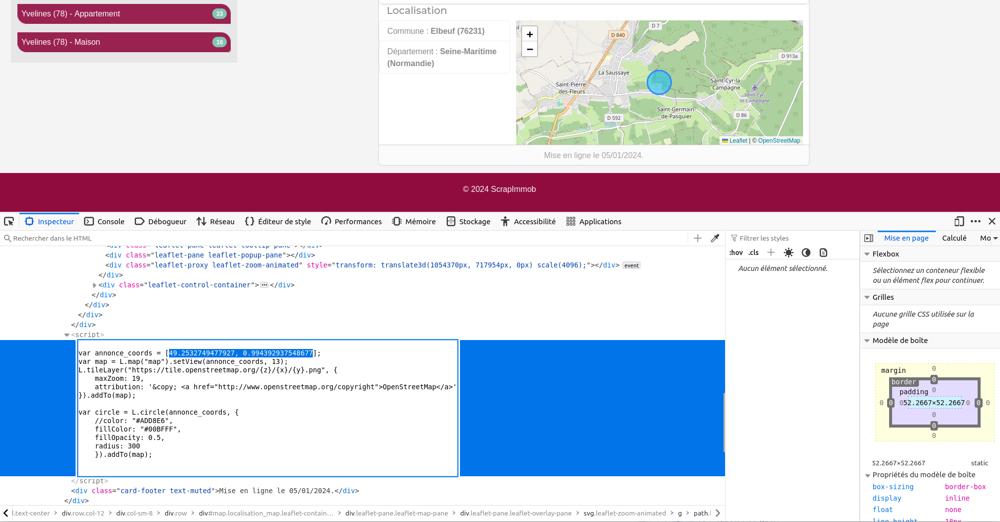

\

**Extraction des coordonées (x,y) pour une page d'annonce donnée :**

```{r, echo=FALSE, message=FALSE, warning=FALSE, cache=TRUE, eval=params$force_scraping}

# Récupération du code source d'une page d'annonce
page <- read_html(scrapimmob$URL[1])

# Récupère des balises de type script
code_page <- page |> html_elements('script') |> html_text2()  

saveRDS(code_page, "offline_data/code_page.rds")
```

```{r, eval = TRUE, echo = FALSE}
code_page <- readRDS("offline_data/code_page.rds")
```


```{r, echo=TRUE, message=FALSE, warning=FALSE, cache=TRUE, eval=FALSE}

# Récupération du code source d'une page d'annonce
page <- read_html(scrapimmob$URL[1])

# Récupère des balises de type script
code_page <- page |> html_elements('script') |> html_text2()  

# Affichage du code source récupéré
code_page

```

```{r, echo = FALSE, eval = TRUE}
code_page
```


Les coordonnées sont stockées dans la seconde balise `<script>` récupérée.


```{r, echo=TRUE, message=FALSE, warning=FALSE, cache=TRUE, eval=TRUE}

# Sélection du 2e élément qui stocke les coordonées
code_page_coord <- code_page[2]

```


### Récupération avec R-Base

Avec la fonction `strcapture()`, nous pouvons ensuite extraire les coordonnées à l'aide d'une expression régulière qui permet de ne garder que les caractères situés entre crochets `[]`.


```{r, echo=TRUE, message=FALSE, warning=FALSE, cache=TRUE, eval=TRUE}
coords <- strcapture(x = code_page_coord, 
                     pattern = "\\[(.*?)\\]", 
                     proto = data.frame(coordinates = character(0)))
# Les coordonnées du marqueur affiché sur la carte sont récupérés
coords

# Split de la chaîne de caractère 
unlist(strsplit(coords$coordinates, split = ", " ))

```


Nous pouvons alors construire une boucle pour collecter toutes les coordonnées d'un seul coup.


```{r map_scrap_cache,  echo=FALSE, message=FALSE, warning=FALSE, eval=params$force_scraping}

# Création de deux colonnes pour stocker les coordonnées
scrapimmob$Lat <- ""
scrapimmob$Long <- ""

for (i in 1:nrow(scrapimmob)){

# Lecture du code source
page <- read_html(scrapimmob$URL[i])

# Récupération du contenu des balises script
code_page  <- page |> html_elements('script') |> html_text2()  

# Extraction des cordonnées
coords <- strcapture(x = code_page[2], 
                     pattern = "\\[(.*?)\\]", 
                     proto = data.frame(coordinates = character(0)))

# Ajout des coordonées dans le data.frame scrapimmo
scrapimmob[ c("Lat","Long")][i,] <-  unlist(strsplit(coords$coordinates, split = ", " ))

# print(paste0("Page ",i))

}  

# Conversion des coordonnées récupérées en format numeric
scrapimmob$Lat <- as.numeric(scrapimmob$Lat)
scrapimmob$Long <- as.numeric(scrapimmob$Long)

saveRDS(scrapimmob, "offline_data/scrapimmob_withCoords.rds")
```

```{r, echo = FALSE, eval = TRUE}
scrapimmob <- readRDS("offline_data/scrapimmob_withCoords.rds")
```


```{r map_scrap,  echo=TRUE, message=FALSE, warning=FALSE, eval=FALSE}

# Création de deux colonnes pour stocker les coordonnées
scrapimmob$Lat <- ""
scrapimmob$Long <- ""

for (i in 1:nrow(scrapimmob)){

# Lecture du code source
page <- read_html(scrapimmob$URL[i])

# Récupération du contenu des balises script
code_page  <- page |> html_elements('script') |> html_text2()  

# Extraction des cordonnées
coords <- strcapture(x = code_page[2], 
                     pattern = "var annonce_coords = \\[(\\d+\\.?\\d*\\, \\d+\\.?\\d*)\\]",
                     proto = data.frame(coordinates = character(0)))

# Ajout des coordonées dans le data.frame scrapimmo
scrapimmob[ c("Lat","Long")][i,] <-  unlist(strsplit(coords$coordinates, split = ", " ))

# print(paste0("Page ",i))

}  

# Conversion des coordonnées récupérées en format numeric
scrapimmob$Lat <- as.numeric(scrapimmob$Lat)
scrapimmob$Long <- as.numeric(scrapimmob$Long)

```


**Les colonnes "Lat" et "Long" sont désormais renseignées pour chaque bien en vente.**


```{r, echo=FALSE, warning=FALSE, eval=TRUE}

tt <- scrapimmob[,c("URL", "Lat", "Long")]

datatable(tt, 
          rownames = FALSE,  
          extensions = 'Buttons',
          options = list(pageLength = 5))

```

### Récupération avec le tidyverse


Avec la fonction `str_extract()` du package `stringr`, plus conviviale, nous pouvons ensuite extraire les coordonnées à l'aide d'une expression régulière qui permet de ne garder que les caractères situés entre crochets `[]`.


```{r, echo=TRUE, message=FALSE, warning=FALSE, cache=TRUE, eval=TRUE}

coords <- str_extract(code_page_coord,"\\[(.*?)\\]", group = 1) %>%
  str_split(", ", simplify = TRUE) %>% # Séparation des 2 coordonnées
  as.numeric()# Conversion en numérique
# Les coordonnées du marqueur affiché sur la carte sont récupérés
coords
```
Nous pouvons alors itérer pour récupérer tous les couples de coordonnées

```{r,  echo=TRUE, message=FALSE, warning=FALSE, eval=FALSE}
scrapimmob_results <- scrapimmob %>% slice(0)
for (i in 1:nrow(scrapimmob)){

# Lecture du code source
scrapimmob_page <- scrapimmob %>% slice(i)
coords <- read_html(scrapimmob_page %>% pull(URL)) %>%
  html_elements('script') %>% # Récupération de la balise script
  html_text2() %>% # Conversion en texte
  pluck(2) %>% # Seule la deuxième balise script contient les coordonnées
  str_extract("\\[(.*?)\\]", group = 1) %>% # Extraction des coordonnées entre crochets
  str_split(", ", simplify = TRUE) %>% # Séparation des 2 coordonnées
  as.numeric()# Conversion en numérique

scrapimmob_results <- scrapimmob_results %>%
  bind_rows(
    scrapimmob_page %>%
      mutate(Lat = coords[1]) %>%
      mutate(Long = coords[2])
  )
print(paste0(i, " / ", nrow(scrapimmob)))
}

scrapimmob <- scrapimmob_results
```


\

**Les colonnes "Lat" et "Long" sont désormais renseignées pour chaque bien en vente.**


```{r, echo=FALSE, warning=FALSE, eval=TRUE}

tt <- scrapimmob[,c("URL", "Lat", "Long")]

datatable(tt, 
          rownames = FALSE,  
          extensions = 'Buttons',
          options = list(pageLength = 5))

```


\


# Exploration des données

Une fois les données collectées, nous pouvons démarrer leur exploration. Pour cela, nous utilisons plusieurs packages de manipulation et de représentation de données : 

- [`ggplot2`](https://cran.r-project.org/web/packages/ggplot2/index.html) pour construire toute sorte de graphiques.     
- [`tm`](https://cran.r-project.org/web/packages/tm/index.html) pour l'analyse statistique de textes.    
- [`wordcloud`](https://cran.r-project.org/web/packages/wordcloud/) pour construire un nuage de mots.    
- [`leaflet`](https://cran.r-project.org/web/packages/leaflet/) pour construire des cartes interactives.    

\


## Les données collectées

Notre base de données liste les 419 biens à vendre (maisons et appartements) en Seine-Maritime, caractèrisés par plusieurs variables : 

- **URL** : URL de la page d'annonce du bien en vente(*string*)       
- **T_court** : Titre court de l'annonce (*string*)       
- **T_long** : Titre long de l'annonce (*string*)       
- **Description** : Description complète de l'annonce (*string*)       
- **Photo_1** : URL de la photo 1 (*string*)       
- **Photo_2** : URL de la photo 2 (*string*)       
- **Photo_3** : URL de la photo 3 (*string*)       
- **Type** : Type de bien (maison ou appartement) (*string*)       
- **nb_ch** : Nombre de chambres (*numeric*)       
- **nb_sdb** : Nombre de salles de bain (*numeric*)       
- **surf_hab** : Surface habitable (en m2) (*numeric*)       
- **surf_jar** : Surface de jardin (en m2) (*numeric*)       
- **prix** : Prix (en €) (*numeric*)       
- **com** : Nom et code INSEE de la commune concernée (*string*)       
- **dep** : Département et région de la commune concernée (*string*)       
- **com_name** : Libellé de la commune (*string*)       
- **com_insee** : Code INSEE de la commune (*string*)       
- **dep_name** : Département d'appartenance de la commune  (*string*)       
- **reg_name** : Région d'appartenance de la commune (*string*)       
- **Lat** : Latitude - coordonnée géographique (*numeric*)       
- **Long** : Longitude - coordonnée géographique (*numeric*)       


```{r, echo=FALSE, eval=TRUE}

datatable(
    scrapimmob, 
    rownames = FALSE,  
    extensions = 'Buttons', options = list(
    dom = 'Bfrtip',  pageLength = 5,
    buttons = list(list(extend = 'colvis', columns = c(2:20))), 
    columnDefs = list(list(
    targets = c(1,2,3),
    visible = TRUE, 
    render = JS(
    "function(data, type, row, meta) {",
    "  if (type === 'display') {",
    "    return data.length < 15 ? data : ",
    "      '<span title=\"' + data + '\">' + data.substr(0, 15) + '...</span>';",
    "  }",
    "  return data;",
    "}"
  )
))))

```


\


## Représentation graphique

Le package de référence `ggplot2` nous permet de réaliser toutes sortes de représentations graphiques.

```{r, echo=TRUE, message=FALSE, warning=FALSE, eval=TRUE}

library(ggplot2)

```


### Graphique univariée

Graphique en barre représentant le nombre de biens en vente par type :

```{r, echo=TRUE, message=FALSE, warning=FALSE, eval=TRUE}

ggplot(scrapimmob) +
 aes(x = Type) +
 geom_bar(fill = "#4682B4") +
 labs(y = "Nombre de biens", title = "Répartition du nombre de biens, par type") +
 coord_flip() +
 theme_gray() +
 theme(plot.title = element_text(size = 14L, face = "bold"))

```


\


Graphique en barre représentant le nombre de biens en vente par commune normande :

```{r, echo=TRUE, message=FALSE, warning=FALSE, eval=TRUE, fig.height=8}   
ggplot(scrapimmob) +
 aes(x = com_name) +
 geom_bar(fill = "#4682B4") +
 labs(y = "Nombre de biens en vente", title = "Répartition du nombre de biens par commune") +
 ylab("") +
 coord_flip() +
 theme_gray() +
 theme(plot.title = element_text(size = 11L, face = "bold"), axis.text=element_text(size=6.5))

```

\


### Graphique bivariée

Distribution des surfaces habitables par types de biens :

```{r, echo=TRUE, message=FALSE, warning=FALSE, eval=TRUE}

ggplot(scrapimmob) +
 aes(x = Type, y = surf_hab, color=Type) +
 geom_boxplot() +
 geom_jitter() +
 labs(y = "Surface en m2", 
 title = "Les surfaces habitables selon le type de bien") +
 theme_gray() +
 theme(plot.title = element_text(size = 14L, 
 face = "bold"))

```

Distribution des surfaces habitables en fonction du prix de mise en vente :

```{r, echo=TRUE, message=FALSE, warning=FALSE, eval=TRUE}

# changer le type, la couleur et la taille
ggplot(scrapimmob) +
  aes(x=prix, y=surf_hab, color = Type) +
  geom_point()

```

\


Distribution des prix par types de biens :


```{r, echo=TRUE, message=FALSE, warning=FALSE, eval=TRUE, fig.height=8}   

# Pour affichage de chiffre dans le graphique
options(scipen = 999)

# Sélection des maisons uniquement
scrapimmobmaison <- scrapimmob[scrapimmob$Type == "Maison",]

# Regroupement par commune
table <- aggregate(x = scrapimmobmaison$prix, by = list(scrapimmobmaison$com_name), FUN=median)

# Graphique 
ggplot(data=table) +
  aes(x = reorder(Group.1, -x), y = x) +
  geom_col(fill = "#4682B4", colour = "white", linewidth = 0.05) +
  coord_flip() +
  labs(
    title = "Le prix des maisons en vente par commune",
    x = "Prix médian",
    y = "") +
  theme_gray() +
  theme(plot.title = element_text(size = 12L, face = "bold"), axis.text=element_text(size=6.5))


```

\


### Nuage de mot 

Les packages `tm` et `wordcloud` sont efficaces pour construire aisément des nuages de mots.


```{r, echo=TRUE, message=FALSE, warning=FALSE, eval=TRUE, cache = FALSE}

library(tm)
library(wordcloud)

```


Nous commençons par créer un objet `list` de type corpus (fonctions `Corpus()` et `VectorSource()` du package `tm`), à partir de la variable "*Description*".


```{r, echo=TRUE, message=FALSE, warning=FALSE, eval=TRUE, cache = FALSE}

# Création du corpus
corpus <- Corpus(VectorSource(scrapimmob$Description))
```


La fonction `tm_map` permet ensuite de nettoyer notre corpus textuel. Après avoir converti tout le texte en minuscule, nous supprimons les *stopwords*, la ponctuation et les chiffres.


```{r, echo=TRUE, message=FALSE, warning=FALSE, eval=TRUE, cache = FALSE}
stopwords_wordcloud <- c(stopwords("french"), "m²")

# traitement du texte
corpus <- tm_map(corpus, content_transformer(tolower))
corpus <- tm_map(corpus, removeWords, stopwords_wordcloud)
corpus <- tm_map(corpus, removePunctuation)
corpus <- tm_map(corpus, removeNumbers)

``` 


Il ne reste plus qu'à utiliser la fonction `wordcloud` du package du même nom pour construire un nuage de mot à partir de ce corpus.


```{r, echo=TRUE, message=FALSE, warning=FALSE, eval=TRUE, cache = FALSE}

wordcloud(corpus, 
          scale = c(2.5,0.5), 
          max.words = 50, 
          min.freq = 2,
          random.order = FALSE,
          colors = rev(terrain.colors(8)))

```


\


## Cartographie 

### Carte interactive


Le package `leaflet` (*binding* de la librairie javascript du même nom) nous permet de construire de cartes interactives.


```{r, echo=TRUE, message=FALSE, warning=FALSE, eval=TRUE}

library(leaflet)

```


Nous affichons la localisation de chaque bien mis en vente, colorés selon le type. Plusieurs informations sur les biens sont accessibles lorsque l'on clique sur un des points affiché :


```{r, echo=TRUE, message=FALSE, warning=FALSE, eval=TRUE}

scrapimmob$Photo_1 <- url_absolute(scrapimmob$Photo_1, "https://analytics.huma-num.fr/Robin.Cura/ScrapImmob/a/b")

leaflet(scrapimmob) |> 
           addTiles() |>
           addCircleMarkers(lng = ~Long , 
                            lat = ~Lat , 
                             popup = ~paste("<strong>", T_court, "</strong>", 
                                            "<br>",
                                            "<br><strong>Type :</strong>", Type, 
                                            "<br><strong>Surface habitable :</strong>", surf_hab,"m²",
                                            "<br><strong>Nombre de chambres :</strong>", nb_ch, "</strong>", 
                                            "<br><strong>Nombre de salles de bains :</strong>", nb_sdb, "</strong>",
                                            "<br><strong>Prix :</strong>", prix, "€"),
                             label = ~T_court, 
                             radius = 2, 
                             color = ~ifelse(Type == "Appartement", "#0C3762", "#F0AA0C"),
                             fillOpacity = 0.8)

```


\


# Export des données

## Export de la BD en tableau 


La fonction R-base `write.csv()` permet d'exporter le `data.frame` *scrapimmob* qui contient les données collectées.


```{r, echo=TRUE, message=FALSE, warning=FALSE, eval=TRUE}

write.csv(x = scrapimmob, file = "data/BD_ScrapImmob.csv", row.names = FALSE)

```

\


## Export de couche géographique

Le package `sf` pour la manipulation de données géographiques vectorielles permet, avec sa fonction `st_as_sf`, de convertir le `data.frame` *scrapimmob* en couche géographique ponctuelle (objet `sf`), à partir des latitudes et des longitudes stockées en colonne.

```{r, echo=TRUE, message=FALSE, warning=FALSE, eval=TRUE}

library(sf)

# Transformation du tableau en objet sf
scrapimmob_sf <- st_as_sf(scrapimmob, 
                          coords = c("Long", "Lat"), 
                          crs = 'EPSG:4326')


# Affichage de la couche géographique générée
plot(scrapimmob_sf["prix"])

```


Notre base de données est désormais un objet `sf` (couche géographique vectorielle). Nous pouvons l'exporter dans le format de fichier de notre choix. Par exemple en format geopackage (.gpkg) :


```{r, echo=TRUE, message=FALSE, warning=FALSE, eval=TRUE}

st_write(obj = scrapimmob_sf, 
         dsn = "data/BD_ScrapImmob.gpkg", 
         layer = "Seine_Maritime", 
         delete_layer = TRUE)

```

\


## Téléchargement des photos

Pour chaque annonce, nous avons collecté les liens vers les photos des biens mis en vente affichées sur le site *web*. A partir de ces liens stockées dans les colonnes "*Photo_1*", "*Photo_2*", et "*Photo_3*", nous pouvons télécharger l'ensemble de ces images de la manière suivante.


1) Créatiopn d'un vecteur contenant toutes les URLs absolues vers les photos.

```{r, echo=TRUE, message=FALSE, warning=FALSE, eval=TRUE}

# Reconstruction des URLs absolues
photo_1 <- url_absolute(scrapimmob$Photo_1, "https://analytics.huma-num.fr/Robin.Cura/ScrapImmob/a/b")
photo_2 <- url_absolute(scrapimmob$Photo_2, "https://analytics.huma-num.fr/Robin.Cura/ScrapImmob/a/b")
photo_3 <- url_absolute(scrapimmob$Photo_3, "https://analytics.huma-num.fr/Robin.Cura/ScrapImmob/a/b")

links_photos <- c(photo_1, photo_2, photo_3)

```


2) Création d'un nouveau répertoire pour y stocker l'ensemble des images collectés. 


```{r, echo=TRUE, message=FALSE, warning=FALSE, eval=FALSE}

dir.create("data/pictures")

```


3) En utilisant la fonction `download.file()`, nous pouvons construire une boucle pour enregistrer toutes les photos dans le répertoire "*photo*". 


```{r, echo=TRUE, message=FALSE, warning=FALSE, eval=FALSE}

for (i in 1:length(links_photos)){

# Récupération du nom de fichier
name_file <- sub(".*/", "", links_photos[i])

# Téléchargement et enregistrement de la photo
download.file(url = links_photos[i], destfile = paste0("data/pictures/", name_file))

}
```


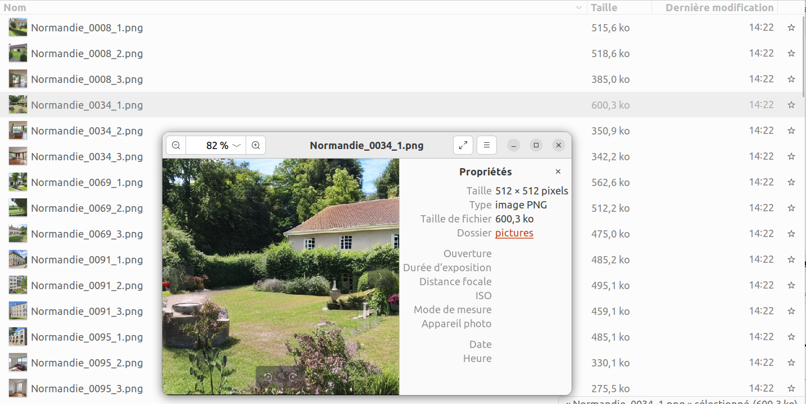

\


# Conclusion


ChatGPT & scraping ? Ouverture Le bon coin ? On laisse cette partie ?


\

# Bibliographie {-}


<div id="refs"></div>


\

# Annexes {-}

## Info session  {-}

```{r, echo=FALSE, cache = FALSE, eval=TRUE}

library(rvest)
library(ggplot2)
library(leaflet)
library(tm)
library(wordcloud)
library(sf)

```


```{r session_info, echo=FALSE, cache = FALSE}

kableExtra::kable_styling(knitr::kable(rzine::sessionRzine()[[1]], row.names = F))
kableExtra::kable_styling(knitr::kable(rzine::sessionRzine()[[2]], row.names = F))

```


\


## Citation {-}

```{r Citation, echo=FALSE}

rref <- bibentry(
   bibtype = "misc",
   title = "Premiers pas en web scraping",
   subtitle = "Introduction à la collecte automatique de données du web",
   author = c("Léa Christophe", "Hugues Pécout", "Robin Cura"),
   doi = "10.48645/xxxxxx",
   url = "https://rzine.fr/publication_rzine/xxxxxxx/",
   keywords ="FOS: Other social sciences",
   language = "fr",
   publisher = "FR2007 CIST",
   year = 2024,
   copyright = "Creative Commons Attribution Share Alike 4.0 International")

``` 

`r capture.output(print(rref))`

\


### BibTex : {-}

```{r generateBibTex, echo=FALSE, eval = TRUE}

#writeLines(toBibtex(rref), "cite.bib")
toBibtex(rref)

``` 

\


## Glossaire {- #endnotes}

```{js, echo=FALSE}

$(document).ready(function() {
  $('.footnotes ol').appendTo('#endnotes');
  $('.footnotes').remove();
});

```
