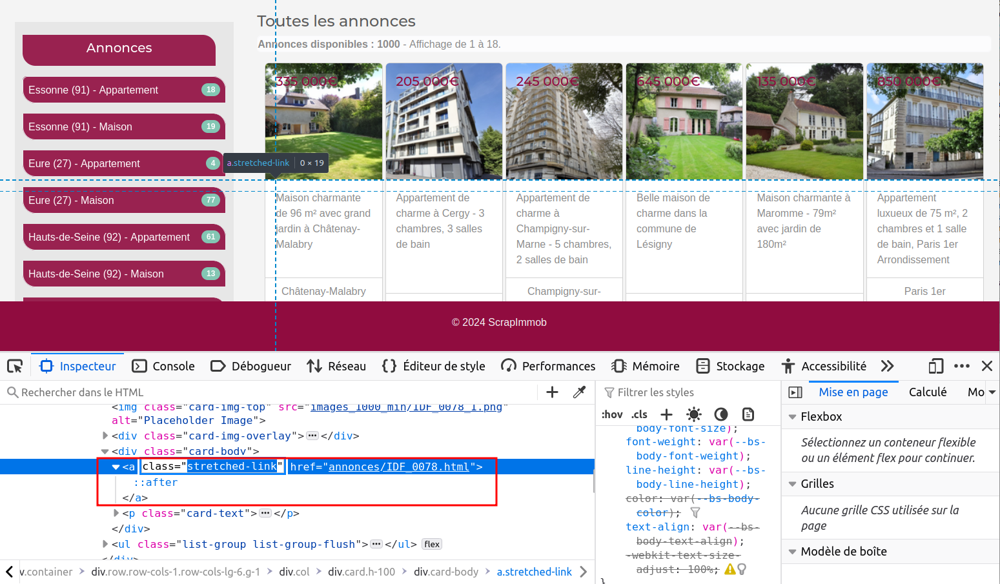

```{r setup, include=FALSE}

## Global options
knitr::opts_chunk$set(echo=TRUE,
        	            cache=FALSE,
                      prompt=FALSE,
                      comment=NA,
                      message=FALSE,
                      warning=FALSE,
                      class.source="bg-info",
                      class.output="bg-warning")


```


> Cet article peut être utilisé comme support pour une initiation aux bases de la collecte automatique de données du *web* avec R.
De nombreux aspects et méthodes de *web scraping* qui ne sont pas abordés dans cet article sont présentés sur ce [**site web associé**](https://webscraping.gitpages.huma-num.fr/website/), plus complet et approfondi sur le *web scraping* avec R et Python. 

# Introduction {-}

Le *web scraping*, ou extraction de données sur le *web*, est un ensemble de techniques qui consistent à extraire de manière automatisée des informations à partir de sites *web*.
En d'autres termes, c'est comme si vous utilisiez un robot pour récupérer des données à partir de pages *web*, plutôt que de le faire manuellement.

En sciences humaines et sociales, le *web scraping* peut être utilisé pour collecter des données pertinentes sur des sites *web*, forums, blogs, des réseaux sociaux, ou autres sources en ligne.
Cette méthode peut être particulièrement utile pour analyser des tendances, des opinions, des dynamiques, ou tout simplement pour constituer une base de données à partir de plusieurs sources internet.
L'utilisation de R pour le *web scraping* permet d'automatiser ce processus et d'analyser les données extraites immédiatement de manière efficace.

Le *web scraping* permet d'extraire des informations spécifiques d'une page *web* en analysant sa structure HTML et en extrayant uniquement les éléments pertinents.
Cette pratique demande ainsi quelques connaissances techniques en matière de *web*, de langage de balisage HTML et de langage CSS, qui permettent respectivement de structurer une page *web* et de définir l'apparence et la mise en forme des différents éléments du document.

Au-delà d'initier au *web scraping* avec R, cet article aborde dans un premier temps les connaissances indispensables à la mise en place d'une collecte de données automatisée.

Le *web scraping* regroupe différentes techniques plus ou moins complexes.
Cet article, qui est une initiation à la pratique de la collecte automatique de données, présente le cas d'utilisation le plus simple (c'est-à-dire le *scraping* d'une page web statique et peu interactive).
Pour aller plus loin et se former à des techniques plus avancées, vous pouvez consulter ce support de formation plus détaillé :

<center>
[**https://webscraping.gitpages.huma-num.fr/website/**](https://webscraping.gitpages.huma-num.fr/website/){target="_blank"}
</center>

\

# Objectifs et prérequis

## Le site web [***ScrapImmob***](https://analytics.huma-num.fr/Robin.Cura/ScrapImmob/index.html){target="_blank"}

Pour cette introduction à la collecte automatisée de données du *web* avec R, nous proposons une mise en pratique sur un site internet de démonstration créé pour l'occasion : [**ScrapImmob**](https://analytics.huma-num.fr/Robin.Cura/ScrapImmob/index.html){target="_blank"}.
**Ce site compile 1000 annonces fictives de ventes immobilières de maisons et d'appartements.**  

<center>

{target="_blank"}](figures/ScrapImmob_Visuel.png)

</center>

\

<div class="alert alert-danger"> <b>L'intégralité des biens présentés, ainsi que les images associées ont été générés par différents modèles d'intelligence artificielle.
Toutes les informations affichées sont donc complètement fictives.
Toute ressemblance avec une annonce existante ou ayant existé serait purement fortuite et ne pourrait être que le fruit d'une pure coïncidence.</b> </div>

Les annonces de ventes de maisons ou d'appartements affichées sur le site [**ScrapImmob**](https://analytics.huma-num.fr/Robin.Cura/ScrapImmob/index.html){target="_blank"} sont localisées dans dix départements français des régions Normandie et Île-de-France : l'Eure, la Seine-Maritime, l'Essonne, les Hauts-de-Seine, Paris, la Seine-Saint-Denis, la Seine-et-Marne, le Val d'Oise, le Val de Marne et les Yvelines. 

Une exploration rapide du site nous permet d'observer que chaque annonce contient les informations suivantes : 

- des **photographies**,    
- un **titre**,     
- une **description**,     
- des **caractéristiques techniques** (surfaces, prix, nombre de pièces, etc.),   
- Une **localisation** (commune et carte interactive). 

<center>

{target="_blank"}](figures/ScrapImmob_annonce.png)

</center>

\

## Les objectifs de collecte

Avant de se lancer dans une collecte automatisée, **il est primordial de bien définir ses objectifs et de déterminer précisément quelles informations on souhaite récupérer.**
**L'exploration du code source du site** (cf. [partie 2.3](#explorer-le-code-source)) **permet ensuite d'estimer le niveau de difficulté et de choisir une méthode de collecte optimale.**

<div class="alert alert-info">
Pour cette démonstration, **notre objectif est de récupérer la liste des biens mis en vente (maisons et appartements) en Seine-Maritime sur le site**
[**ScrapImmob**](https://analytics.huma-num.fr/Robin.Cura/ScrapImmob/index.html){target="_blank"}, **incluant l'ensemble des caractéristiques de description**.
**La récupération des coordonnées géographiques affichées dans la carte interactive est également souhaitée**.
</div>

**Voici l'ensemble des caractéristiques que nous souhaitons récupérer :** 

:::{.bold}
- **Titre**
- **Description**
- **Type de bien**
- **Nombre de chambres**
- **Nombre de salles de bain**
- **Surface habitable**
- **Surface de jardin**
- **Prix**
- **Commune**
- **Coordonnées géographiques**
- **Photographies** (URL et téléchargement)
:::

Pour répondre à cet objectif, nous allons alterner exploration, collecte et traitement de données :

1. Exploration du système de filtrage des biens (fonctionnement du système d'URL) ([Partie 3.2.1](#le-système-durl))

2. Récupération de la liste de toutes les pages (URLs) que l'on souhaite *scraper* ([Partie 3.2.2](#localiser-les-urls-des-pages-dannonces))

3. Exploration du code source du site afin de localiser les informations à récupérer ([Partie 3.3.1](#collecte-principale))

4. Collecte de l'ensemble des caractéristiques de chaque bien à partir de la liste des URsL récupérées ([Partie 3.3.2](#construction-dun-tableau-de-collecte))

5. Nettoyage et traitement des données collectées ([Partie 3.4](#nettoyage-des-données))

6. Exploration du code source pour récupérer les coordonnées géographiques (carte intéractive) ([Partie 3.5](#collecte-de-coordonnées))

7. Collecte et traitement de coordonnées géographiques de chaque bien ([Partie 3.5](#collecte-de-coordonnées))

8. Téléchargement de l'ensemble des photos associées aux biens précédemment collectés ([Partie 3.8](#téléchargement-des-photos))

\

## Comprendre le code source 

**Le scraping d'un site web démarre toujours par l'exploration du code source du site ciblé**.
En effet, pour automatiser la collecte d'informations, il est nécessaire d'inspecter le code source afin de déterminer la localisation précise des différentes informations ciblées. 

**Extrait du code source de la page d'accueil du site web** [**ScrapImmob**](https://analytics.huma-num.fr/Robin.Cura/ScrapImmob/index.html){target="_blank"} :

<center>

{target="_blank"}](figures/code_source_extarct.png)

</center>

\

Pour comprendre la structure d'une page web, plusieurs prérequis sont nécessaires.
**Il est indispensable d'avoir certaines connaissances spécifiques liées à la structure d'une page *web* et une compréhension des principes techniques sous-jacents.**
**Vous devez ainsi acquérir une connaissance minimum du langage HTML (balises) et une familiarité avec le CSS (sélecteurs) pour identifier, cibler et extraire les éléments d'une page** ***web***.
Pour cette raison, la partie suivante introduit les connaissances techniques indispensables à la mise en place de la collecte automatisée.

\

# Bases techniques

## Le langage HTML

Le langage HTML (***H****yper***T***ext* ***M****arkup* ***L****anguage*) est un langage informatique qui permet de décrire le contenu d'une page web.
Comme le XML (*e****X****tensible* ***M****arkup* ***L****anguage*), son langage cousin, le HTML est un langage basé sur l'utilisation de balises (définies au sein de chevrons `<>`).

Le XML peut être utilisé dans une variété de domaines, notamment pour l'échange de données entre applications.
Par exemple, voici un document XML simple représentant des informations sur un livre :

```
<Book>
  <Title>Le Seigneur des Anneaux</Title>
  <Author>J.R.R. Tolkien</Author>
  <Genre>Fantasy</Genre>
  <Year>1954</Year>
</Book>
```

Le langage HTML partage de nombreuses caractéristiques avec le XML^[Via un héritage commun depuis [le langage SGML](https://fr.wikipedia.org/wiki/Standard_Generalized_Markup_Language)], mais il est spécifiquement conçu pour structurer et organiser le contenu des pages *web*.

Les normes HTML (HTML5 par exemple) définissent un [ensemble important mais circonscrit de balises](https://developer.mozilla.org/fr/docs/Web/HTML/Element) (des *tags*) pour définir la structure et le contenu d'une page *web*, ce qui permet aux navigateurs *web* de l'afficher correctement pour les utilisateurs.

\

### Les balises

Il n'y a pas de nombre fixe de balises HTML, car de nouvelles balises peuvent être introduites avec les versions futures du langage HTML.
Cependant, il existe un ensemble de balises HTML standard définies dans les spécifications du W3C (*World Wide Web Consortium*^[«&nbsp;Le ***World Wide Web Consortium***, abrégé par le sigle ***W3C***, est un organisme de standardisation à but non lucratif, fondé en octobre 1994 chargé de promouvoir la compatibilité des technologies du *World Wide Web* telles que HTML5, HTML, XHTML, XML, RDF, SPARQL, CSS, XSL, PNG, SVG, MathML et SOAP.&nbsp;» [Wikipedia, 10/09/2024](https://fr.wikipedia.org/wiki/World_Wide_Web_Consortium)]).
Pour obtenir la liste la plus à jour des balises HTML, vous pouvez consulter la [documentation officielle du W3C](https://www.w3.org/){target="_blank"}.

Chaque balise est entourée des symboles **`<`** et **`>`** et peut contenir des attributs qui spécifient des propriétés supplémentaires pour l'élément.
Si aucune balise n'est obligatoire dans une page HTML, il est de convention d'avoir la structure de base suivante :

```{html, eval = FALSE, class.source='bg-info'}     
<!DOCTYPE html>
<html>
<head>
  
    <!-- Métadonnées de la page -->
  
    <title>Titre de la page</title>
  
</head>
<body>

    <!-- Contenu de la page -->
    
</body>
</html>     
```

- **`<!DOCTYPE html>`** : En début du document, indique au navigateur qu'il s'agit d'une page HTML5^[«&nbsp;**HTML5** (*HyperText Markup Language 5*) est la dernière révision majeure du HTML (format de données conçu pour représenter les pages *web*).
Cette version a été finalisée le 28 octobre 2014. HTML5 spécifie deux syntaxes d'un modèle abstrait défini en termes de DOM : HTML5 et XHTML5.&nbsp;», [Wikipedia, 10/09/2024](https://fr.wikipedia.org/wiki/HTML5)].
- **`<html>`** : Englobe tout le contenu de la page HTML. Définit le début et la fin du document HTML.
- **`<head>`** : Contient les métadonnées de la page, des liens vers des fichiers annexes (CSS, javascript…), etc.
- **`<body>`** : Contient tout le contenu visible de la page, tel que le texte, les images, les liens, les tableaux, etc.    
- **`<title>`** : Définit le titre de la page qui apparaîtra dans la barre de titre du navigateur.  

Dans la majorité des cas, on utilise une balise de fermeture pour indiquer la fin de l'élément.
Une balise de fermeture présente le symbole **`/`** avant le nom de la balise :

```{html, eval = FALSE, class.source='bg-info'}    
<body>

    <!-- Contenu de la page -->
    
</body>    
```    

Le `body` peut englober toute une variété de balises prédéfinies pour structurer et ajouter différents types de contenu dans la page *web*.
Voici quelques balises indispensables à connaître :

- **`<h1>`**, **`<h2>`**, …, **`<h6>`** : **titres** de différents niveaux hiérarchiques,    
- **`<p>`** : **paragraphe**,    
- **`<a>`** : **lien hypertexte**,    
- **``** : **image**,    
- **`<ul>`**, **`<ol>`**, **`<li>`** : **listes** non ordonnées et ordonnées,    
- **`<table>`**, **`<tr>`**, **`<td>`** : **tableau** avec des lignes et des cellules,    
- **`<div>`** : **section** (type bloc),    
- **`<span>`** : **section** (type "*inline*").

Exemple d'utilisation de la balise **`p`** (paragraphe) :

```{html, eval = FALSE, class.source='bg-info'}    
<body>

<p>Ceci est un paragraphe en langage HTML</p>

</body>    
```

Dans cet exemple, les balises **`<p>`** et **`</p>`** permettent de créer un paragraphe dont le contenu textuel est :  
"*Ceci est un paragraphe en langage HTML*".

Les différentes balises permettent ainsi de structurer, hiérarchiser et organiser le contenu d'une page *web*.
Elles peuvent s'emboîter indéfiniment :

```{html, eval = FALSE, class.source='bg-info'}    
<body>
  
<div>
  
<p>Un paragraphe en <a href="https://fr.wikipedia.org/wiki/HTML5">langage HTML</a></p>

</div>  
  
</body>    
```


Voici le rendu graphique du code HTML ci-dessus dans un navigateur *web* :


\

### Les attributs

Ces balises hiérarchisées et potentiellement regroupées peuvent être renseignées d'attributs qui permettent de spécifier des informations supplémentaires et jouer sur leur mise en forme.
Exemples d'attributs :

- **`id`** : identifiant unique de la balise,    
- **`class`** : classe de la balise,    
- **`href`** : lien,    
- etc.    

**Ces attributs sont à spécifier dans les balises ouvrantes** :

```{html, eval = FALSE, class.source='bg-info'}    
<body>

<div id="debut_doc">
    <h1 class="categorie">Tous les articles</h1>
</div>

<div id="Liste_ref">
    <h2 class="article">Titre article</h2>
    <p class="summary">Résumé article...</p>
    <a href="https://www.article.org">Intégralité article</a>
  
    <h2 class="article">Titre article bis</h2>
    <p class="summary">Résumé article bis...</p>
    <a href="https://www.article_bis.org">Intégralité article bis</a>
</div>

</body>    
```

L'organisation segmentée du contenu via les balises **`div`** ou **`span`** ainsi que les différents attributs spécifiés permettent la mise en forme et le paramétrage des éléments.
**Les attributs des balises peuvent être associés à une mise en forme (couleur, taille, position, etc.) à l'aide du langage CSS** (cf. [partie suivante](#le-langage-css)).
**Mais il s'agit également d'éléments cruciaux pour la collecte automatisée de données sur le** ***web***, **car ils permettent de cibler précisément des éléments**. 

Dans l'exemple de code source ci-dessus, il est ainsi possible de récupérer toutes les URLs (***U****niform* ***R****esource* ***L****ocator*) des articles, en ciblant le contenu de tous les attributs **`href`** des balises **`<a>`** situés dans la **`<div>`** ayant pour identifiant "*Liste_ref*".

\

## Le langage CSS

Le CSS, ou *Cascading Style Sheets* (feuilles de style en cascade), est un langage de programmation utilisé pour décrire l'apparence et la mise en forme des documents HTML et XML.
Il permet de contrôler l'apparence visuelle des différents éléments de pages *web* (taille, position, couleur, police, marges, etc.) via les sélecteurs CSS.

Le CSS peut être incorporé de différentes manières :

**1. Directement dans les balises** à l'aide de l'attribut **`style`** :

```{html, eval = FALSE, class.source='bg-info'}    
<h1 style ="font-size:40px;color:#f03b35;text-align:center;">Titre principal</h1>    
```

**2. Dans le document HTML**, inclut dans une balise **`<style>`** adaptée à cet effet :

```{html, eval = FALSE, class.source='bg-info'}    
<html>

<style>
h1 {
color: #f03b35;
font-size: 40px;
text-align: center;
}
</style>

<body>
<h1>Titre principal</h1>
</body>
  
</html>
```


**3. Dans une feuille de style externe** (fichier texte avec l'extension **`.css`**).
Cette dernière méthode est à privilégier car la séparation du contenu et la mise en forme facilite la mise à jour des styles.
Le lien vers la feuille de style CSS est à indiquer dans une balise `<link>` inclue dans la balise `<head>` qui contient les métadonnées du document :

:::: {style="display: flex;"}

::: {.column width="59%"}
<center><b>page.html</b></center>

```{html, eval = FALSE, class.source='bg-info'}    
<html>

<head>
<link rel="stylesheet" href="style.css">
</head>

<body>

<h1>Titre principal</h1>
<p>Un premier paragraphe introductif</p>

</body>

</html>    
```
:::

::: {.column width="2%"}
:::

::: {.column width="39%"}
<center><b>style.css</b></center>

```{css, eval = FALSE, class.source='bg-warning'}    
body {
background-color: lightblue;
}

h1 { 
color: #f03b35;
font-size: 40px;
text-align:center;
}

p { 
font-style: italic;
font-size: 20px;
}    
```
:::
::::

**Dans les trois cas présentés ci dessus, le rendu graphique dans un navigateur** ***web*** **sera le suivant :**

{fig-align="center"}

\

### Les sélecteurs CSS simples

<div class="alert alert-danger">**Bien qu'une connaissance approfondie du CSS ne soit pas nécessaire pour le *web scraping*, il est important de connaître les sélecteurs CSS.**
**Leur utilisation est précieuse pour cibler des données de manière détaillée et ainsi optimiser la collecte.**
</div>

Comme une page HTML est un ensemble **structuré** de balises, ce qui revient à dire qu'une page HTML est un ensemble organisé de données, il est possible d'interroger la structure de cette page pour en cibler des éléments.
En HTML, on utilise un langage d'interrogation propre, basé sur des **sélecteurs**, c'est-à-dire des expressions qui permettent de définir précisément un sous-ensemble des balises HTML (et CSS) d'une page web.

Si on peut utiliser ces sélecteurs pour extraire de l'information, leur usage le plus courant consiste à mettre en forme des éléments HTML, c'est-à-dire à appliquer un style spécifique à un sous-ensemble de balises.

**1. Les sélecteurs d'éléments** permettent de cibler tous les éléments d'un même type. Exemple pour les balises `h2`:


:::: {style="display: flex;"}
::: {.column width="49%"}
<center><b>page.html</b></center>
```{html, eval = FALSE, class.source='bg-info'}    
<h2>Titre de niveau 2</h2>    
```
:::

::: {.column width="2%"}
:::

::: {.column width="49%"}
<center><b>style.css</b></center>
```{css, eval = FALSE, class.source='bg-warning'}    
h2 { font-size: 20px; }    
```
:::
::::

\

**2. Les sélecteurs d'identifiants** permettent de cibler un élément par son identifiant (**`id`**), préfixé du symbole `#`.

:::: {style="display: flex;"}
::: {.column width="49%"}
<center><b>page.html</b></center>
```{html, eval = FALSE, class.source='bg-info'}    
<div id="example">  </div>    
```
:::

::: {.column width="2%"}
:::

::: {.column width="49%"}
<center><b>style.css</b></center>
```{css, eval = FALSE, class.source='bg-warning'}    
#example { background-color: #f2f2f2; }    
```
:::
::::

\

**3. Les sélecteurs de classes** permettent de cibler tous les éléments d'une même classe.
On utilise le préfixe `.` pour indiquer qu'il s'agit d'un nom de `class`.

:::: {style="display: flex;"}
::: {.column width="49%"}
<center><b>page.html</b></center>
```{html, eval = FALSE, class.source='bg-info'}    
<p class="summary">Ceci est un résumé</p>    
```
:::

::: {.column width="2%"}
:::

::: {.column width="49%"}
<center><b>style.css</b></center>
```{css, eval = FALSE, class.source='bg-warning'}    
.summary { font-family: Arial, sans-serif; }    
```
:::
::::

\

**4. Les sélecteurs d'attributs** permettent de cibler des éléments ayant un attribut commun.
Exemple : l'attribut `href` de la balise `<a>`, qui renseigne l'URL d'un lien cliquable.   

:::: {style="display: flex;"}
::: {.column width="49%"}
<center><b>page.html</b></center>
```{html, eval = FALSE, class.source='bg-info'}    
<a href="https://www.example.org">Lien</a>    
```
:::

::: {.column width="2%"}
:::

::: {.column width="49%"}
<center><b>style.css</b></center>
```{css, eval = FALSE, class.source='bg-warning'}    
a[href] { color: purple; }    
```
:::
::::

Il est possible de préciser sa cible en indiquant une valeur spécifique à l'attribut.

```{css, eval = FALSE, class.source='bg-warning'}    
a[href="https://example.org"] { color: purple;}    
```

\

### Les sélecteurs complexes et combinateurs

Le CSS met également à disposition des sélecteurs complexes et combinateurs que l'on peut utiliser pour cibler des contenus de manière très précise.
Quelques exemples :

**A. Les sélecteurs descendants** ciblent les éléments, descendants d'un autre élément.

:::: {style="display: flex;"}
::: {.column width="49%"}
<center><b>page.html</b></center>
```{html, eval = FALSE, class.source='bg-info'}    
<div id="liste_ref">

  
    <p class="summary">Ceci est un résumé</p>
    
  
</div>    
```
:::

::: {.column width="2%"}
:::

::: {.column width="49%"}
<center><b>style.css</b></center>
```{css, eval = FALSE, class.source='bg-warning'}    
#liste_ref p .summary { font-size: 12px; }    
```

<div class="alert alert-danger">Cible tous les paragraphes de la classe `summary`, positionnés dans l'élément ayant pour identifiant `liste_ref`.</div>
:::
::::

\

**B. Les sélecteurs de voisin direct** ciblent les nœuds qui suivent immédiatement un élément.

:::: {style="display: flex;"}
::: {.column width="49%"}

<center><b>page.html</b></center>

```{html, eval = FALSE, class.source='bg-info'}    
<div id="liste_ref">

    <h2>Titre article</h2>
    <p class="summary">Ceci est un résumé</p>
    
    <h2>Titre article</h2>
    <p class="summary">Ceci est un résumé</p>
        
</div>    
```
:::

::: {.column width="2%"}
:::

::: {.column width="49%"}

<center><b>style.css</b></center>

```{css, eval = FALSE, class.source='bg-warning'}    
#liste_ref + h2 { font-size: 14px; }    
```

\

<div class="alert alert-danger">L'utilisation du symbole `+` permet de cibler uniquement la première balise `h2` de la balise ayant pour identifiant `liste_ref`.</div>
:::
::::

\

### Exercice

Pour mieux comprendre l'utilisation et le fonctionnement du HTML et du CSS, **vous pouvez vous exercer à la pratique de ces deux langages à partir de cet exemple simple mis à disposition en téléchargement** :

\

<center>
[ **exo_HTML.zip**](https://gitlab.huma-num.fr/webscraping/rzine_webscraping/-/raw/master/exo_HTML.zip?ref_type=heads&inline=false)
</center>

<br>

Une fois téléchargé, décompressez le répertoire qui contient deux fichiers : page.html et style.CSS.

1. Un fichier HTML peut être interprété (mis en page) par n'importe quel navigateur (Mozilla Firefox, Google Chrome, Microsoft Edge, ect.).
Ouvrez le fichier page.html avec un navigateur.
Aucune connexion internet n'est nécessaire. 


2. Ouvrez les deux fichiers (page.html et style.CSS) avec un éditeur de fichier texte (ex : bloc-note, RStudio, Notepad++, ect.).

:::: {style="display: flex;"}
::: {.column width="69%"}

<center><b>page.html</b></center>

```{html, eval = FALSE, class.source='bg-info'}    
<!DOCTYPE html>
<html>
  <head>
    <title>Ma Page HTML</title>
      <meta charset="utf-8" />
      <link rel="stylesheet" href="style.css">
  </head>
  
  <body>
  <h1>Un titre de niveau 1</h1>
  <p>Un premier petit paragraphe.</p>
  <h2>Un titre de niveau 2</h2>
  <p>Un autre paragraphe contenant un lien pour aller sur le site 
  <a href="https://elementr.netlify.app/">ElementR</a>.
  </p>
        
  </body>
</html>    
```
:::

::: {.column width="2%"}

:::

::: {.column width="29%"}

<center><b>style.css</b></center>

```{css, eval = FALSE, class.source='bg-warning'}    
h1 { 
color: #f03b35;
font-size: 40px;
text-align:center;
}    
```
:::

:::

3. Ajoutez et/ou modifiez du contenu (balise) dans le code source du fichier page.html.
Enregistrez le fichier et ré-affichez (ou rafraîchissez avec la touche `F5`) la page HTML dans le navigateur pour découvrir le rendu.

4. Ajoutez et/ou modifiez du contenu dans le code source du fichier style.css.
Enregistrez le fichier et ré-affichez la page HTML (ou rafraîchissez-la avec la touche `F5`) dans le navigateur pour apprécier la nouvelle mise en page.

\

## Explorer le code source  

Maintenant que vous avez les bases des langages HTML et CSS, vous avez les capacités de consulter le code source du site [**ScrapImmob**](https://analytics.huma-num.fr/Robin.Cura/ScrapImmob/index.html){target="_blank"}, comprendre sa structure et localiser les informations que vous souhaitez extraire.

### Affichage brut

Il est très simple d'afficher le code source d'une page *web*.
Réalisez un clic-droit sur la page ciblée, puis sélectionnez le menu "*(Affichez le) code source de la page*".
Le code source que le navigateur reçoit et met en forme est alors affiché dans un nouvel onglet.
Cette fonctionnalité est également accessible avec le raccourci `Ctrl + U`.

::::: {style="display: flex;"}
:::: {.column width="49%"}
::: {style="text-align: center;"}
Avec *Google Chrome* :
{fig-align="center"}
::: 
:::: 
:::: {.column width="2%"}
::::
:::: {.column width="49%"}
::: {style="text-align: center;"}
Avec *Mozilla Firefox* :

:::
::::
:::::

\

### L'inspecteur de code

**L'inspecteur de code**, un outil proposé par l'ensemble des navigateurs, simplifie l'exploration du code source d'une page.
En s'appuyant sur différentes fonctionnalités (survol, filtrage, recherche, etc.), **l'inspecteur de code facilite l'identification des balises, des classes, des identifiants, des styles associés aux éléments** et permet ainsi de procéder à une extraction ciblée de données.
En utilisant l'inspecteur de code source, vous accédez à toutes les informations nécessaires pour concevoir un script de collecte automatisée. 

Pour y accéder, cliquez-droit n'importe où sur la page *web* ouverte dans un navigateur, puis cliquez sur “Inspecter” :

:::: {style="display: flex;"}

::: {.column width="49%"}

::: {style="text-align: center;"}

Avec *Google Chrome* :

{fig-align="center"}

::: 

::: 

::: {.column width="2%"}

:::

::: {.column width="49%"}

::: {style="text-align: center;"}

Avec *Mozilla Firefox* :


:::

::: 

::::

\

Une fois l'inspecteur ouvert, l'outil de sélection (entouré en <font style="color:#FF0000;">**rouge**</font>) donne la possibilité de naviguer dans le code source en survolant les différents éléments de la page, et vice versa.


\

Vous pouvez déplier le code source pour l'explorer en profondeur.     

Sur la page d'accueil de [ScrapImmob](https://analytics.huma-num.fr/Robin.Cura/ScrapImmob/index.html){target="_blank"}, **les liens vers les pages d'annonces listées sur la page d'accueil semblent stockés dans l'attribut `href` des balises `<a>` de la classe `stretched-link`**.



\

En réalisant un clic-droit sur un élément, vous pouvez accédez à la fonctionnalité "copier" qui vous permet de récupérer plusieurs choses :


\

Il est ainsi possible de récupérer aisément : 

- **l'intérieur du HTML** : contenu de la balise sélectionnée. Par exemple, l'intérieur du HTML de `<div id="abc" class="foo"><strong>TEXTE</strong></div>` est  `<strong>TEXTE</strong>`.
- **l'exterieur du HTML** : ensemble de la balise sélectionnée. Par exemple, l'extérieur du HTML de `<div id="abc" class="foo"><strong>TEXTE</strong></div>` est  `<div id="abc" class="foo"><strong>TEXTE</strong></div>`.
- **Le sélecteur CSS**. Exemple pour le titre du site "ScrapImmob" : `header.col-12 > h1:nth-child(1)`
- **Le chemin CSS**. Exemple pour le titre du site "ScrapImmob" : `html body div.container-fluid div.row header.col-12.text-center.p-3 h1`
- **Le Xpath**. Exemple pour le titre du site "ScrapImmob" : `/html/body/div/div[1]/header/h1`

<div class="alert alert-info">
XPath est un acronyme qui signifie "*XML Path Language*".
Il s'agit d'un langage de requête utilisé pour naviguer et interroger des documents XML ou HTML.
XPath est ainsi utilisé pour sélectionner des éléments spécifiques d'une page *web*.</div>

Ces trois derniers éléments pourront vous être précieux pour automatiser votre collecte.
Par exemple, le sélecteur CSS de la première balise `<a>` de la classe `stretched-link` est `div.col:nth-child(1) > div:nth-child(1) > div:nth-child(3) > a:nth-child(1)`.
Ce sélecteur permet de cibler la première balise `<a>` de cette classe.

<div class="alert alert-info">
L'inspecteur de code des navigateurs génère des sélecteurs qui sont toujours exacts, mais ne sont pas nécessairement les plus parcimonieux ou compréhensibles.
Il existe en effet de très nombreux ensembles de sélecteurs différents qui peuvent cibler le(s) même(s) élément(s) d'une page web.
En pratique, si le navigateur indique bien que le sélecteur correspondant à cette dernière requête est `div.col:nth-child(1) > div:nth-child(1) > div:nth-child(3) > a:nth-child(1)`, on notera que la récupération du premier élément de `a.stretched-link` (par exemple en faisant  `$$('a.stretched-link')[0]` dans la console, cf. *infra*) est plus lisible.
</div>

\

### La console de l'inspecteur de code

Pour tester un sélecteur CSS, c'est-à-dire vérifier qu'il isole bien un sous-ensemble des éléments structurés d'une page web, on peut l'exécuter directement dans la `Console` de l'inspecteur de code.

::: {style="text-align: center;"}
Avec *Mozilla Firefox* :
{fig-align="center"}
:::

Dans la console, on peut tester un sélecteur CSS en utilisant la syntaxe spécifique suivante :  
`$$('sélecteur')`  
Par exemple, pour sélectionner tous les liens (balises `<a>...</a>`) de cette page web, on peut exécuter la requête `$$('a')` dans la console de l'inspecteur. Exemple avec *Firefox* :

{fig-align="center"}

Cela renvoie une liste d'objets HTML que l'on peut explorer interactivement (code dépliable), et permet ainsi de tester le bon fonctionnement d'une requête via sélecteurs CSS, avant de l'automatiser dans un script de *scraping*.

Chacun des éléments isolés peut être localisé dans l'inspecteur (clic sur l'icône  avec *Firefox*, et clic sur le nom de l'élément avec le navigateur *Chrome*).

\

### Exercices d'exploration du code source

<div class="alert alert-info">
Nous proposons ici une courte série d'exercices corrigés (cliquer sur `Réponse`) qui doivent permettre de mener une première exploration du code source du site exemple</div>

1. Combien y-a-t-il de liens (balises `<a>...</a>`) sur [cette page web](https://analytics.huma-num.fr/Robin.Cura/ScrapImmob/index.html){target="_blank"} ?


```{=html}
<details class='alert alert-light'>
<summary><b>Réponse ▼</b></summary>
Pour connaître le nombre de liens de la page citée, on peut mener une recherche des éléments <code>&lt;a&gt;</code> de la page, en tappant la requête suivante dans la console : <br/>
<code>$$('a')</code>
<br/>
Cela renvoit un "array" (c'est-à-dire un tableau mono-dimensionnel) de longueur 40, indiquant qu'il y a 40 éléments <code>&lt;a&gt;</code>, donc 40 liens dans cette page.

</details>
```

2. Combien y-a-t-il de liens (balises `<a>...</a>`) de la classe `.stretched-link` ? Vous pouvez utiliser la syntaxe suivante : `$$('element.class')`

```{=html}
<details class='alert alert-light'>
<summary><b>Réponse ▼</b></summary>
On peut ici cumuler des sélecteurs, en ajoutant la classe <code>.stretched-link</code> au sélecteur des liens <code>a</code> : <br/>
<code>$$('a.stretched-link')</code>
<br/>
Le tableau retourné contient cette fois-ci 18 éléments.

</details>
```

3. Combien y-a-t-il d'éléments en gras (balise `<strong>...</strong>`) sur [une page d'annonce](https://analytics.huma-num.fr/Robin.Cura/ScrapImmob/annonces/IDF_0049.html){target="_blank"} ? 

```{=html}
<details class='alert alert-light'>
<summary><b>Réponse ▼</b></summary>
Même logique que pour la recherche d'éléments <code>&lt;a&gt;</code>, mais cette fois-ci pour les éléments <code>&lt;strong&gt;</code> <br/>
<code>$$('strong')</code> : 
<br/>
Le tableau retourné contient 7 éléments, et on peut déjà remarquer au survol des éléments que ce sont les caractéristiques techniques des biens (type, nombre de chambres, de salle-de-bains, surface, prix et localisation).
Ici, avec les fonctions <code>map</code> et <code>innerHTML</code>, nous affichons le texte mis en gras dans ces 7 balises.

</details>
```

4. Combien y-a-t-il de balises `<script>...</script>` qui permettent d'intégrer ou de faire référence à un script javascript exécutable ? Dans quelle balise `<script>` sont stockées les coordonnées géographiques du marqueur affiché sur la carte interactive des [pages d'annonces](https://analytics.huma-num.fr/Robin.Cura/ScrapImmob/annonces/IDF_0049.html){target="_blank"}  ?

```{=html}
<details class='alert alert-light'>
<summary><b>Réponse ▼</b></summary>
Encore la même logique que pour la recherche d'éléments <code>&lt;a&gt;</code>, mais cette fois-ci pour les éléments <code>&lt;script&gt;</code> <br/>
<code>$$('script')</code> : 
<br/>

Il y a 4 balises scripts, dont nous pouvons noter que seule la deuxième ne semble pas charger une bibliothèque de fonctions distante.
<br/>
En utilisant à nouveau la fonction <code>innerHTML</code> sur la deuxième balise (sélection de l'index 1 – en javascript, l'indexation débute à 0 – via les crochets <code>[index]</code>), on affiche son contenu, et on peut noter qu'elle semble contenir des coordonnées géographiques.

</details>
```

<!--
## Les appels réseaux d'une page 

 Quand on souhaite réaliser une collecte d'éléments redondants (structurés de la même manière) sur une page *web* (ex : sites d'annonce, catalogues de médias, etc.), il peut être utile de chercher à comprendre le fonctionnement interne de la page. 

 Pour cela, il est possible d'observer ce qui se passe lorsqu'une page *web* est chargée, de façon à repérer des éléments structurés (données *json* par exemple) qui seraient chargés ou requêtés lors de l'interrogation de la page. Il s'agit donc d'observer les appels qu'une page émet lors de son chargement, pour récupérer des images, des polices, des bibliothèques de mise en page (CSS, javascript), etc. 

 On peut réaliser cette opération dans l'inspecteur de code, dans l'onglet "*Réseaux*" (ou *Network* dans Chrome) après avoir actualisé la page : 

 <video width="100%" controls> 

 <source src="figures/Screencast_Inspecteur_Network_crop.webm" type="video/webm"> 

 </video> 

 \ 

 Dans L'exemple ci-dessus, on constate que l'ouverture de la page de cet article déclenche :   

 1. L'ouverture de la page à proprement parler (format  `html` dans la colonne `Type`).     
 2. Le chargement de la bibliothèque de fonctions MathJax.js (`javascript`) qui permet de mettre en forme des équations dans des pages HTML.   
 3. La tentative de chargement de la "favicon" du site, c'est-à-dire de l'icône qui devrait s'afficher dans le titre de l'onglet. Comme cette icône n'existe pas, la page essaie de la charger depuis d'autres emplacements (3 derniers appels), sans succès.  

 <div class="alert alert-info"> 
 <b>La première étape du *web scraping* consiste ainsi à analyser le code source de la page et du site *web* ciblé, afin de trouver le chemin ou l'emplacement exact des informations que l'on souhaite récupérer. Plus le code HTML d'un site est structuré et optimisé, plus la collecte automatisée sera facilitée.</b></div>
 -->

\

# Mise en pratique

## Les packages de scraping

Comme pour toutes les opérations et manipulations de données, plusieurs solutions existent pour le *web scraping* avec R.
Si plusieurs fonctions R-base^[L’appellation R-base utilisée tout au long de ce document désigne l'ensemble des fonctions natives de R, c'est-à-dire installées d'office avec le logiciel, sans ajout de *packages* supplémentaires. On oppose fréquemment les fonctions R-base et les fonctions du *tidyverse*, qui utilisent une approche syntaxique assez différente.] peuvent être utilisées, il existe surtout deux packages de référence en matière de collecte automatisée :

- [**`rvest`**](https://rvest.tidyverse.org/){target="_blank"} : développé par Hadley Wickham (Posit), ce package facilite le scraping en utilisant les sélecteurs CSS et XPath pour extraire les données formatées en HTML ou en XML.
Ce package s'inspire de bibliothèques Python déjà existantes : [Beautiful Soup](https://www.crummy.com/software/BeautifulSoup/){target="_blank"} et [RoboBrowser](https://robobrowser.readthedocs.io/en/latest/readme.html){target="_blank"}.
**`rvest`** fait partie de l'écosystème **`tidyverse`**, les fonctions peuvent s'utiliser avec le(s) *pipe(s)*.
Ce package est simple d'utilisation mais également limité en matière de fonctionnalité.
Il ne permet que depuis peu, et de manière réduite, de simuler les actions d'un utilisateur (clic, scroll, etc.).
On l'utilisera essentiellement pour l'extraction de données de sites *web* statiques.

- [**`Rselenium`**](https://cran.r-project.org/web/packages/RSelenium/index.html){target="_blank"} : ce package est ce que l'on appelle un *binding* de langage ("liaison") qui permet d'utiliser, depuis R, les fonctionnalités de l'outil **`Selenium 2.0 WebDriver`**.
Ce *framework* *web* permet d'automatiser les tests d'applications *web* en simulant des utilisateurs.
**`Selenium 2.0 WebDriver`** peut aussi être utilisé pour la collecte automatisée de données sur des sites *web* dynamiques, nécessitant une interaction utilisateur (exécution de code javascript généré par clic, survol, scroll, etc.).
Il s'agit concrètement d'un outil qui simule la navigation sur un site web plutôt que d'un outil comme `rvest` qui en extrait simplement le contenu.


**Le site *web* [**ScrapImmob**](https://analytics.huma-num.fr/Robin.Cura/ScrapImmob/index.html){target="_blank"} est un site *web* statique.**
**Il n'existe pas de base de données, toutes les informations affichées par le navigateur sont stockées dans le code source de la page.**
**Ainsi, il n'est pas nécessaire de simuler le comportement d'un utilisateur pour accéder aux données ciblées.**
**Dans ce cas, il est plus simple d'utiliser le package [**`rvest`**](https://rvest.tidyverse.org/){target="_blank"}**.

\

### Installation de `rvest`

Le package [**`rvest`**](https://rvest.tidyverse.org/){target="_blank"} permet de naviguer à travers la structure HTML des pages *web*, d'extraire du texte, des tableaux, des images et d'autres éléments, et de les convertir en données structurées directement exploitables dans R. 

Commencez par installer le package, puis chargez la librairie.

```{r, message=FALSE, warning=FALSE, eval=FALSE}
install.packages("rvest")
library(rvest)
```

```{r, message=FALSE, warning=FALSE, echo = FALSE, eval=TRUE, cache=FALSE}
library(rvest)
```

\

### Fonctionnement de **`rvest`**

Commençons par explorer les principales fonctions du package [**`rvest`**](https://rvest.tidyverse.org/){target="_blank"} à partir d'un extrait du code source du site *web* [**ScrapImmob**](https://analytics.huma-num.fr/Robin.Cura/ScrapImmob/index.html){target="_blank"}.
Pour cela, nous pouvons utiliser la fonction **`minimal_html()`** qui permet de créer un contenu HTML (XML) requêtable à partir de code HTML fourni dans une chaîne de caractères.

```{r, message=FALSE, warning=FALSE}

# Extrait de code source HTML du site ScrapImmob 
extrait_html <- "<div class='card-body'>
                      <a href='annonces/IDF_0078.html' class='stretched-link'></a>
                      <p class='card-text'>Maison charmante de 96 m² avec grand jardin à Châtenay-Malabry</p>
                  </div>"

# Interprétation du "texte" comme du code source HTML
basic_html <- minimal_html(extrait_html)


class(basic_html)

```

- Les fonctions **`html_element()`** ou **`html_elements()`** permettent respectivement la récupération du 1er ou de tous les éléments d'un document HTML, en précisant un sélecteur CSS ou un Xpath.
Par exemple,  `html_elements("p")` appliqué au code source d'une page permet de récupérer tous les paragraphes : 

```{r, echo = TRUE, message=FALSE, warning=FALSE}

# Récupérer toutes les balises <p> du document :
basic_html |> html_elements("p")

```

- La fonction **`html_attr()`** permet l'extraction des valeurs d'attributs. 

```{r, echo=TRUE, message=FALSE, warning=FALSE}

# Récupérer la ou les URL(s) indiquée(s) dans l'attribut href
basic_html |> html_elements("a") |> html_attr("href")

```

- Les fonctions **`html_text()`** ou **`html_text2()`** permettent d'extraire uniquement le texte d'un élément.

```{r, echo=TRUE, message=FALSE, warning=FALSE}

# Récupérer le contenu textuel des balises <p>
basic_html |> html_elements("p") |> html_text2()

```

<div class="alert alert-danger">
**Les fonctions du package `rvest` sont conçues pour être utilisées en *pipe*.**
**Elles fonctionnent aussi bien avec le *pipe* natif du R-base (`|>`), qu'avec celui du package `magrittr` (`%>%`), utilisé par le `tidyverse`**
</div>

\

## Le système d'URL 

### Filtrage des biens & ciblage d'URL

:::: {style="display: flex;"}

::: {.column width="28%"}

::: {style="text-align: left;"}

 
 
::: 

::: 

::: {.column width="2%"}

:::
  
::: {.column width="70%"}

Sur la page d'accueil du site [**ScrapImmob**](https://analytics.huma-num.fr/Robin.Cura/ScrapImmob/index.html){target="_blank"}, un ensemble de boutons situé à gauche permet de filtrer les biens par département et par type de biens.
**Lorsque l'on clique sur l'un de ces boutons, les biens affichés sur la page sont filtrés en fonction du choix réalisé.**
**L'URL de la page est alors modifiée** de la manière suivante :

**URL principale** :       
[[https://analytics.huma-num.fr/Robin.Cura/**ScrapImmob/index.html**]{style="font-size: 90%;"}](https://analytics.huma-num.fr/Robin.Cura/ScrapImmob/index.html)    

**URL du filtre "Essonne (91) - Appartement"** :  
[[https://analytics.huma-num.fr/Robin.Cura/**ScrapImmob/91_appartement/index.html**]{style="font-size: 90%;"}](https://analytics.huma-num.fr/Robin.Cura/ScrapImmob/91_appartement/index.html)         

**URL du filtre "Val-d'Oise (95) - Maison"** :          
[[https://analytics.huma-num.fr/Robin.Cura/**ScrapImmob/95_maison/index.html**]{style="font-size: 90%;"}](https://analytics.huma-num.fr/Robin.Cura/ScrapImmob/95_maison/index.html)      

::: 

::::

Notre objectif étant de collecter uniquement des données sur les biens (maisons et appartements) de la Seine-Maritime, nous allons orienter notre collecte sur les deux URLs suivantes :

- [[https://analytics.huma-num.fr/Robin.Cura/ScrapImmob/**76_maison/index.html**]{style="font-size: 90%;"}](https://analytics.huma-num.fr/Robin.Cura/ScrapImmob/76_maison/index.html)       
- [[https://analytics.huma-num.fr/Robin.Cura/ScrapImmob/**76_appartement/index.html**]{style="font-size: 90%;"}](https://analytics.huma-num.fr/Robin.Cura/ScrapImmob/76_appartement/index.html)    

Nous commençons par récupérer le code source de ces deux pages avec la fonction `read_html()`.
Cette fonction effectue une requête HTTP, puis en analyse le code HTML récupéré à l'aide du package `xml2`.

```{r, eval=params$force_scraping, message=FALSE, warning=FALSE, cache=FALSE, echo = FALSE}
url_appart <- "https://analytics.huma-num.fr/Robin.Cura/ScrapImmob/76_appartement/"
url_maison <- "https://analytics.huma-num.fr/Robin.Cura/ScrapImmob/76_maison/"

code_appart <- read_html(url_appart)
code_maison <- read_html(url_maison)
xml2::write_xml(code_appart, "offline_data/code_appart.html")
xml2::write_xml(code_appart, "offline_data/code_maison.html")
```

```{r, eval=TRUE, message=FALSE, warning=FALSE, cache=FALSE, echo = FALSE}
url_appart <- "https://analytics.huma-num.fr/Robin.Cura/ScrapImmob/76_appartement/"
url_maison <- "https://analytics.huma-num.fr/Robin.Cura/ScrapImmob/76_maison/"
code_appart <- read_html("offline_data/code_appart.html")
code_maison <- read_html("offline_data/code_maison.html")
```

```{r,  eval=FALSE, message=FALSE, warning=FALSE, cache=FALSE}
url_appart <- "https://analytics.huma-num.fr/Robin.Cura/ScrapImmob/76_appartement/"
url_maison <- "https://analytics.huma-num.fr/Robin.Cura/ScrapImmob/76_maison/"

code_appart <- read_html(url_appart)
code_maison <- read_html(url_maison)
```

```{r,  eval=TRUE, message=FALSE, warning=FALSE, cache=FALSE}
# Affichage de l'objet code_appart
code_appart
```

\

### Localiser les URLs des pages d'annonces

À partir de ces deux pages et de leur code source, nous allons récupérer la liste des URLs de toutes les pages des annonces affichées.
Cela nous permettra dans un second temps, de collecter l'ensemble des informations de description de chaque bien en vente. 

En explorant le code source, on remarque que les URLs des pages d'annonces complètes sont stockées dans des balises `<a>` de la classe `stretched-link` :


\

Pour récupérer l'ensemble de ces URLs, nous devons collecter les valeurs (URL en chaîne de caractères) de l'attribut `href` dans toutes les balises `<a>` de la classe `stretched-link` :

```{r, echo=TRUE, message=FALSE, warning=FALSE}

code_appart |> html_elements("a.stretched-link") |>  html_attr("href")

```

Nous pouvons faire la même chose pour les annonces de vente de maison en Seine-Maritime :

```{r, echo=TRUE, message=FALSE, warning=FALSE}

code_maison |> html_elements("a.stretched-link") |>  html_attr("href")

```

Cela permet de récupérer les URLs des annonces affichées sur la première page.
Pour collecter l'ensemble des biens ciblés, nous devons comprendre comment fonctionne le système d'URL qui permet d'afficher toutes les annonces de biens en vente en Seine-Maritime (cf. [partie suivante](#récupérer-toutes-les-urls)).

\

### Récupérer toutes les URLs

Dans la partie précédente, nous avons pu collecter les URLs des biens affichés sur les premières pages.
Pour reproduire la collecte d'URLs sur l'ensemble des pages des appartements et des maisons de Seine-Maritime, il est nécessaire de connaître le nombre total de pages à afficher pour consulter tous les biens et de comprendre le système d'URLs utilisé par [**ScrapImmob**](https://analytics.huma-num.fr/Robin.Cura/ScrapImmob/index.html){target="_blank"}.

\

:::: {style="display: flex;"}

::: {.column width="47%"}

<center>

<b>[**../76_appartement/index.html**](https://analytics.huma-num.fr/Robin.Cura/ScrapImmob/76_appartement/index.html){target="_blank"}</b>

</center>

:::{style="margin-top:3%;"}


:::

Dans cette section, il y a 156 biens en vente, et chaque page en affiche jusqu'à 18.
**Il y a donc 9 pages des biens listés** (156 / 18 = 8.7).

::: 

::: {.column width="6%"}

:::
  
::: {.column width="47%"}

<center>

<b>[**../76_maison/index.html**](https://analytics.huma-num.fr/Robin.Cura/ScrapImmob/76_maison/index.html){target="_blank"}</b>

</center>

:::{style="margin-top:3%;"}


:::

Dans cette section, il y a 263 biens en vente, et chaque page en affiche jusqu'à 18.
**Il y a donc 15 pages des biens listés** (263 / 18 = 14.6).

::: 
::::

Lorsque l'on observe le comportement de l'URL à chaque chargement d'une nouvelle page, il est facile de comprendre le système d'URLs utilisé par [**ScrapImmob**](https://analytics.huma-num.fr/Robin.Cura/ScrapImmob/index.html){target="_blank"} :

**Page 1** = https://analytics.huma-num.fr/Robin.Cura/ScrapImmob/76_appartement/**index.html**   
**Page 2** = https://analytics.huma-num.fr/Robin.Cura/ScrapImmob/76_appartement/**page_2.html**   
**Page 3** = https://analytics.huma-num.fr/Robin.Cura/ScrapImmob/76_appartement/**page_3.html**    
**Page 4** = https://analytics.huma-num.fr/Robin.Cura/ScrapImmob/76_appartement/**page_4.html**     
**Page 5** = https://analytics.huma-num.fr/Robin.Cura/ScrapImmob/76_appartement/**page_5.html**     
...     


**Il est alors aisé de reconstituer la liste des URLs des pages ciblées de la manière suivante :**

```{r, echo=TRUE, message=FALSE, warning=FALSE}

# Nombres de pages à scrapper
nbpage_appart <- 9
nbpage_maison <- 15

# Construction des URLs pour les biens de type "appartement" (76) 
list_url_appart <- paste0(url_appart, "page_", 1:nbpage_appart,".html")

# Construction des URLs pour les biens de type "maison" (76) 
list_url_maison <- paste0(url_maison, "page_", 1:nbpage_maison,".html")

# Concaténation des deux vecteurs d'URLs
list_url <- c(list_url_appart, list_url_maison)

# Modification des URLs des premières pages : page_1.html = index.html
list_url<- gsub(x = list_url, pattern =  "page_1.html", replacement = "index.html")

# Affichage du vecteur de liens
head(list_url)

```

<div class="alert alert-danger"> <b>
Une autre solution aurait été de simuler le clic d'un utilisateur sur le bouton "page suivante".
Cela aurait permis de  collecter des données sans avoir à lister les URLs des pages ciblées, mais cela aurait nécessité un script plus complexe alors que le système d'URLs s'avère extrêmement simple !</b></div>

\

### Collecter toutes les URLs

À partir de cette liste d'URLs, nous allons pouvoir collecter l'ensemble des liens qui renvoient vers des pages d'annonces complètes. Pour cela, nous créons la boucle suivante : 

```{r scrap_link_cache, echo=FALSE, eval = params$force_scraping, message=FALSE, warning=FALSE}
# Création d'un vecteur vide
links <- character()

# Boucle de récupération des URLs de page d'annonce
for (i in 1:length(list_url)){

  # Récupération du code source de la page i
  page <- read_html(list_url[i])

  # Récupération du lien dans les balises de la classe "stretched-link"
  links_p <- page |> html_elements("a.stretched-link") |>  html_attr("href")

  links <- c(links, links_p)

 }

# Affichage des 6 premières URLs récupérées
head(links)
saveRDS(links, "offline_data/links.rds")
```

```{r scrap_link_offline, echo=FALSE, eval = TRUE, message=FALSE, warning=FALSE}
links <- readRDS('offline_data/links.rds')
```

```{r scrap_link, echo=TRUE, message=FALSE, warning=FALSE, eval = FALSE}

# Création d'un vecteur vide
links <- character()

# Boucle de récupération des URLs des pages d'annonces
for (i in 1:length(list_url)){

  # Récupération du code source de la page i
  page <- read_html(list_url[i])

  # Récupération des liens dans les balises de la classe "stretched-link"
  links_p <- page |> html_elements("a.stretched-link") |>  html_attr("href")

  # Concaténation des URLs récupérées
  links <- c(links, links_p)

}
```

Total du nombre de liens de page d'annonce récupéré :

```{r scrap_link_print, echo=TRUE, message=FALSE, warning=FALSE, eval = TRUE}

length(links)

# Affichage des 6 premiers liens récupérés
head(links)

```

**Les URLs récupérées sont relatives**, c'est-à-dire qu'elles n'incluent que le chemin relatif des pages par rapport à la page où elles sont indiquées.
Le chemin courant complet n'est pas indiqué.
Nous pouvons le rajouter avec la fonction `url_absolute()` de la manière suivante.

```{r, echo=TRUE, message=FALSE, warning=FALSE, eval=TRUE}

links <- url_absolute(links, "https://analytics.huma-num.fr/Robin.Cura/ScrapImmob/a/b")

# Affichage des 6 premières URLs absolues reconstruites
head(links)

``` 

\

## Collecte principale

### Scraping d'une page d'annonce

Notre liste de pages *web* à scraper est prête.
Nous pouvons maintenant explorer les pages de chaque annonce pour comprendre comment sont structurées les données en HTML afin de les extraire automatiquement.
Après une exploration avec l'inspecteur de code, nous observons que les éléments ciblés sont stockés dans les balises suivantes :

- **Titre court** : balise `<h6>` de classe `display-6`
- **Titre long** : balise `<h5>` de classe `card-title`
- **Description** : balise `<p>` de classe `card-text`
- **Photos (3)** : balises `` de classe `img-fluid`

Les autres informations sont stockées dans une balise `<ul>` (ou `<div>`) de classe `list-group` :

- **Type de bien** : balise `<li>` de classe `list-group-item` - élément 1    
- **Nombre de chambres** : balise `<li>` de classe `list-group-item` - élément 2   
- **Nombre de salles de bain** : balise `<li>` de classe `list-group-item` - élément 3   
- **Surface habitable** : balise `<li>` de classe `list-group-item` - élément 4   
- **Surface jardin** : balise `<li>` de classe `list-group-item` - **Cet élément est facultatif !**     
- **Prix** : balise `<li>` de classe `list-group-item` - élément 5 ou 6   
- **Commune** : balise `<li>` de classe `list-group-item` - élément 6 ou 7
-  **Département** : balise `<li>` de classe `list-group-item` - élément 7 ou 8

<div class="alert alert-info">
**Les informations que l'on souhaite récupérer dans les balises `<li>` sont affichées en gras (balise `<strong>`).**
**Cette caractéristique s'avère très précieuse pour optimiser la collecte.**
</div>

\

Dans un premier temps, nous essayons d'extraire ces informations pour la première page d'annonce :

```{r, echo= FALSE, message=FALSE, warning=FALSE, eval =TRUE}

library(rvest)

``` 

```{r, echo=FALSE, message=FALSE, warning=FALSE, eval =params$force_scraping}
# Lecture du code source de la page 1
code_annonce_1 <- read_html(links[1])
xml2::write_xml(code_annonce_1, "offline_data/code_annonce_1.html")
``` 

```{r, echo=FALSE, message=FALSE, warning=FALSE, eval = TRUE}
# Lecture du code source de la page 1
code_annonce_1 <- read_html("offline_data/code_annonce_1.html")
``` 

```{r, echo=TRUE, message=FALSE, warning=FALSE, eval =FALSE}

# Lecture du code source de la page 1
code_annonce_1 <- read_html(links[1])

``` 

Nous pouvons essayer d'extraire chaque élément séparément :

```{r, echo=TRUE, message=FALSE, warning=FALSE}

# Titre court
code_annonce_1 |> html_element("h6.display-6") |> html_text2()

# Titre long
code_annonce_1 |> html_element("h5.card-title") |> html_text2()

# Description
code_annonce_1 |> html_element("p.card-text") |> html_text2()

# Photos (liens relatifs)
code_annonce_1 |> html_elements("img.img-fluid") |>  html_attr("src")

# Photos 1
code_annonce_1 |> html_element("a.col-sm-3:nth-child(1) > img") |>  html_attr("src")

# Photos 2
code_annonce_1 |> html_element("a.col-sm-3:nth-child(2) > img") |>  html_attr("src")

# Photos 3
code_annonce_1 |> html_element("a.col-sm-3:nth-child(3) > img") |>  html_attr("src")


# Type, nombre de chambres, de salles de bain, surfaces, prix, commune et département
code_annonce_1 |> html_elements("li.list-group-item > strong") |> html_text2()

```
 
<div class="alert alert-info">
**La récupération des coordonnées du marqueur affiché dans la carte interactive est légèrement plus complexe.**
**Leur collecte automatisée est expliquée dans la [partie 3.5](#collecte-de-coordonnées).**
</div>

\

### Construction d'un tableau de collecte

Nous pouvons démarrer la collecte automatisée des informations sur l'ensemble des page ciblées.
Nous commençons par créer un tableau contenant les URLs des pages ciblées dans la première colonne, puis plusieurs colonnes vides qui nous permettront de stocker l'ensemble des données collectées.

```{r, echo=TRUE, message=FALSE, warning=FALSE, cache=FALSE}

scrapimmob <- data.frame(URL = as.character(links),
                         T_court = NA,
                         T_long =  NA,
                         Description = NA,
                         Photo_1 = NA,
                         Photo_2 = NA,
                         Photo_3 = NA,
                         Type = NA,
                         nb_ch = NA,
                         nb_sdb = NA,
                         surf_hab = NA,
                         surf_jar = NA,
                         prix = NA,
                         com = NA,
                         dep = NA)

```

Le `data.frame` *scrapimmob* prêt à stocker les données collectées :

```{r, echo=FALSE, warning=FALSE, eval=TRUE, cache=FALSE}

library(DT)
datatable(
    scrapimmob, 
    rownames = FALSE,  
    extensions = 'Buttons', options = list(
    dom = 'Bfrtip', pageLength = 5,
    buttons = list(list(extend = 'colvis', columns = c(1:14))), 
    columnDefs = list(list(
    targets = c(1,2,3),
    visible = TRUE )
)))

```

\

### Scraping de toutes les pages  {.tabset}

Nous pouvons maintenant construire une boucle qui collecte toutes les données ciblées et complète le tableau précédemment créé.

```{r scraping_cached, echo=FALSE, message=FALSE, warning=FALSE, eval = params$force_scraping}

for (i in 1:nrow(scrapimmob)){   

# Récupération du code source  
code_annonce <- read_html(scrapimmob$URL[i])

# Récupération Titre court
scrapimmob$T_court[i] <- code_annonce |> html_element("h6.display-6") |> html_text2()

# Récupération Titre long
scrapimmob$T_long[i] <- code_annonce |> html_element("h5.card-title") |> html_text2()

# Récupération Description
scrapimmob$Description[i] <- code_annonce |> html_element("p.card-text") |> html_text2()

# Récupération Photo 1 (lien relatif)
scrapimmob$Photo_1[i] <- code_annonce |> html_element("a.col-sm-3:nth-child(1) > img") |>  html_attr("src")

# Récupération Photo 2
scrapimmob$Photo_2[i] <- code_annonce |> html_element("a.col-sm-3:nth-child(2) > img") |>  html_attr("src")

# Récupération Photo 3
scrapimmob$Photo_3[i] <- code_annonce |> html_element("a.col-sm-3:nth-child(3) > img") |>  html_attr("src")

# Récupération Type, Nb de chambre, de salle de bain, surface, prix, commune et département
infos <- code_annonce |> html_elements("li.list-group-item > strong") |> html_text2()

scrapimmob$Type[i] <- infos[1]
scrapimmob$nb_ch[i] <- infos[2]
scrapimmob$nb_sdb[i] <- infos[3]
scrapimmob$surf_hab[i] <- infos[4]

if (length(infos)==7){

scrapimmob$surf_jar[i] <- NA
scrapimmob$prix[i] <- infos[5]
scrapimmob$com[i] <- infos[6]
scrapimmob$dep[i] <- infos[7]

} else {

scrapimmob$surf_jar[i] <- infos[5]
scrapimmob$prix[i] <- infos[6]
scrapimmob$com[i] <- infos[7]
scrapimmob$dep[i] <- infos[8]

}

# print(paste0("Page ",i))

}

saveRDS(scrapimmob, "offline_data/scrapimmob.rds")
```

```{r, echo = FALSE, eval = TRUE}
scrapimmob <- readRDS("offline_data/scrapimmob.rds")
```

```{r scraping, echo=TRUE, message=FALSE, warning=FALSE, eval = FALSE}

for (i in 1:nrow(scrapimmob)){   

  # Récupération du code source de chaque page
  code_annonce <- read_html(scrapimmob$URL[i])

  # Récupération Titre court
  scrapimmob$T_court[i] <- code_annonce |> html_element("h6.display-6") |>
    html_text2()

  # Récupération Titre long
  scrapimmob$T_long[i] <- code_annonce |> html_element("h5.card-title") |>
    html_text2()

  # Récupération Description
  scrapimmob$Description[i] <- code_annonce |> html_element("p.card-text") |>
    html_text2()

  # Récupération Photo 1 (lien relatif)
  scrapimmob$Photo_1[i] <- code_annonce |>
    html_element("a.col-sm-3:nth-child(1) > img") |>
    html_attr("src")

  # Récupération Photo 2
  scrapimmob$Photo_2[i] <- code_annonce |> 
    html_element("a.col-sm-3:nth-child(2) > img") |>  
    html_attr("src")

  # Récupération Photo 3
  scrapimmob$Photo_3[i] <- code_annonce |> 
    html_element("a.col-sm-3:nth-child(3) > img") |>  
    html_attr("src")

  # Récupération Type, nombre de chambres,
  # de salles de bain, surface, prix, commune et département
  infos <- code_annonce |>
    html_elements("li.list-group-item > strong") |>
    html_text2()

  scrapimmob$Type[i] <- infos[1]
  scrapimmob$nb_ch[i] <- infos[2]
  scrapimmob$nb_sdb[i] <- infos[3]
  scrapimmob$surf_hab[i] <- infos[4]

  if (length(infos) == 7){

    scrapimmob$surf_jar[i] <- NA
    scrapimmob$prix[i] <- infos[5]
    scrapimmob$com[i] <- infos[6]
    scrapimmob$dep[i] <- infos[7]

  } else {

    scrapimmob$surf_jar[i] <- infos[5]
    scrapimmob$prix[i] <- infos[6]
    scrapimmob$com[i] <- infos[7]
    scrapimmob$dep[i] <- infos[8]

}

# print(paste0("Page ",i))

}

```

<div class="alert alert-danger">
Dans la liste à puce (balise `<li>` de la classe `list-group-item`) se trouvent plusieurs informations sur les biens.
Cela permet de collecter plusieurs informations d'un coup.
Cependant, certaines informations ne sont pas toujours renseignées.
C'est le cas de "la surface de jardin".
Pour cette raison, nous utilisons un test `if` qui permet d'adapter la collecte en fonction du nombre d'éléments récupérés.
</div> 

<!--
En Tidyverse :  

```{r, echo=TRUE, message=FALSE, warning=FALSE, eval = FALSE}

library(purrr)

scrapimmob_results <- scrapimmob %>% slice(0) # Initialisation à 0 lignes du tableau de résultats

for (i in 1:nrow(scrapimmob)){

code_annonce <- read_html(scrapimmob$URL[i])
infos <- code_annonce |> html_elements("li.list-group-item > strong") |> html_text2()

scrapimmob_page <- scrapimmob %>%
   slice(i) %>%
   mutate(T_court = html_element(code_annonce, "h6.display-6") |> html_text2()) %>% # Titre court
   mutate(T_long =  html_element(code_annonce, "h5.card-title") |> html_text2()) %>% # Titre long
   mutate(Description = html_element(code_annonce, "p.card-text") |> html_text2()) %>% #Description
   mutate(Photo_1 =  html_elements(code_annonce, "img") |> html_attr('src') %>% pluck(1)) %>%
   mutate(Photo_2 =  html_elements(code_annonce, "img") |> html_attr('src') %>% pluck(2)) %>%
   mutate(Photo_3 =  html_elements(code_annonce, "img") |> html_attr('src') %>% pluck(3)) %>%
   mutate(Type = pluck(infos, 1)) %>%
   mutate(nb_ch = pluck(infos, 2)) %>%
   mutate(nb_sdb = pluck(infos, 3)) %>%
   mutate(surf_hab = pluck(infos, 4))

 if (length(infos)==7){
   scrapimmob_page <- scrapimmob_page %>%
     mutate(surf_jar = NA) %>%
     mutate(prix = pluck(infos, 5)) %>%
     mutate(com = pluck(infos, 6)) %>%
     mutate(dep = pluck(infos, 7))
 } else {
   scrapimmob_page <- scrapimmob_page %>%
     mutate(surf_jar = pluck(infos, 5)) %>%
     mutate(prix = pluck(infos, 6)) %>%
     mutate(com = pluck(infos, 7)) %>%
     mutate(dep = pluck(infos, 8))
 }

 scrapimmob_results <- scrapimmob_results %>%
   bind_rows(scrapimmob_page)

 print(paste0(i, " / ", nrow(scrapimmob)))

}
scrapimmob <- scrapimmob_results

```
-->


Cette boucle permet de compléter le `data.frame` *scrapimmob* :

```{r, echo=FALSE, warning=FALSE, eval=TRUE}

datatable(
    scrapimmob, 
    rownames = FALSE, filter = 'top',  
    extensions = 'Buttons', options = list(
    dom = 'Bfrtip', pageLength = 5,
    buttons = list(list(extend = 'colvis', columns = c(2:14))), 
    columnDefs = list(list(
    targets = c(1,2,3),
    visible = TRUE, 
    render = JS(
    "function(data, type, row, meta) {",
    "  if (type === 'display') {",
    "    return data.length < 15 ? data : ",
    "      '<span title=\"' + data + '\">' + data.substr(0, 15) + '...</span>';",
    "  }",
    "  return data;",
    "}"
  )
))))

```

\

## Nettoyage des données {.tabset}

**En *web scraping*, le plus compliqué n'est pas forcément la collecte des données.**
**Un prétraitement des données collectées est souvent nécessaire pour obtenir une base de données propre et optimisée.**

Dans notre démonstration, certaines des informations collectées ont besoin d'être nettoyées.
C'est par exemple le cas de la variable  `prix`, qui affiche l'unité monétaire (€), ou le cas de la variable `com` qui contient le nom de la commune et son code INSEE.
Nous procédons donc à des traitements pour nettoyer les informations collectées. 

1) **Suppression des unités de mesure** pour les prix et les surfaces collectés :

```{r, echo=TRUE, message=FALSE, warning=FALSE, cache=TRUE, eval=TRUE}

# Suppression du symbol " m²"
scrapimmob$surf_hab <- gsub(x = scrapimmob$surf_hab, pattern = " m²", replacement = "")
scrapimmob$surf_jar <- gsub(x = scrapimmob$surf_jar, pattern = " m²", replacement = "")

# Suppression du symbole "€" et des espaces
scrapimmob$prix <- gsub(x = scrapimmob$prix, pattern = "€| ", replacement = "")

```

2) **Conversion des nombres** stockés en `string` en format `numeric`.

```{r, echo=TRUE, message=FALSE, warning=FALSE, cache=TRUE, eval=TRUE}

# Vecteur des noms de colonnes à convertir
col <- c("nb_ch", "nb_sdb", "surf_hab", "surf_jar", "prix")

# Conversion en numeric des colonnes ciblées 
scrapimmob[col] <- as.data.frame(lapply(scrapimmob[col], as.numeric))

```

3) **Ventilation de la variable `com`** en deux colonnes : `com_name` et `com_insee`.

```{r, echo=TRUE, message=FALSE, warning=FALSE, cache=TRUE, eval=TRUE}

# Séparation de la valeur de la variable "com" à partir du symbole "("
Name_and_code <- unlist(strsplit(scrapimmob$com, split = " \\(" ))

# Transformation du vecteur récupéré en matrice, puis insertion dans le data.frame
scrapimmob[ c("com_name","com_insee")] <- matrix(Name_and_code, ncol = 2, byrow = TRUE)

# Suppression de la parenthèse restante dans le nouveau champ "com_insee"
scrapimmob$com_insee <- gsub(x= scrapimmob$com_insee, pattern = ")", replacement = "")

```

4) **Même opération sur la variable `dep`**, ventilée en deux colonnes : `dep_name` et `reg_name`.

```{r, echo=TRUE, message=FALSE, warning=FALSE, cache=TRUE, eval=TRUE}

# Séparation de la valeur de la variable "dep" à partir du symbole "("
dep_and_reg <- unlist(strsplit(scrapimmob$dep, split = " \\(" ))

# Transformation du vecteur en matrice + insertion dans le data.frame
scrapimmob[ c("dep_name","reg_name")] <- matrix(dep_and_reg, ncol = 2, byrow = TRUE)

# Suppression de la parenthèse restante dans le nouveau champ "com_insee"
scrapimmob$reg_name <- gsub(x= scrapimmob$reg_name, pattern = ")", replacement = "")

```

**Résultats des traitements réalisés :**

```{r, echo=FALSE, warning=FALSE, eval=TRUE}

scrapimmob2 <- scrapimmob[, c(9,10,11,12,13,16,17,18,19)]

datatable(scrapimmob2, 
    rownames = FALSE, filter = 'top',  extensions = 'Buttons',options = list(pageLength = 5, 
    buttons = list(list(extend = 'colvis', columns = c(1:3)))))

```

<!--
Avec dplyr et le tidyverse : 

 ```{r, echo=TRUE, message=FALSE, warning=FALSE, cache=TRUE, eval=FALSE} 
 library(dplyr) 
 library(stringr) 
 library(tidyr) 
 scrapimmob <- scrapimmob %>% 
   # 1) **Suppression des unités de mesure** pour les prix et les surfaces collectés. 
   mutate(surf_hab = str_remove(surf_hab, " m²") %>% as.numeric()) %>% # Suppression du symbol " m²" 
   mutate(surf_jar = str_remove(surf_jar, " m²") %>% as.numeric()) %>% # Suppression du symbol " m²" 
   mutate(prix = str_remove(prix, "€") %>% str_remove(., " ")) %>% # Suppression du symbole "€" et des espaces 
   # 2) **Conversion des nombres** stockés en `string` en format `numeric`. 
   mutate(across( 
     .cols = c(starts_with("nb_"), starts_with("surf_"), prix), 
     .fns = as.numeric 
   )) %>% 
   # 3) **Ventilation de la variable "com"** en deux colonnes : "com_name" et "com_insee" et Idem pour variable "dep" 
   separate_wider_delim(com, delim = "(", names = c("com_name", "com_insee")) %>% # Division en deux colonnes 
   separate_wider_delim(dep, delim = "(", names = c("dep_name", "reg_name")) %>% # Division en deux colonnes 
   mutate(com_insee = str_remove(com_insee, fixed(")"))) %>% # Suppression des parenthèses fermantes restantes 
   mutate(reg_name = str_remove(reg_name, fixed(")"))) %>% # Suppression des parenthèses fermantes restantes 
   mutate(reg_name = paste0("    ", reg_name)) %>% 
   mutate(across(  # Suppression des espaces en début et fin 
     .cols = c(com_name, com_insee, dep_name, reg_name), 
     .fns = str_trim)) 
 ``` 

 **Résultats des traitements réalisés sur les différentes variables :** 

 ```{r, echo=FALSE, warning=FALSE, eval=TRUE} 
 scrapimmob2 <- scrapimmob[, c(9,10,11,12,13,16,17,18,19)] 
 datatable(scrapimmob2,  
     rownames = FALSE, filter = 'top',  extensions = 'Buttons',options = list(pageLength = 5,  
     buttons = list(list(extend = 'colvis', columns = c(1:3))))) 
 ```
 -->

\

## Collecte de coordonnées 

La collecte des coordonnées géographiques de la localisation des biens en vente indiquées sur la carte interactive est un peu plus difficile.
Les coordonnées sont stockées dans une balise `<script>` dans le code source des pages :


\

**Extraction des coordonnées (x, y) pour une page d'annonce donnée :**

```{r, echo=FALSE, message=FALSE, warning=FALSE, cache=TRUE, eval=params$force_scraping}

# Récupération du code source d'une page d'annonce
page <- read_html(scrapimmob$URL[1])

# Récupération des balises de type script
code_page <- page |> html_elements('script') |> html_text2()  

saveRDS(code_page, "offline_data/code_page.rds")
```

```{r, eval = TRUE, echo = FALSE}
code_page <- readRDS("offline_data/code_page.rds")
```

```{r, echo=TRUE, message=FALSE, warning=FALSE, cache=TRUE, eval=FALSE}

# Récupération du code source d'une page d'annonce
page <- read_html(scrapimmob$URL[1])

# Récupération des balises de type script
code_page <- page |> html_elements('script') |> html_text2()  

# Affichage du code source récupéré
code_page

```

```{r, echo = FALSE, eval = TRUE}
code_page
```

Les coordonnées sont stockées dans la deuxième balise `<script>`, au sein d'une chaîne de caractère qui englobe beaucoup d'informations.
Il est donc nécessaire de réaliser quelques traitements afin d'extraire uniquement les coordonnées.
Nous commençons par ne garder que le code source de la deuxième balise `<script>`.

```{r, echo=TRUE, message=FALSE, warning=FALSE, cache=TRUE, eval=TRUE}

# Sélection du 2e élément (balise script) qui contient les coordonées
code_page_coord <- code_page[2]

```

Puis la fonction `strcapture()` nous permet aussi ensuite extraire les coordonnées à l'aide d'une **expression régulière**^[**Les expressions régulières** (ou <strong>reg</strong>ular <strong>ex</strong>pressions, <strong>REGEX</strong>) sont des formules informatiques standardisées, relativement universelles, qui permettent de décrire un *pattern* à rechercher dans une chaîne de caractères.
Leur syntaxe est difficillement intelligible, mais extrêmement puissante.
Elles permettent d'extraire des informations structurées dans du texte, mais également de valider des expressions lors de la saisie.
Par exemple, l'expression régulière `(0|(\\+33)|(0033))[1-9][0-9]{8}` permet de valider un numéro de téléphone français (doit commencer par 0, +33 ou 0033 puis doit être suivi d'un chiffre de 1 à 9, puis de huit chiffres de 0 à 9).] qui permet de ne garder que les caractères situés entre crochets `[]`.

Pour isoler les caractères situés entre crochets dans la balise `script`, on utilise l'expression régulière "`\\[(.*?)\\]`", qui peut se décomposer ainsi :  

* `\\[` : recherche d'un crochet ouvrant (avec utilisation de '\\\\' pour indiquer qu'il s'agit bien du caractère, et non du rôle syntaxique "crochet");  
* `(.*?)` : extraction (parenthèses) de ce qui correspond au motif `.*?`, c'est-à-dire n'importe quel caractère (`.`), dans n'importe quelle quantité positive (`*`) ou nulle (`?`);  
* `\\]` : ...jusqu'au crochet fermant.

```{r, echo=TRUE, message=FALSE, warning=FALSE, cache=TRUE, eval=TRUE}
coords <- strcapture(x = code_page_coord, 
                     pattern = "\\[(.*?)\\]", 
                     proto = data.frame(coordinates = character(0)))

# Les coordonnées du marqueur affiché sur la carte sont récupérées
coords
```

À l'aide de la fonction `strsplit()`, on découpe cette chaïne de caractères là où l'on détecte une virgule suivie d'un espace.
Cela génère une liste de deux éléments que l'on peut ensuite dé-lister (fonction `unlist()`) pour obtenir un vecteur textuel contenant les deux coordonnées.

```{r, echo=TRUE, message=FALSE, warning=FALSE, cache=TRUE, eval=TRUE}
# Découpage de la chaîne de caractère 
unlist(strsplit(coords$coordinates, split = ", " ))

```

Nous pouvons alors construire une boucle pour répéter cette opération pour toutes les annonces et collecter toutes les coordonnées d'un seul coup.

```{r map_scrap_cache,  echo=FALSE, message=FALSE, warning=FALSE, eval=params$force_scraping}

# Création de deux colonnes pour stocker les coordonnées
scrapimmob$Lat <- ""
scrapimmob$Long <- ""

# Boucle sur l'ensemble des pages d'annonces
for (i in 1:nrow(scrapimmob)){

# Lecture du code source
page <- read_html(scrapimmob$URL[i])

# Récupération du contenu des balises script
code_page  <- page |> html_elements('script') |> html_text2()  

# Extraction des cordonnées
coords <- strcapture(x = code_page[2], 
                     pattern = "\\[(.*?)\\]", 
                     proto = data.frame(coordinates = character(0)))

# Ajout des coordonées dans le data.frame scrapimmo
scrapimmob[ c("Lat","Long")][i,] <-  unlist(strsplit(coords$coordinates, split = ", " ))

# print(paste0("Page ",i))

}  

# Conversion des coordonnées récupérées en format numeric
scrapimmob$Lat <- as.numeric(scrapimmob$Lat)
scrapimmob$Long <- as.numeric(scrapimmob$Long)

saveRDS(scrapimmob, "offline_data/scrapimmob_withCoords.rds")
```

```{r map_scrap,  echo=TRUE, message=FALSE, warning=FALSE, eval=FALSE}

# Création de deux colonnes pour stocker les coordonnées
scrapimmob$Lat <- ""
scrapimmob$Long <- ""


# Création de deux colonnes pour stocker les coordonnées
for (i in 1:nrow(scrapimmob)){

  # Lecture du code source
  page <- read_html(scrapimmob$URL[i])

  # Récupération du contenu des balises script
  code_page  <- page |> html_elements('script') |> html_text2()  

  # Extraction des cordonnées
  coords <- strcapture(x = code_page[2], 
                      pattern = "\\[(.*?)\\]",
                      proto = data.frame(coordinates = character(0)))

  # Ajout des coordonées dans le data.frame scrapimmo
  scrapimmob[ c("Lat","Long")][i,] <-  unlist(strsplit(coords$coordinates, split = ", " ))

}  


# Conversion des coordonnées récupérées en format numeric
scrapimmob$Lat <- as.numeric(scrapimmob$Lat)
scrapimmob$Long <- as.numeric(scrapimmob$Long)

```

**Les colonnes "Lat" et "Long" sont désormais renseignées pour chaque bien en vente :**

```{r, echo=FALSE, warning=FALSE, eval=TRUE, cache=FALSE}
scrapimmob <- readRDS("offline_data/scrapimmob_withCoords.rds")
coords_map <- scrapimmob[,c("URL", "Lat", "Long")]

datatable(coords_map, 
          rownames = FALSE,  
          extensions = 'Buttons',
          options = list(pageLength = 5))


```

<!--
Récupération avec le tidyverse 

 Avec la fonction `str_extract()` du package `stringr`, plus conviviale, nous pouvons ensuite extraire les coordonnées à l'aide d'une expression régulière qui permet de ne garder que les caractères situés entre crochets `[]`. 


 ```{r, echo=TRUE, message=FALSE, warning=FALSE, cache=TRUE, eval=FALSE} 
 library(stringr) 
 coords <- str_extract(code_page_coord,"\\[(.*?)\\]", group = 1) %>% 
   str_split(", ", simplify = TRUE) %>% # Séparation des 2 coordonnées 
   as.numeric()# Conversion en numérique 
 # Les coordonnées du marqueur affiché sur la carte sont récupérés 
 coords 
 ``` 
 Nous pouvons alors itérer pour récupérer tous les couples de coordonnées 

 ```{r,  echo=TRUE, message=FALSE, warning=FALSE, eval=FALSE} 
 scrapimmob_results <- scrapimmob %>% slice(0) 
 for (i in 1:nrow(scrapimmob)){ 

 # Lecture du code source 
 scrapimmob_page <- scrapimmob %>% slice(i) 
 coords <- read_html(scrapimmob_page %>% pull(URL)) %>% 
   html_elements('script') %>% # Récupération de la balise script 
   html_text2() %>% # Conversion en texte 
   pluck(2) %>% # Seule la deuxième balise script contient les coordonnées 
   str_extract("\\[(.*?)\\]", group = 1) %>% # Extraction des coordonnées entre crochets 
   str_split(", ", simplify = TRUE) %>% # Séparation des 2 coordonnées 
   as.numeric()# Conversion en numérique 

 scrapimmob_results <- scrapimmob_results %>% 
   bind_rows( 
     scrapimmob_page %>% 
       mutate(Lat = coords[1]) %>% 
       mutate(Long = coords[2]) 
   ) 
 print(paste0(i, " / ", nrow(scrapimmob))) 
 } 

 scrapimmob <- scrapimmob_results 
 ``` 

 \ 

 **Les colonnes "Lat" et "Long" sont désormais renseignées pour chaque bien en vente.** 


 ```{r, echo=FALSE, warning=FALSE, eval=TRUE} 

 tt <- scrapimmob[,c("URL", "Lat", "Long")] 

 datatable(tt,  
           rownames = FALSE,   
           extensions = 'Buttons', 
           options = list(pageLength = 5)) 

 ```
 -->

\

## Base de données finale

Notre base de données collectée liste les 419 biens à vendre (maisons et appartements) en Seine-Maritime, caractérisés par plusieurs variables : 

- **URL** : URL de la page d'annonce du bien en vente (*string*)       
- **T_court** : Titre court de l'annonce (*string*)       
- **T_long** : Titre long de l'annonce (*string*)       
- **Description** : Description complète de l'annonce (*string*)       
- **Photo_1** : URL de la photo 1 (*string*)       
- **Photo_2** : URL de la photo 2 (*string*)       
- **Photo_3** : URL de la photo 3 (*string*)       
- **Type** : Type de bien (maison ou appartement) (*string*)       
- **nb_ch** : Nombre de chambres (*numeric*)       
- **nb_sdb** : Nombre de salles de bain (*numeric*)       
- **surf_hab** : Surface habitable (en m²) (*numeric*)       
- **surf_jar** : Surface de jardin (en m²) (*numeric*)       
- **prix** : Prix (en €) (*numeric*)       
- **com** : Nom et code INSEE de la commune concernée (*string*)       
- **dep** : Département et région de la commune concernée (*string*)       
- **com_name** : Libellé de la commune (*string*)       
- **com_insee** : Code INSEE de la commune (*string*)       
- **dep_name** : Département d'appartenance de la commune  (*string*)       
- **reg_name** : Région d'appartenance de la commune (*string*)       
- **Lat** : Latitude - coordonnée géographique (*numeric*)       
- **Long** : Longitude - coordonnée géographique (*numeric*)       

```{r, echo=FALSE, eval=TRUE}

datatable(
    scrapimmob, 
    rownames = FALSE,  
    extensions = 'Buttons', options = list(
    dom = 'Bfrtip',  pageLength = 5,
    buttons = list(list(extend = 'colvis', columns = c(2:20))), 
    columnDefs = list(list(
    targets = c(1,2,3),
    visible = TRUE, 
    render = JS(
    "function(data, type, row, meta) {",
    "  if (type === 'display') {",
    "    return data.length < 15 ? data : ",
    "      '<span title=\"' + data + '\">' + data.substr(0, 15) + '...</span>';",
    "  }",
    "  return data;",
    "}"
  )
))))

```

\

# Export des données

## Export de la base en tableau 

La fonction native `write.csv()` permet d'exporter le `data.frame` *scrapimmob* qui contient l'ensemble des données collectées.

```{r, echo=TRUE, message=FALSE, warning=FALSE, eval=TRUE}

write.csv(x = scrapimmob, file = "data/BD_ScrapImmob.csv", row.names = FALSE)

```

## Export de couche géographique

Le package `sf` pour la manipulation de données géographiques vectorielles permet, avec sa fonction `st_as_sf`, de convertir le `data.frame` *scrapimmob* en couche géographique ponctuelle (objet `sf`), à partir des latitudes et des longitudes stockées en colonne.

```{r, echo=TRUE, message=FALSE, warning=FALSE, eval=TRUE}

library(sf)

# Transformation du tableau en objet sf
scrapimmob_sf <- st_as_sf(scrapimmob, 
                          coords = c("Long", "Lat"), 
                          crs = 'EPSG:4326')


# Affichage graphique de la couche géographique
plot(scrapimmob_sf["prix"])

```

Notre base de données est désormais une couche géographique vectorielle (objet `sf`).
Nous pouvons l'exporter dans le format de fichier de notre choix. Par exemple, en format geopackage (.gpkg) :

```{r, echo=TRUE, message=FALSE, warning=FALSE, eval=TRUE}

st_write(obj = scrapimmob_sf, 
         dsn = "data/BD_ScrapImmob.gpkg", 
         layer = "Seine_Maritime", 
         delete_layer = TRUE)

```

\

## Téléchargement des photos

Pour chaque annonce, nous avons collecté les liens vers les photos des biens mis en vente affichées sur le site *web*.
À partir de ces liens stockés dans les colonnes `Photo_1`, `Photo_2`, et `Photo_3`, nous pouvons télécharger l'ensemble de ces images de la manière suivante.


1) Création d'un nouveau répertoire pour y stocker l'ensemble des images collectés. 

```{r, echo=TRUE, message=FALSE, warning=FALSE, eval=FALSE}

dir.create("data/pictures")

```

2) Construction d'un vecteur contenant toutes les URLs absolues (cf. [partie 3.2.4](#collecter-toutes-les-urls)) vers les photos.

```{r, echo=TRUE, message=FALSE, warning=FALSE, eval=TRUE}

# Reconstruction des URLs absolues
photo_1 <- url_absolute(scrapimmob$Photo_1,
  "https://analytics.huma-num.fr/Robin.Cura/ScrapImmob/a/b")

photo_2 <- url_absolute(scrapimmob$Photo_2,
  "https://analytics.huma-num.fr/Robin.Cura/ScrapImmob/a/b")

photo_3 <- url_absolute(scrapimmob$Photo_3,
  "https://analytics.huma-num.fr/Robin.Cura/ScrapImmob/a/b")

links_photos <- c(photo_1, photo_2, photo_3)

```

3) En utilisant la fonction `download.file()`, nous pouvons construire une boucle pour enregistrer toutes les photos dans le nouveau répertoire "*pictures*". 

```{r, echo=TRUE, message=FALSE, warning=FALSE, eval=FALSE}

for (i in 1:length(links_photos)){

  # Récupération du nom de fichier à partir du lien
  name_file <- sub(".*/", "", links_photos[i])

  # Téléchargement et enregistrement de la photo
  download.file(url = links_photos[i], destfile = paste0("data/pictures/", name_file))

}
```

Toutes les photos sont récupérées :


\

# Exploration des données

## Graphique `ggplot2`

Le package [`ggplot2`](https://cran.r-project.org/web/packages/ggplot2/index.html){target="_blank"} nous permet de réaliser toutes sortes de représentations graphiques.

```{r, echo=TRUE, message=FALSE, warning=FALSE, eval=TRUE}

library(ggplot2)

```

### Graphique univarié

Graphique en barre représentant le nombre de biens en vente par type :

```{r, echo=TRUE, message=FALSE, warning=FALSE, eval=TRUE}

ggplot(scrapimmob) +
  aes(x = Type) +
  geom_bar(fill = "#4682B4") +
  labs(y = "Nombre de biens",
    title = "Répartition du nombre de biens, par type") +
  coord_flip() +
  theme_gray() +
  theme(plot.title = element_text(size = 12L,
    face = "bold"))

```

\

Graphique en barre représentant le nombre de biens en vente par commune normande :

```{r, echo=TRUE, message=FALSE, warning=FALSE, eval=TRUE, fig.height=8}   
ggplot(scrapimmob) +
  aes(x = com_name) +
  geom_bar(fill = "#4682B4") +
  labs(y = "Nombre de biens en vente",
    title = "Répartition du nombre de biens par commune") +
  ylab("") +
  coord_flip() +
  theme_gray() +
  theme(plot.title = element_text(size = 11L, face = "bold"),
    axis.text=element_text(size=6.5))

```

\

### Graphique bivarié

Distribution des surfaces habitables par types de biens :

```{r, echo=TRUE, message=FALSE, warning=FALSE, eval=TRUE}

ggplot(scrapimmob) +
  aes(x = Type, y = surf_hab, color=Type) +
  geom_boxplot() +
  geom_jitter() +
  labs(y = "Surface en m2", 
    title = "Les surfaces habitables selon le type de bien") +
  theme_gray() +
  theme(plot.title = element_text(size = 14L, 
    face = "bold"))

```

Distribution des surfaces habitables en fonction du prix de mise en vente :

```{r, echo=TRUE, message=FALSE, warning=FALSE, eval=TRUE}

# changer le type, la couleur et la taille
ggplot(scrapimmob) +
  aes(x = prix, y = surf_hab, color = Type) +
  geom_point()

```

\

Distribution des prix médians des maisons, par commune :

```{r, echo=TRUE, message=FALSE, warning=FALSE, eval=TRUE, fig.height=8}   

# Paramétrage de l'affichage des chiffre dans le graphique
options(scipen = 999)

# Sélection des maisons
scrapimmobmaison <- scrapimmob[scrapimmob$Type == "Maison",]

# Regroupement par commune - calcul prix médian
table <- aggregate(
  x = scrapimmobmaison$prix,
  by = list(scrapimmobmaison$com_name),
  FUN=median
  )

# Graphique 
ggplot(data=table) +
  aes(x = reorder(Group.1, -x), y = x) +
  geom_col(fill = "#4682B4", colour = "white", linewidth = 0.05) +
  coord_flip() +
  labs(
    title = "Le prix des maisons en vente par commune",
    x = "Prix médian",
    y = "") +
  theme_gray() +
  theme(plot.title = element_text(size = 12L, face = "bold"),
  axis.text=element_text(size=6.5))


```

\

## Nuage de mots

Les packages [`tm`](https://cran.r-project.org/web/packages/tm/index.html){target="_blank"} et [`wordcloud`](https://cran.r-project.org/web/packages/wordcloud/){target="_blank"} permettent de construire rapidement un nuage de mots. 

```{r, echo=TRUE, message=FALSE, warning=FALSE, eval=TRUE, cache = FALSE}

library(tm)
library(wordcloud)

```

Nous commençons par créer un objet `list` de type corpus (fonctions `Corpus()` et `VectorSource()` du package `tm`), à partir de la variable `Description`.

```{r, echo=TRUE, message=FALSE, warning=FALSE, eval=TRUE, cache = FALSE}
# Création du corpus
corpus <- Corpus(VectorSource(scrapimmob$Description))
```

La fonction `tm_map` permet ensuite de nettoyer notre corpus textuel.
Après avoir converti tout le texte en minuscule, nous supprimons les *stopwords*, la ponctuation et les chiffres.

```{r, echo=TRUE, message=FALSE, warning=FALSE, eval=TRUE, cache = FALSE}

# Conversion du texte en minuscule
corpus <- tm_map(corpus, content_transformer(tolower))
# Gestion de l'encodage du texte
corpus <- tm_map(corpus, content_transformer(function(x){
  iconv(enc2utf8(x), sub = "byte")}
  ))
# Supression de stopwords
corpus <- tm_map(corpus, removeWords, stopwords("french"))
# Supression de la ponctuation
corpus <- tm_map(corpus, removePunctuation)
# Supression des chiffres
corpus <- tm_map(corpus, removeNumbers)
# Fonction de nettoyage personnalisée pour supprimer les motifs spécifiques
enlever_symbols <- content_transformer(function(x, pattern) gsub(pattern, "", x))

# Supression des symboles '€' et 'm²'
corpus <- tm_map(corpus, enlever_symbols, "€")
corpus <- tm_map(corpus, enlever_symbols, "m²")

``` 

La fonction `wordcloud` permet ensuite de construire un nuage de mots.

```{r, echo=TRUE, message=FALSE, warning=FALSE, eval=TRUE, cache = FALSE}

wordcloud(corpus, 
          scale = c(2.5,0.5), 
          max.words = 50, 
          min.freq = 2,
          random.order = FALSE,
          colors = rev(terrain.colors(8)))

```

\

## Cartographie 

### Carte interactive

Le package [`leaflet`](https://cran.r-project.org/web/packages/leaflet/){target="_blank"} (*binding* de la librairie javascript du même nom) nous permet de construire de cartes interactives, et nous allons ici mobiliser la variable `scrapimmob_sf` qui correspond à la conversion en objet spatial vectoriel (sf) de la base de données des biens mis en vente.


```{r, echo=TRUE, message=FALSE, warning=FALSE, eval=TRUE}

library(leaflet)

```

La fonction `leaflet()` nous permet de cartographier les biens mis en vente, colorés selon le type. 

```{r, echo=TRUE, message=FALSE, warning=FALSE, eval=TRUE}

# Transformation des liens vers la photo 1 (lien relatifs -> absolus) 
scrapimmob_sf$Photo_1 <- url_absolute(
  scrapimmob_sf$Photo_1,
  "https://analytics.huma-num.fr/Robin.Cura/ScrapImmob/a/b"
  )

# Carte intéractive
leaflet(scrapimmob_sf) |>
  # Ajout d'un fond de carte
  addTiles() |>
  # Ajourt des marqueurs
  addCircleMarkers(
      # Construction de pop-up  
      popup = ~paste("<strong>", T_court, "</strong>",
                     "<br>",
                     "<br><strong>Type :</strong>", Type, 
                     "<br><strong>Surface habitable :</strong>", surf_hab,"m²",
                     "<br><strong>Nombre de chambres :</strong>", nb_ch, "</strong>", 
                     "<br><strong>Nombre de salles de bains :</strong>", nb_sdb, "</strong>",
                     "<br><strong>Prix :</strong>", prix, "€"),
      label = ~T_court, 
      radius = 2,
      color = ~ifelse(Type == "Appartement", "#0C3762", "#F0AA0C"),
      fillOpacity = 0.8)

```

\

<center>
Le survol et le clic sur les points affichés permettent de consulter les différentes informations collectées.
</center>

\

# Conclusion

## Généralisation de l'exemple

Le site *web* exemple utilisé dans cet article est certes entièrement fictif, généré par un savant mélange de données *data-driven* et d'appel à des outils d'IA (*Large Language Model* pour les descriptions des annonces, *Text-to-Image Model* pour les "photos"), mais n'en reste pas moins complètement réaliste.
La plupart des sites d'annonces, immobilières ou généralistes, comme [Leboncoin](https://www.leboncoin.fr/){target="_blank"}, adoptent en effet une structure similaire, où des pages de catalogages d'annonces, correspondant à des filtres sur la base de données globale, permettent d'accéder à des vignettes des annonces individuelles, que l'on peut ensuite parcourir individuellement.   

À ce titre, la méthode didactique de *web scraping* présentée dans ce document peut tout à fait être répliquée pour un ensemble assez large de sites.

## Éthique du scraping

La création d'un site *web* exemple ([***ScrapImmob***](https://analytics.huma-num.fr/Robin.Cura/ScrapImmob/index.html){target="_blank"}) permet certes une maîtrise totale du contenu, mais vise surtout à ne pas lancer de processus de *scraping* sur un site pour lequel nous n'aurions pas les droits.
Le *web scraping* constitue ainsi une procédure assez agressive et un coût certain pour un site, car une multitude de requête sont envoyées en peu de temps.

L'extraction par *web scraping* de l'ensemble du contenu d'un site peut être condamné, comme dans l'exemple du site [Leboncoin](https://www.leboncoin.fr/){target="_blank"} sus-cité qui avait obtenu réparation légale après avoir été scrapé de manière systématique par un concurrent.

## Quelques bonnes pratiques

Dans un but de recherche, le *web scraping* est le plus souvent légal, mais cela n'empêche pas qu'il s'agit d'un procédé agressif dont il vaut mieux autant que possible limiter l'impact, au moyen de quelques bonnes pratiques.

### Avant de se lancer

Il est indispensable de mener des recherches approfondies pour voir si les données que l'on cherche à collecter ne sont pas déjà disponibles, sous une forme ou une autre, de manière publique ou non.
Cela peut prendre la forme de fichiers complets disponibles en open-data, de "*dumps*" de données mis à disposition par les plateformes (*challenges* Kaggle, *datasets* HuggingFace, etc.), ou encore d'interfaces dédiées à l'extraction des données mises à disposition par les sites (les ***API***).

Dans le cas où les données ne semblent pas disponibles, n'hésitez pas à contacter et demander directement les données au producteur.

### Scraper avec parcimonie

Si la scraping est le seul moyen d'accés aux données ciblées, vous pouvez vous lancer.
Néanmoins, il est important de respecter un principe de parcimonie : chaque requête envoyée à un site web (fonction `read_html()`) simule ainsi la requête d'un utilisateur désireux d'accéder au site, et en les démultipliant, on peut engendrer un trafic important vers le site, ce qui a des répercussions financières voire matérielles pour lui.
Le code présenté dans cet article émet  **plus de 2 000 requêtes** vers notre site exemple, en téléchargeant **plus de 500 Mo de données** (majoritairement les photos).
C'est de plusieurs ordres de grandeur supérieur au comportement d'un utilisateur "réel" du site, et cela pourrait tout à fait entraîner des erreurs sur le serveur physique qui héberge ce site, d'autant plus si une vingtaine de personnes exécute ces mêmes requêtes simultanément.

Avant de se lancer dans le *web scraping*, il est donc important de réfléchir aux informations dont on a réellement besoin et à la manière de minimiser le nombre de requêtes effectuées. 


## Pour aller plus loin

Si l'exemple développé dans cet article est thématiquement plausible, la plupart des sites actuels reposent sur des bases technologiques bien plus complexes qu'un simple enchaînement de pages HTML (site "statique"), en générant à la volée le contenu affiché par le navigateur (sites "dynamiques").

Chaque technologie sous-jacente à un site implique des choix techniques et des logiques de *web scraping* très différents, et on pourrait presque dire que le *web scraping* de chaque site demande de développer un processus unique.

Pour vous aider à mettre en place des processus de *web scraping* plus complexes, nous vous renvoyons vers un site web bien plus complet associée à cette publication : [https://webscraping.gitpages.huma-num.fr/website/](https://webscraping.gitpages.huma-num.fr/website/).

<!-- # Bibliographie {-} -->

<!-- <div id="refs"></div> -->

\

# Annexes {-}

## Info session  {-}

```{r, echo=FALSE, cache = FALSE, eval=TRUE}

library(rvest)
library(ggplot2)
library(leaflet)
library(tm)
library(wordcloud)
library(sf)

```

```{r session_info, echo=FALSE, cache = FALSE}

kableExtra::kable_styling(knitr::kable(rzine::sessionRzine()[[1]], row.names = F))
kableExtra::kable_styling(knitr::kable(rzine::sessionRzine()[[2]], row.names = F))

```

\

## Citation {-}

```{r Citation, echo=FALSE}

rref <- bibentry(
   bibtype = "misc",
   title = "Premiers pas en web scraping",
   subtitle = "Introduction à la collecte automatique de données du web",
   author = c("Léa Christophe", "Hugues Pécout", "Robin Cura", "Alexandre Cebeillac", "Sébastien Rey-Coyrehourcq"),
   doi = "10.48645/xxxxxx",
   url = "https://rzine.fr/publication_rzine/xxxxxxx/",
   keywords ="FOS: Other social sciences",
   language = "fr",
   publisher = "FR2007 CIST",
   year = 2024,
   copyright = "Creative Commons Attribution Share Alike 4.0 International")

``` 

`r capture.output(print(rref))`

\

### BibTex : {-}

```{r generateBibTex, echo=FALSE, eval = TRUE}

#writeLines(toBibtex(rref), "cite.bib")
toBibtex(rref)

``` 

\

## Glossaire {- #endnotes}

```{js, echo=FALSE}

$(document).ready(function() {
  $('.footnotes ol').appendTo('#endnotes');
  $('.footnotes').remove();
});

```
