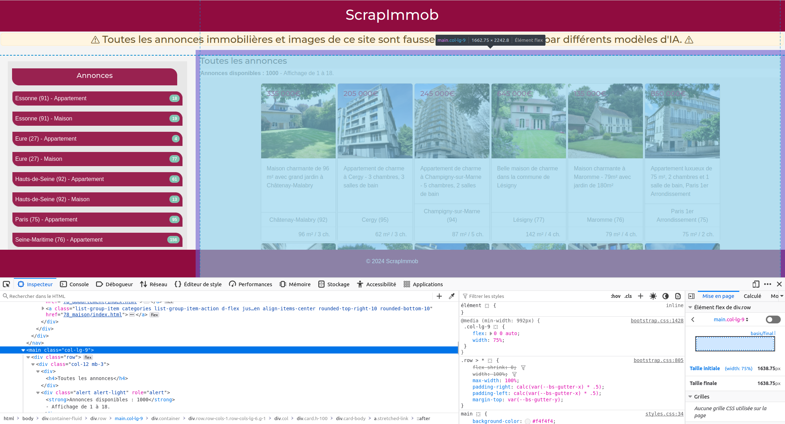

```{r setup, include=FALSE}

## Global options
knitr::opts_chunk$set(echo=TRUE,
        	            cache=FALSE,
                      prompt=FALSE,
                      comment=NA,
                      message=FALSE,
                      warning=FALSE,
                      class.source="bg-info",
                      class.output="bg-warning")


```


> Cet article peut être utilisé pour une initiation aux bases de la collecte automatique de données du Web avec R. De nombreux aspects et méthodes de webscraping qui ne sont pas abordés dans ce document sont présenté sur ce [**site web associé**](https://webscraping.gitpages.huma-num.fr/website/) plus complet et approfondie sur le webscraping avec R et Python. 

# Introduction {-}

Le *web scraping*, ou extraction de données sur le web, est une technique qui consiste à extraire de manière automatisée des informations à partir de sites web. En d'autres termes, c'est comme si vous utilisiez un robot pour récupérer des données à partir de pages web, plutôt que de le faire manuellement.

En sciences humaines et sociales, le *web scraping* peut être utilisé pour collecter des données pertinentes sur des sites web, forums, blogs, des réseaux sociaux, ou autres sources en ligne. Cette méthode peut être particulièrement utile pour analyser des tendances, des opinions, des dynamiques... ou tout simplement pour constituer une base de données à partir de plusieurs sources web. L'utilisation de R pour le web scraping permet d'automatiser ces processus et d'analyser les données extraites de manière efficace.

Le *Web scraping* permet d'extraire des informations spécifiques d'une page web en analysant sa structure HTML et en extrayant uniquement les éléments pertinents. Cette pratique demande ainsi quelques connaissances techniques en matière de web, de langague de balisage HTML et de le CSS, qui permettent respectivement de structurer une page web et de définir l'apparence et la mise en forme des différents éléments du document.

Au delà de présenter le web scraping avec R, cet article aborde dans un premier temps les connaisances indispensables à la mise en place d'une collecte de données automatisée.

Le *Web scraping* regroupe différentes techniques plus ou moins complexes. Cet article, qui est une inititation à la pratique de la collecte automatique de données présente le cas d'utilisation le plus simple. Pour aller plus loin et se former à des techniques plus avancées, vous pouvez consulter ce support de formation plus détaillé : https://webscraping.gitpages.huma-num.fr/website/


# Bases techniques

L’extraction automatisé de données du web requiert des prérequis indispensables : certaines connaissances spécifiques liées à la structure d’une page web et une compréhension des principes techniques sous-jacents. Vous devez ainsi acquérir une connaissance du langage HTML (balises) et une familiarité avec le CSS (sélecteurs) pour identifier, cibler et extraire les éléments d’une page web.

## Le langage HTML

Le HTML, acronyme de HyperText Markup Language (langage de balisage hypertexte en français), est un langage informatique utilisé pour structurer et organiser le contenu des pages web.Il utilise une syntaxe basée sur des balises (tags) pour délimiter les différents éléments d’une page. 

### Les balises

Il n'y a pas de nombre fixe de balises HTML, car de nouvelles balises peuvent être introduites avec les versions futures du langage HTML. Cependant, il existe un ensemble de balises HTML standard définies dans les spécifications du W3C (*World Wide Web Consortium*^[Le World Wide Web Consortium, abrégé par le sigle W3C, est un organisme de standardisation à but non lucratif, fondé en octobre 1994 chargé de promouvoir la compatibilité des technologies du World Wide Web telles que HTML5, HTML, XHTML, XML, RDF, SPARQL, CSS, XSL, PNG, SVG, MathML et SOAP.]). Pour obtenir la liste la plus à jour des balises HTML, vous pouvez consulter la [documentation officielle du W3C](https://www.w3.org/).

Chaque balise est entourée des symboles `<` et `>` et peut contenir des attributs qui spécifient des propriétés supplémentaires pour l’élément. Si aucune balise n'est obligatoire dans une page HTML, il est de convention d'avoir la structure de base suivante :

``` {html, eval = FALSE, class.source='bg-info'}
<!DOCTYPE html>
<html>
<head>
    <title>Titre de la page</title>
</head>
<body>

    <!-- Contenu de la page -->
    
</body>
</html>
```

- `<!DOCTYPE html>` : En début du document, indique au navigateur qu’il s’agit d’une page HTML5^[HTML5 (HyperText Markup Language 5) est la dernière révision majeure du HTML (format de données conçu pour représenter les pages web). Cette version a été finalisée le 28 octobre 2014. HTML5 spécifie deux syntaxes d'un modèle abstrait défini en termes de DOM : HTML5 et XHTML5.].
- `<html>` : Englobe tout le contenu de la page HTML. Définit le début et la fin du document HTML.
- `<head>` : Contient les métadonnées de la page, des liens vers des fichiers annexes (CSS, javascript…), etc.
- `<title>` : Pour définir le titre de la page qui apparaîtra dans la barre de titre du navigateur.
- `<body>` : Contient tout le contenu visible de la page, tel que le texte, les images, les liens, les tableaux, etc.


Dans la majorité des cas, on utilise une balise de fermeture pour indiquer la fin de l'élémént. Une balise de fermeture présente un `/` avant le nom de la balise :

``` {html, eval = FALSE, class.source='bg-info'}
<body>

    <!-- Contenu de la page -->
    
</body>
```


Le body peut contenir toute une variété de balises prédéfinies pour structurer et ajouter différents types de contenu dans la page web. Voici quelques balises indispensables à connaitre :


- `<h1>`, `<h2>`, …, `<h6>` : Définissent les titres de différents niveaux.
- `<p>` : Définit un paragraphe.
- `<a>` : Crée un lien hypertexte.
- `` : Insère une image.
- `<ul>`, `<ol>`, `<li>` : Créent des listes non ordonnées et ordonnées.
- `<table>`, `<tr>`, `<td>` : balises pour créer des tableaux avec des lignes et des cellules de données.
- `<div>` : Divise le document en sections ou en groupes de contenu.
- `<span>` : Applique des styles à des parties de texte.


Exemple de balise `p` (paragraphe) :

``` {html, eval = FALSE, class.source='bg-info'}
<body>

<p>Un paragraphe en langage HTML</p>

</body>
```

Dans cet exemple, les balises `<p>` et `</p>` permettent de créer un paragraphe dont le contenu est "Un paragraphe en langage HTML".

Les différentes balises permettent ainsi de structurer, hierarchiser et organiser le contenu d'une page web. Elles peuvent s'emboiter indéfiniment.


``` {html, eval = FALSE, class.source='bg-info'}
<body>
  
<div>
  
<p>Un paragraphe en <a href="https://fr.wikipedia.org/wiki/HTML5">langage HTML</a></p>

</div>  
  
  
</body>
```


### Les attributs

Ces balises hiérarchisées et potentiellement regroupées, peuvent être accompagnées d'attributs qui permettent de spécifier des informations supplémentaires et jouer sur leur mise en forme, tels que des :    
- identifiants (`id`),   
- classes (`class`),   
- liens (`href`),   
- etc.   

Ces attributs sont à spécifier dans les balises d'ouverture :

``` {html, eval = FALSE, class.source='bg-info'}
<body>

<div id="debut_doc">
    <h1 class="categorie">Tous les articles</h1>
</div>

<div id="Liste_ref">
    <h2 class="article">Titre article</h2>
    <p class="summary">Résumé de l'article...</p>
    <a href="https://www.article.org">Intégralité de l'article</a>
  
    <h2 class="article">Titre article bis</h2>
    <p class="summary">Résumé de l'article bis...</p>
    <a href="https://www.article_bis.org">Intégralité de l'article bis</a>
</div>

</body>
```

L'organisation segmenté du contenu via les balises `div` ou `span` ainsi que les différents attributs spécifiés permettent la mise en forme et le paramétrage des éléments. Les attributs des balises peuvent être associés à une mise en forme (couleur, taille, position, etc.) à l'aide du langage CSS (cf. [partie suivante](#le-langage-css)). Mais **il s'agit également d'éléments cruciaux pour la collecte automatisée de données sur le web**, car il permettent de cibler précisément des éléments. 

Il est par exemple possible de récupérer toutes les URL des articles en ciblant le contenu de tous les attributs `href` des balises `<a>` dans la `<div>` ayant pour identifiant `Liste_ref`.

<center>
`<div>` **&rarr;** ayant pour `id` "Liste_ref" **&rarr;**  `<a>` **&rarr;**  contenu du `href`
</center>

\

## Le langage CSS

Le CSS, ou *Cascading Style Sheets* (feuilles de style en cascade), est un langage de programmation utilisé pour décrire l’apparence et la mise en forme des documents HTML et XML. Il permet de contrôler l’apparence visuelle des différents éléments de pages web (taille, position, couleur, police, marges, etc.) via les sélecteurs CSS.

Le CSS peut être incorporé de différentes manières :

**1. Directement dans les balises** à l'aide de l'attribut `style` :

``` {html, eval = FALSE, class.source='bg-info'}
<h1 style ="font-size:40px;color:#f03b35;text-align:center;">Titre principal</h1>
```

**2. Dans le document HTML**, via la balise `<style>` adaptée à cet effet :

``` {html, eval = FALSE, class.source='bg-info'}
<style>

h1 {
color: #f03b35;
font-size: 40px;
text-align: center;
}
    
</style>

<body>
<h1>Titre principal</h1>
</body>
```


**3. Dans une feuille de style externe** (fichier texte avec l'extension `.css`). Cette dernière méthode est à privilégier car la séparation du contenu et la mise en forme facilite la mise à jour des styles :

:::: {style="display: flex;"}

::: {.column width="59%"}
<center><b>page.html</b></center>

``` {html, eval = FALSE, class.source='bg-info'}
<body>

<h1>Titre principal</h1>

</body>
```
:::

::: {.column width="2%"}
:::

::: {.column width="39%"}
<center><b>style.css</b></center>

```{r, eval = FALSE, class.source='bg-warning'}

h1 { 
color: #f03b35;
font-size: 40px;
text-align:center;
}

```
:::
::::

À chaque fois, le rendu graphique sera le suivant :

{fig-align="center"}


### Les sélecteurs CSS simples


<div class="alert alert-danger">**Bien qu'une connaissance approfondie du CSS ne soit pas nécessaire le scraping, il est important de connaître les sélecteurs CSS.** **Leur utilisation est précieuse pour cibler des données de manière détaillée et ainsi optimiser la collecte.**</div>

Plusieurs sélecteurs CSS permettent de cibler et styliser les différentes balises HTML :


**1. Les sélecteurs d’éléments** : permet de cibler tous les éléments d’un même type.

:::: {style="display: flex;"}
::: {.column width="49%"}
<center><b>page.html</b></center>
``` {html, eval = FALSE, class.source='bg-info'}
<h2>Titre de niveau 2</h2>
```
:::

::: {.column width="2%"}
:::

::: {.column width="49%"}
<center><b>style.css</b></center>
```{css, eval = FALSE, class.source='bg-warning'}
h2 { font-size: 20px; }
```
:::
::::

\

**2. Les sélecteurs d'identifiants** : permet de cibler un élément spécifique par son identifiant (**`id`**).

:::: {style="display: flex;"}
::: {.column width="49%"}
<center><b>page.html</b></center>
```{html, eval = FALSE, class.source='bg-info'}
<div id="example">  </div>
```
:::

::: {.column width="2%"}
:::

::: {.column width="49%"}
<center><b>style.css</b></center>
```{css, eval = FALSE, class.source='bg-warning'}
#example { background-color: #f2f2f2; }
```
:::
::::

\

**3. Les sélecteurs de classes** : permet de cibler les éléments ayant une classe spécifique (**`class`**).

:::: {style="display: flex;"}
::: {.column width="49%"}
<center><b>page.html</b></center>
``` {html, eval = FALSE, class.source='bg-info'}
<p class="summary">Ceci est un résumé</p>
```
:::

::: {.column width="2%"}
:::

::: {.column width="49%"}
<center><b>style.css</b></center>
```{css, eval = FALSE, class.source='bg-warning'}
.summary { font-family: Arial, sans-serif; }
```
:::
::::

\

**4. Les sélecteurs d'attributs** : cible les éléments ayant un attribut spécifique. Exemple : l'attribut `href` (lien cliquable)\

:::: {style="display: flex;"}
::: {.column width="49%"}
<center><b>page.html</b></center>
``` {html, eval = FALSE, class.source='bg-info'}
<a href="https://www.example.org">Lien</a>
```
:::

::: {.column width="2%"}
:::

::: {.column width="49%"}
<center><b>style.css</b></center>
```{css, eval = FALSE, class.source='bg-warning'}
a[href] { color: purple; }
```
:::
::::

Il est possible de préciser sa cible en indiquant une valeur pour l'attribut.

```{css, eval = FALSE, class.source='bg-warning'}
a[href="https://example.org"] { color: purple;}
```


\

### Les sélecteurs complexes et combinateurs

Le CSS met également à disposition des sélecteurs complexes et combinateurs que l'on peut utiliser pour cibler des contenus de manière très précise. Quelques exemples :

**A. Les sélecteurs descendants** : cible les éléments qui sont descendants d'un autre élément.

:::: {style="display: flex;"}
::: {.column width="49%"}
<center><b>page.html</b></center>
``` {html, eval = FALSE, class.source='bg-info'}
<div id="liste_ref">

  
    <p class="summary">Ceci est un résumé</p>
    
  
</div>
```
:::

::: {.column width="2%"}
:::

::: {.column width="49%"}
<center><b>style.css</b></center>
```{css, eval = FALSE, class.source='bg-warning'}
#liste_ref p .summary { font-size: 12px; }
```
<div class="alert alert-danger">Cible tous les paragraphes de la classe `summary`, positionnés dans l'élément ayant pour identifiant `liste_ref`.</div>
:::
::::


\

**B. Les sélecteurs de voisin direct** : cible les nœuds qui suivent immédiatement un élément

:::: {style="display: flex;"}
::: {.column width="49%"}
<center><b>page.html</b></center>
``` {html, eval = FALSE, class.source='bg-info'}
<div id="liste_ref">

    <h2>Titre de l'article</h2>
    <p class="summary">Ceci est un résumé</p>
    
    <h2>Titre de l'article</h2>
    <p class="summary">Ceci est un résumé</p>
        
</div>
```
:::

::: {.column width="2%"}
:::

::: {.column width="49%"}
<center><b>style.css</b></center>
```{css, eval = FALSE, class.source='bg-warning'}
#liste_ref + h2 { font-size: 14px; }
```

\

<div class="alert alert-danger">Cible uniquement la première balise `h2` de l'élément ayant pour identifiant `liste_ref`.</div>
:::
::::

\

### Exemple pratique simple

Pour mieux comprendre l'utilisation et le fonctionnement du HTML et du CSS, **vous pouvez vous exercer à la pratique de ces deux langages à partir de cet exemple simple mis à disposition en téléchargement** :

\

<center>
[ **exo_HTML.zip**](https://gitlab.huma-num.fr/webscraping/rzine_webscraping/-/raw/master/exo_HTML.zip?ref_type=heads&inline=false)
</center>

<br>

Une fois téléchargé, décompressez le répertoire. 
Un fichier HTML peut être interprété (mis en page) par n'importe quel navigateur (Firefox, Google Chrome, Microsoft Edge, ect...) :

1. Ouvrez le fichier page.html avec un naviguateur web. Aucune connexion internet n'est nécessaire.

2. Ouvrez le fichier page.hmtl et le fichier style.CSS avec un editeur de fichier texte (ex : bloc-note, Rstudio...).

3. Ajoutez et/ou modifiez du contenu (balise) dans le code source du fichier page.html. Enregistrez le fichier réaffichez (ou raffraichissez avec la touche `F5`) la page HTML dans le naviguateur pour apercevoir la nouvelle mise en page. 

4. Ajoutez et/ou modifiez du contenu dans le code source du fichier style.css. Enregistrez le fichier réaffichez (ou raffraichissez avec la touche `F5`) la page HTML dans le naviguateur pour apercevoir la nouvelle mise en page.


\

## Le code source d'une page web {#codesource}

La connaissance du HTML et du CSS vous permettra de comprendre et de naviguer dans le code source du page web. L’ensemble des navigateurs web modernes proposent des outils d’inspection du code source des pages web. 

**L’inspecteur de code source** permet d’explorer le code source d’une page web. Il **permet l’identification des balises, des classes, des identifiants et des styles associés aux éléments, et ainsi de procéder à une extraction ciblée de données**. En utilisant l’inspecteur de code source, vous accédez à toutes les informations nécessaires pour concevoir un script de collecte automatisée. 


Pour y accéder, cliquez-droit n’importe où sur la page web ouverte dans un naviguateur, puis cliquez sur “Inspecter” :

:::: {style="display: flex;"}
::: {.column width="49%"}
::: {style="text-align: center;"}
Avec *Google Chrome* :


{fig-align="center"}
::: 
::: 
::: {.column width="2%"}
:::

::: {.column width="49%"}
::: {style="text-align: center;"}
Avec *Mozilla FireFox* :


:::
::: 
::::

\

L'inspecteur s'ouvre et en utilisant l'outil de sélection (entouré en <font style="color:#FF0000;">**rouge**</font>), il donne la possibilité de naviguer dans le code source en survolant les différents éléments de la page, et vice versa.


\

Vous pouvez déplier le code source pour l'explorer en profondeur. Cet article est une page HTML dans laquelle l'ensemble de la partie "2. Bases techniques" semblent contenu dans une `div` ayant pour identifiant `"bases-techniques"` :


\

En réalisant un clic-droit sur un élément, vous pouvez récupérer plusieurs choses. Cliquez sur copier :


\

Ainsi, vous pouvez récupérer aisément : 

- l'intérieur du HTML (?)
- l'exterieur du HTML (?)
- **Le sélecteur CSS** (ex : `#bases-techniques`)
- **Le chemin CSS** (ex : `html body.preload div#content div#main div#bases-techniques.section.level1`
- **Le Xpath** (ex : `//*[@id="bases-techniques"]`)

Ces trois derniers éléments pourront vous être précieux pour automatiser votre collecte.
Pour cette page, le sélecteur CSS `#bases-techniques h2` permet ainsi de cibler tous les titres de niveau 2 présents dans l'élément `div` ayant pour identifiant "bases-techniques"... Le scraping peut commencer !

<div class="alert alert-danger">
<b>La première étape du webscraping consiste ainsi à analyser le code source de la page et du site web ciblé, afin de trouver le chemin ou l'emplacement exacte des informations que l'on souhaite récupérer.</b>
</div>


**Partie à développer ? Plus de chose sur l'inspecteur ?**

\


# Présentation du cas pratique

## Le site web de démonstration

Pour cette introduction au web scraping avec R, nous proposons une mise en pratique sur un site web de démonstration crée pour l'occasion : [**ScrapImmob**](https://analytics.huma-num.fr/Robin.Cura/ScrapImmob/index.html). **Ce site compile 1000 annonces fictives de ventes immobilères de maisons et d'appartements**.  

<center>


</center>

\

<div class="alert alert-danger"> <b>L'intégralité biens présentés ainsi que les images associées ont été générés par différents modèles d'intelligence artificielle. Toutes les informations affichées sont donc fausses !</b> </div>


Comme n'importe quel site d'annonces immobilières, **ScapImmob recense des annonces de ventes de maisons ou d'appartements dans dix départements français : l'Essonne, l'Eure, les Hauts-de-Seine, Paris, la Seine-Maritime, la Seine-Saint-Denis, la Seine-et-Marne, le Val d'Oise, le Val de Marne et les Yvelines.** 

Une exploration rapide du site nous permet d'observer que chaque annonce contient les informations suivantes : 

- des photographies,    
- un titre,     
- une description,     
- des caractèristiques techniques (surfaces, prix, nombre de pièces, etc.),   
- Une localisation (commune et carte interactive). 

Pour automatiser la collecte de ces informations, nous devons inspecter le code source du site pour déterminer la localisation précise de ces différents éléments. Dans quelles balises se trouvent-il ? Quels sont les identifiants ou classes des différentes balises ? ect.

\

## Exploration du site web

Pour scrapper, il est important de comprendre comment le site web est construit pour être capacité de cibler les bons élements lors du scrapping. Après avoir navigué sur ScrapImmob dans la partie précédente, nous pouvons donc commencer à explorer son code source. Pour cela, nous allons utiliser l'inspecteur de code expliqué dans la partie sur [le code source d'une page web](#codesource) de cette fiche. Pour rappel, c'est à l'aide de l'inspecteur que nous pourrons donc trouver les balises, les classes, les identifiants et les styles associés aux éléments, et ainsi de procéder à une extraction ciblée des informations. 


\

## Objectifs
Avant de commencer à scrapper, il est important de définir nos objectifs et de clarifier les informations que l'on souhaite récupérer. Cela permet de construire un code optimisé récupérant uniquement les élements qui seront utiles à notre analyse. Nous souhaitons obtenir une base de 

Définir ses objectifs ! = Présentation du système d'URL

lecture de chaque page de chaque bien
Objectifs de ce scraping ?

\

# Mise en pratique

## Le package <code>rvest</code> 
Pour ce cas pratique, nous allons utilisé le package [<code>rvest</code>](https://rvest.tidyverse.org/), développé par Hadley Wickham, qui facilite le scraping en utilisant les sélecteurs CSS et XPath pour extraire les données des pages web.Il existe plusieurs packages permettant de faire du webScraping avec R comme [<code>RSelenium</code>](https://cran.r-project.org/web/packages/RSelenium/index.html). Selon le site que vous souhaitez scraper et les fonctionnalités dont vous avez besoin, il faut choisir le package le plus adapté. Dans notre cas, ScrapImmob est un site statistique et bien structurées donc le package <code>rvest</code> correspond bien à ce type de site web. A l'inverse pour du scraping de pages web dynamiques ou nécessitant une interaction utilisateur, <code>RSelenium</code> aurait été plus adapté. 


```{r message=FALSE, warning=FALSE}
library(rvest)
```


## Découvrir les fonctions principales de <code>rvest</code>

### Scraping d'un extrait de code html
Commençons à explorer les principales fonctions du package <code>rvest</code> à partir d'un extrait de code html du site ScrapImmob : 

``` {r message=FALSE, warning=FALSE}
#Exemple HTML simple
basic_html <- minimal_html( '<div class="card-body">
                                <a href="annonces/IDF_0078.html" class="stretched-link"></a>
                                <p class="card-text">Maison charmante de 96 m² avec grand jardin à Châtenay-Malabry</p>
                            </div>')
```

- Les fonctions <code>read_element</code> ou <code>read_elements</code> permettent la récupération du 1er ou de tous les élements selon leur sélécteur CSS ou Xpath.

``` {r echo = TRUE, message=FALSE, warning=FALSE}
#Récupérer les éléments de la balise <p>
basic_html %>% html_elements("p")
```


- La fonction <code>html_attr</code> permet l'extraction des données des attributs. 

``` {r echo= TRUE, message=FALSE, warning=FALSE}
#Récupérer l'url indiqué dans l'attribut href
basic_html %>% html_elements("a") %>% html_attr("href")
```


- Les fonctions <code>html_text</code> ou <code>html_text2</code> permettent l'extraction du texte d'un élément

``` {r echo= TRUE, message=FALSE, warning=FALSE}
#Récupérer le texte entre les balises
basic_html %>% html_elements("p") %>% html_text2()
```


### Scraping de la première page du site ScrapImmob

Maintenant, nous allons nous exercer sur la [première page du site ScrapImmob](https://analytics.huma-num.fr/Robin.Cura/ScrapImmob/index.html). Nous récupérons le code de la page à l'aide de la fonction <code>read_html</code> : 

``` {r message=FALSE, warning=FALSE}
#Stockage de l'URL 
urlannonce <- "https://analytics.huma-num.fr/Robin.Cura/ScrapImmob/"

#Lecture de l'URL
page <- read_html(urlannonce)
```

Notre 1ère objectif est de récupérer les URLs des biens immobiliers de cette première page de ScrapImmob. 

``` {r echo= TRUE, message=FALSE, warning=FALSE}
#Récupérer les url des biens immobiliers de la 1ère page
page %>% html_elements("div:nth-child(1) > div:nth-child(3) > a:nth-child(1)") %>% html_attr("href")
```


### Scraping des URLs de tous les biens immobiliers

``` {r echo= TRUE, message=FALSE, warning=FALSE}
#Récupérer les url des biens immobiliers de la 1ère page

extraire_liens <- function(url) {
  page <- read_html(url)
  liens <- page %>% html_elements("div:nth-child(1) > div:nth-child(3) > a:nth-child(1)") %>% html_attr("href")
  return(liens)
} 

#Récupérer le nombre de pages
nombre_de_pages <- 5

# Liste pour stocker tous les liens
liste_de_liens <- list()

#Boucle
for (i in 1:nombre_de_pages) {
  url_page <- paste0(urlannonce, "?page=", i)
  liens_page <- extraire_liens(url_page)
  
  # Faire quelque chose avec les liens extraits (imprimer, stocker, etc.)
  liste_de_liens <- c(liste_de_liens, liens_page)
}

liste_de_liens
```

### Scraping d'éléments d'une page d'annonce immobilière
Travaillons maintenant sur la 1ère annonce immobilière de cette liste 

``` {r echo= TRUE, message=FALSE, warning=FALSE}

#Récupérer l'URL de la 1ère annonce
urlannonce1 <- paste0("https://analytics.huma-num.fr/Robin.Cura/ScrapImmob/",liste_de_liens[1])

#Lire la page 
pageannonce1 <- read_html(urlannonce1)

#Récupérer l'élément titre 
pageannonce1 %>% html_element(".display-6") %>% html_text2()


```


``` {r echo= TRUE, message=FALSE, warning=FALSE}

#Récupérer de l'URL de la 1ère image
image_url <- pageannonce1  %>% 
           html_element("img") %>%  # Sélectionner tous les éléments 'img'
  html_attr("src")


```


## Scraping de la base de données sur Paris 

### Création de la liste des annonces à scrapper 
Nous souhaitons maintenant obtenir une base de données complète des biens immobiliers qui contient un ensemble d'informations sur Paris.Pour ça, il nous faut la liste des urls des biens. 

``` {r echo= TRUE, message=FALSE, warning=FALSE}

#METTRE ICI LE CODE QUI PERMET DE RECUPERER LA LISTE DES BIENS SUR PARIS 


```

### Fonctions nécessaires au scraping 
Nous allons créer un ensemble de fonction qui nous permettent de scrapper ces éléments.
``` {r echo= TRUE, message=FALSE, warning=FALSE}

#Fonction d'extraction du titre court 
extraire_titrec <- function(url) {
  titre <- page %>% html_elements(".display-6)") %>% html_text2()
  return(titre)
} 

#Fonction d'extraction du titre long 
extraire_titrel <- function(url) {
  element <- page %>% html_elements("h5.card-title:nth-child(1)") %>% html_text2()
  return(element)
} 

#Fonction d'extraction de la description 
extraire_description <- function(url) {
  element <- page %>% html_elements(".card-text") %>% html_text2()
  return(element)
} 

#Fonction d'extraction du type 
extraire_type <- function(url) {
  element <- page %>% html_elements("ul.list-group > li:nth-child(1) > strong:nth-child(2)") %>% html_text2()
  return(element)
} 


#Fonction d'extraction du nombre de chambres 
extraire_chambres <- function(url) {
  element <- page %>% html_elements("ul.list-group > li:nth-child(2) > strong:nth-child(2)") %>% html_text2()
  return(element)
} 

#Fonction d'extraction du nombre de salle de bains
extraire_chambres <- function(url) {
  element <- page %>% html_elements("li.list-group-item:nth-child(3) > strong:nth-child(2)") %>% html_text2()
  return(element)
} 

#Fonction d'extraction du nombre de la surface habitable
extraire_surf <- function(url) {
  element <- page %>% html_elements("li.list-group-item:nth-child(4) > strong:nth-child(2)") %>% html_text2()
  return(element)
} 

#Fonction d'extraction du nombre de la surface jardin
extraire_surfj <- function(url) {
  element <- page %>% html_elements("li.list-group-item:nth-child(5) > strong:nth-child(2)") %>% html_text2()
  return(element)
} 

#Fonction d'extraction du prix
extraire_prix <- function(url) {
  element <- page %>% html_elements("li.list-group-item:nth-child(6) > strong:nth-child(2)") %>% html_text2()
  return(element)
} 

#Fonction d'extraction de la commune 
extraire_commune <- function(url) {
  element <- page %>% html_elements("div.list-group:nth-child(1) > li:nth-child(1) > strong:nth-child(1)") %>% html_text2()
  return(element)
} 

#Fonction d'extraction du département
extraire_commune <- function(url) {
  element <- page %>% html_elements("div.list-group:nth-child(1) > li:nth-child(2) > strong:nth-child(1)") %>% html_text2()
  return(element)
} 


#Fonction d'extraction de la localisation 
extraire_loc <- function(url){
  element <- 
    page %>% html_elements('script') %>% # On récupère les balises de type script
                      html_text2() %>% # On en extrait le contenu
                      pluck(2) %>% # On ne garde que la 2ème balise string, qui est celle qui contient le code leaflet
                      str_extract(string = .,
                                  pattern = "var annonce_coords = \\[(\\d+\\.?\\d*\\, \\d+\\.?\\d*)\\]", # regexp qui cherche les caractères "var annonce_coords = [unNombreDecimal, unAutreNombreDecimal]" et met les deux nombres décimaux dans un groupe (les parenthèses) -> "49.224678, 1.184296"
                                  group = 1) %>% # On ne conserve que le groupe 1, donc ce qui était en parenthèse dans la regexp 
                      str_split(pattern = ',') %>% # On découpe par la virgule -> list(c("49.224678", " 1.184296"))
                      pluck(1) %>% # str_split crée une liste de vecteurs, on ne garde que le premier élément -> c("49.224678", " 1.184296")
                      str_trim() %>% # sur chaque vecteur, on enlève les espaces en début et en fin -> c("49.224678", "1.184296")
                      as.numeric() # On peut enfin les convertir en numérique, et donc récupérer la latitude puis la longitude (ordre inversé de coordonnées de leaflet)
  return(element)
}


```

### Scraping de la base 
Appliquons maintenant les fonctions à la liste de biens pour constituer notre base de données


## Exploration de la base de données scrappées 

### Présentation de la BD scrapée

### Répartition par type

### Distribution par type/prix

### Surface moyenne

### Nuage de mot sur les description des biens


### Carte !

Géocodage adresse + carto 

### Export

#### csv

#### Géopackage


# Pour aller plus loin

## Rselenium

## Support complet


# Conclusion

Ouverture Le bon coin ?


# Bibliographie {-}

<div id="refs"></div>

# Annexes {-}

## Info session  {-}

```{r session_info, echo=FALSE}
kableExtra::kable_styling(knitr::kable(rzine::sessionRzine()[[1]], row.names = F))
kableExtra::kable_styling(knitr::kable(rzine::sessionRzine()[[2]], row.names = F))
```

## Citation {-}

```{r Citation, echo=FALSE}
rref <- bibentry(
   bibtype = "misc",
   title = "Titre de la fiche",
   subtitle = "Sous-Titre de la fiche",
   author = c("Premier Auteur.e", "Second Auteur.e"),
   doi = "10.48645/xxxxxx",
   url = "https://rzine.fr/publication_rzine/xxxxxxx/",
   keywords ="FOS: Other social sciences",
   language = "fr",
   publisher = "FR2007 CIST",
   year = 2021,
   copyright = "Creative Commons Attribution Share Alike 4.0 International")

``` 

`r capture.output(print(rref))`

### BibTex : {-}

```{r generateBibTex, echo=FALSE}

writeLines(toBibtex(rref), "cite.bib")
toBibtex(rref)

``` 

<br/>

## Glossaire {- #endnotes}

```{js, echo=FALSE}

$(document).ready(function() {
  $('.footnotes ol').appendTo('#endnotes');
  $('.footnotes').remove();
});

```
